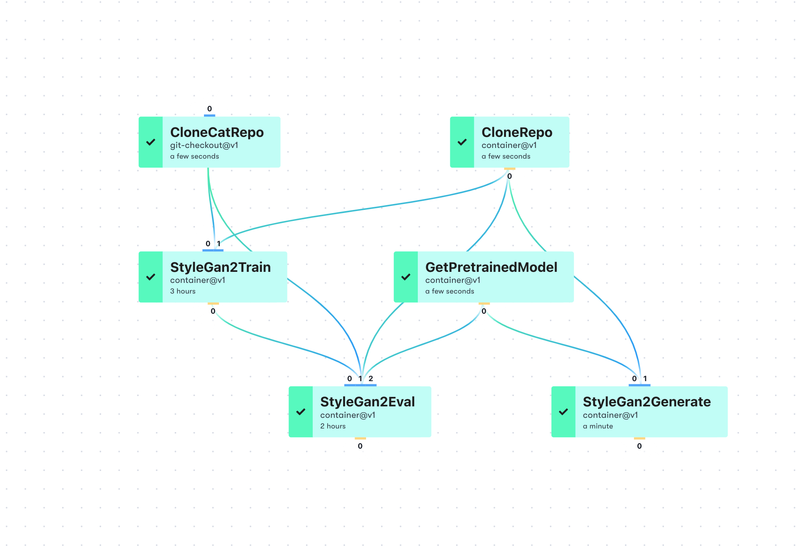
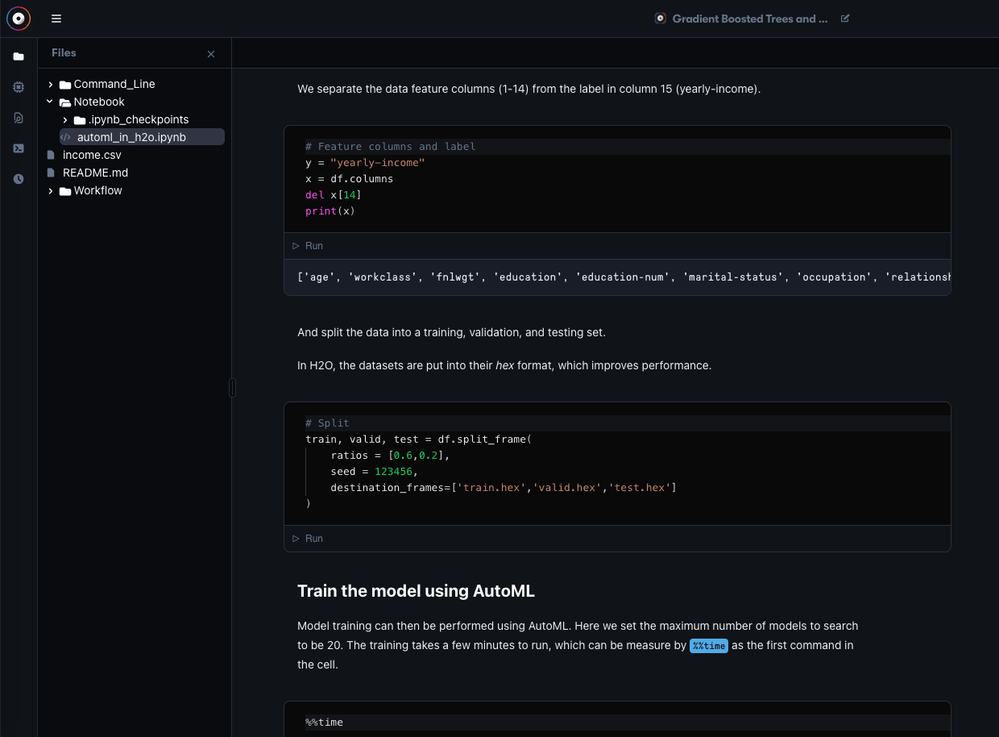
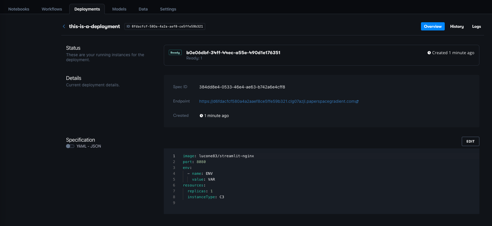

# About Gradient

### **Welcome to Gradient!**

Gradient is a [Paperspace ](https://www.paperspace.com/)product that simplifies developing, training, and deploying machine learning models. Whether you're a **student**, a **researcher**, or a **professional**, Gradient can make your work easier. Watch [Welcome to Gradient](https://www.youtube.com/watch?v=b9pnSHP0eIs) to learn more, or just [create an account](https://console.paperspace.com/signup?gradient=true) to get started!


This is the documentation for the [Gradient](https://paperspace.com/gradient) platform. If you are looking for general information on Paperspace or to contact Support, visit our [Help Center](https://support.paperspace.com).


Gradient is offered as a [managed service](https://console.paperspace.com/signup?gradient=true) or as a [self-hosted](gradient-private-cloud/about/setup/self-hosted-clusters/) version you can install into any existing Kubernetes cluster.

## Getting Access


#### Request a Walkthrough

Prefer a guided tour? [Click here](https://info.paperspace.com/contact-sales-gradient) to get in touch with a Gradient expert.


### Individuals can sign up [here](https://console.paperspace.com/signup?gradient=true) for Gradient.

The best way to discover Gradient is to try it out. You can get started in seconds with the following guide:



## What's in Gradient?

Gradient consists of

**Notebooks:** Start your analysis right away by creating a Notebook and beginning coding. Notebooks are suitable for all users and give easy access to Gradient's GPU hardware, containers with a variety of data-science-ready software \(or bring your own\), and the flexibility to explore and solve problems using a popular notebook interface similar to Jupyter and Colab.

**Workflows \(advanced\):** For users who want to properly organize larger projects, perform MLOps, or move into production, Workflows provide a rigorous description of all steps of your data flow. Using the combination of Gradient Actions and the YAML markup language, reproducible enterprise-grade data science is now available to all.

**Deployments \(advanced\):** A model is not useful if it can't be used. Gradient Deployments complete the necessary steps of deploying your model to production so that it can generate business value for you and your company. We support popular ML frameworks such as TensorFlow, and generic models too, via ONNX or a custom description.

## How does it Work?

All work is done as part of a Project. Create a Project, then start Notebooks, Workflows, and Deployments within it. Create a new project for every problem you want to solve!

Projects can be created standalone, or linked to a GitHub repository. When you just need simplicity, a standalone project with a Notebook works great. When you need more organization, a repo-linked project with Gradient Workflows allows everything to be kept consistent by triggering reruns when things change. This is good for Deployments too.

Notebooks, Workflows, and Deployments all have access to [Gradient machine instances](https://docs.paperspace.com/gradient/more/instance-types), which in turn provide CPU and GPU hardware \(including distributed\), and the benefits of orchestrated containerized software, without the user having to set it up.

Users can access Gradient via the graphical user interface, the terminal command line, or programmatically from their code via the API/SDK.

Other functionality includes the ability to collaborate in teams, Gradient-managed storage, and access to external data such as Amazon S3. Everything is versioned and reproducible.

For more details on Gradient and how it works, see [Core Concepts](https://docs.paperspace.com/gradient/get-started/core-concepts).

## What's in the Docs?

Our documentation is divided into several major sections

* **Get Started:** For all the details on how to quickly get going, start here. We include how to use Projects, our tutorials, as well as more details on core concepts of Gradient, and frequently asked questions.
* **Explore, Train, Deploy\*:** Explore with Notebooks, Train with Workflows, and Deploy with Deployments. Everything you need to know is here, each with its own section.
* **Artifacts:** End-to-end data science consists of many artifacts. Here we describe them, and how they are versioned. Datasets, machine learning models, versions of your code, and other information such as model metrics are included.
* **Gradient Cluster:** Not everyone wants to be 100% in the cloud or use shared clusters. Here we cover how to set up your own.
* **More:** Anything not covered above is here, including Gradient instance types, how to use the API/SDK, release notes, and some future roadmap items.

 \* You can train and deploy models in Notebooks too: the divisions are not strict

## Other Resources

Aside from this documentation, some other resources are

* Our [Help Center](https://support.paperspace.com) is a great resource for general Paperspace information.
* Check out the [ML Showcase](https://ml-showcase.paperspace.com/) for a curated list of interactive ML sample projects.
* View the Gradient [release notes](https://updates.paperspace.com/) and subscribe to product updates. 
* For for a preview of upcoming features see our [Roadmap](https://paperspace.hellonext.co/). 
* Please visit the [Community](http://community.paperspace.com/) to view and post questions.
* **New!** Join our [Discord](https://discord.gg/ayUhknap)

