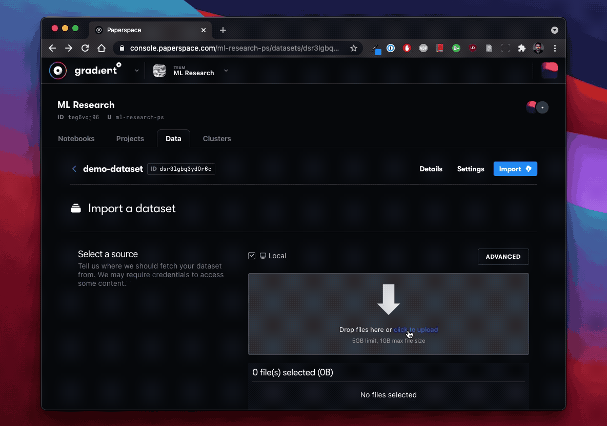

# Data

## [Versioned Data](private-datasets-repository/)

Gradient provides the ability to mount S3 compatible object storage buckets to workloads at runtime.  Datasets have immutable versions that can be used to track your data as it changes.  

### Quickstart: Using the web UI uploader

The easiest way to get data into Gradient is to use the web-based uploader. To understand how versioned data works within Gradient and learn about connecting to additional data sources, click [here](private-datasets-repository/).

## Persistent Storage 

Persistent storage is a high-performance storage directory located at `/storage` within Notebooks where you can read and write files. Persistent storage is backed by a filesystem and is ideal for storing data like images, datasets, model checkpoints etc.  Anything you store in the `/storage` directory will be accessible across multiple runs of Notebooks in a given storage region. 


Persistent Storage is specific to each region. 



Persistent storage is only available in the managed service or private clusters.


