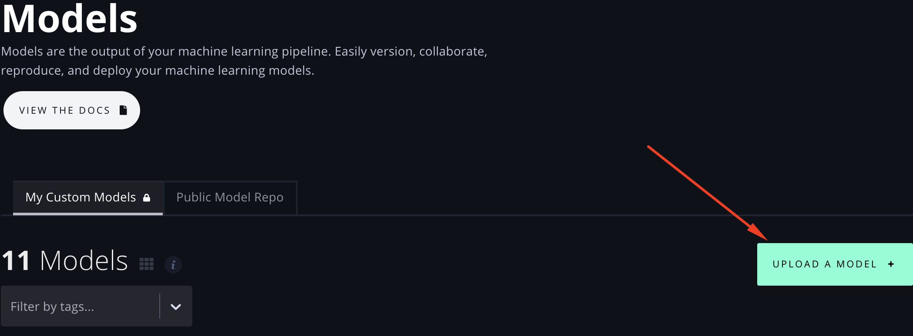
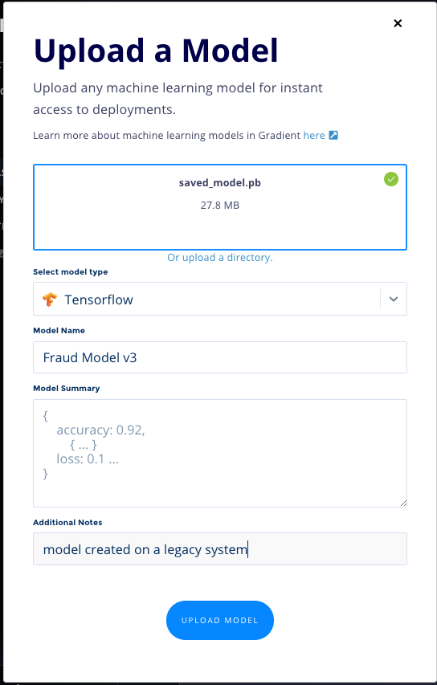
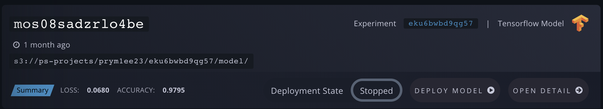
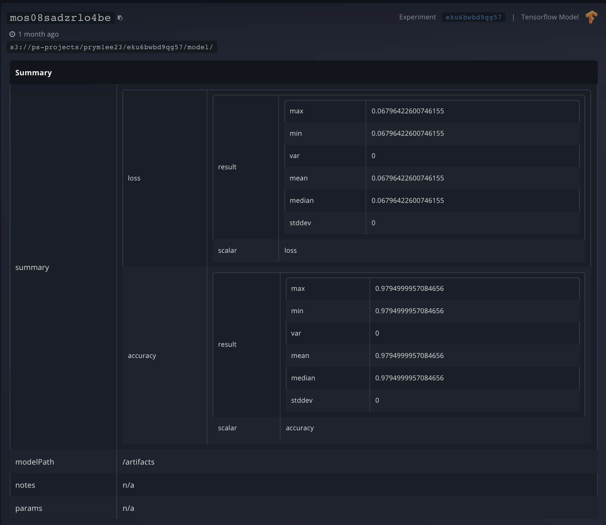
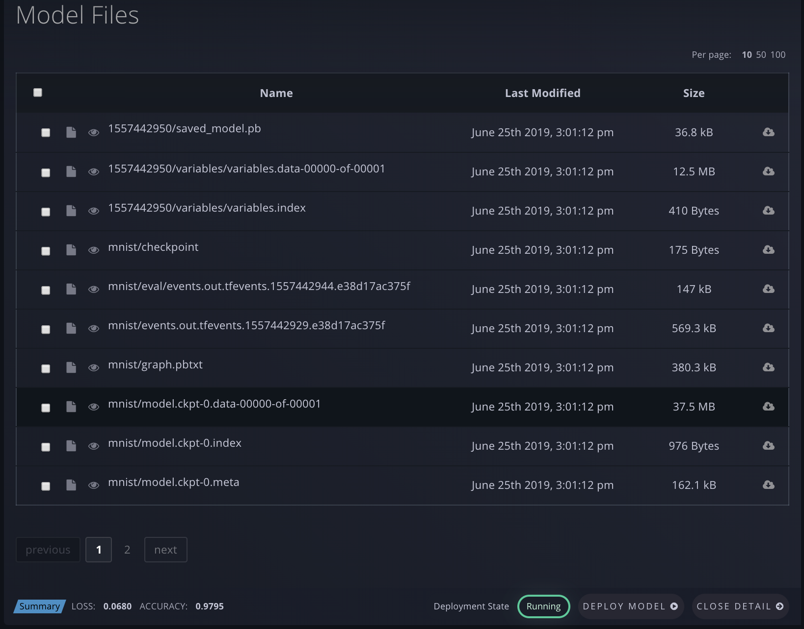
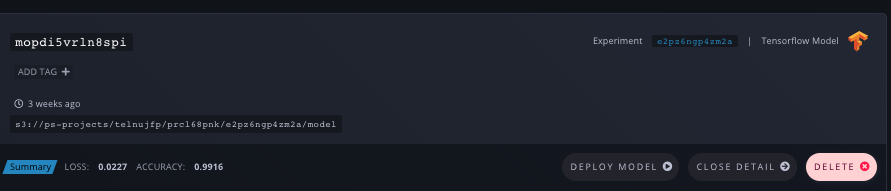

# Managing Models

## Create a Model

There are two ways to create a Model in Gradient, and both can be done via the web UI or CLI:

### 1. Run a workload that generates a Model

You can do this via using a [Gradient Action](../../../explore-train-deploy/workflows/gradient-actions.md#model-create) or the [SDK](../../../more/gradient-python-sdk-1/). This will place your Model in your Project's [Model Repository](../#model-repository).


View the full CLI/SDK Docs for **Models **[here](https://paperspace.github.io/gradient-cli/gradient.cli.html#gradient-models).&#x20;


### 2. Upload a Model



To upload a Model via the Web UI, first navigate to the **Models** page.

From there, click **Upload a Model +**



This will open up a modal to **Upload a Model**, where you can drag 'n' drop a Model file from your local machine (or click to find it locally), as well as select the model **Type** and provide a **Name**, custom **Summary**, and any **Additional Notes** as metadata.  Additionally, you can click "Or Upload a directory" to select a local folder.



Then click **Upload Model**. This will upload and register the Model in Gradient.



You can upload a Model via the CLI with the `gradient models upload` subcommand:

```
gradient models upload downloads/squeezenet1.1.onnx --name squeezenet --modelType ONNX
```

Whether you use the Web UI or CLI, you've now successfully uploaded a Model into Gradient!

_Note: Uploaded Models will not be associated with an Experiment. _

Now that you have a Model, whether uploaded or generated by running an Experiment, read on to learn how you can use it to create a Deployment.



## View Models in Your Model Repository

You can view your team's Models in your Model Repository via the Web UI or CLI, as seen below.



Navigate to **Models** in the side nav to see your list of trained Models:

 (2) (2) (2) (2) (2) (2) (2) (1).png>)



As you can see, the Web UI view shows your Model ID, when the model was created, the S3 bucket location of your model, your metrics summary data, the Experiment ID, the model type, and whether it is currently deployed on Paperspace.

You can click **Deploy Model** to [Create a Deployment](https://docs.paperspace.com/gradient/explore-train-deploy/deployments/managing-deployments#create-a-deployment) with your Model. And you can click **Open Detail** to see a more detailed view of the Model's performance metrics. This will also show a list of all of the checkpoint files (artifacts) generated by the Experiment, as well as the final Model at hand, and you can download any of those files.







Alternately, you can view your Models (currently with less detailed info) via the CLI by running `gradient models list`.

```
$ gradient models list

+------+-----------------+------------+------------+----------------+
| Name | ID              | Model Type | Project ID | Experiment ID  |
+------+-----------------+------------+------------+----------------+
| None | moilact08jpaok  | Tensorflow | prcl68pnk  | eshq20m4egwl8i |
| None | mos2uhkg4yvga0p | Tensorflow | prcl68pnk  | ejuxcxp2zbv0a  |
| None | moc7i8v6bsrhzk  | Custom     | prddziv0z  | e5rxj0aqtgt2   |
```

#### Parameters

The following parameters can be used with the `list` subcommand:

| Argument         | Description                         |
| ---------------- | ----------------------------------- |
| `--experimentId` | Filter models list by Experiment ID |
| `--projectId`    | Filter models list by Project ID    |



## Renaming a Model

Just click on the name to rename your model.

.png>)

## Delete a Model

### Delete models in your Model Repository



Navigate to **Models** in the side nav to see your list of trained Models.  From here you can delete models by clicking the delete button. &#x20;

.png>)





You can delete a model using the CLI with the following command:

```bash
gradient models delete --id <your model id>
```


