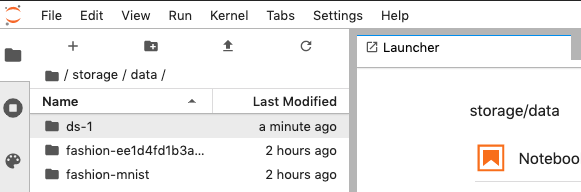

# S3 Datasets \(deprecated\)


S3 Datasets have been deprecated and replaced by [Versioned Datasets](./).


Datasets are downloaded and mounted readonly on `/data/DATASET` within your experiment jobs using the supplied AWS credentials. The credentials are optional for public buckets. The name of the dataset is the `basename` of the last item in the s3 path, e.g. `s3://my-bucket/mnist.zip` would have the name `mnist` and `s3://my-bucket` would have the name `my-bucket`. The name maybe overridden with the optional `name` parameter.

```text
datasets: [
    {
        "uri": "s3://my-bucket/mnist-modified.zip",
        "awsSecretAccessKey": "<KEY>",
        "awsAccessKeyId": "<ID>",
        "name": "mnist",
    },
]
```

#### ETag

When downloading a dataset you may supply an optional `etag` parameter, which will tell the dataset downloader to verify that the object stored at the path matches the supplied etag. If it does not match the etag, the experiment will end with an error. This feature is only supported on S3 objects and not buckets.

```text
datasets: [
    {
        "uri": "s3://my-bucket/my-dataset.zip",
        "awsSecretAccessKey": "<KEY>",
        "awsAccessKeyId": "<ID>",
        "etag": "d0e2243df4d1e89ead52d51083b2eb523593b38e",
    },
]
```

#### VersionId

When downloading a dataset you may supply an optional `versionId` parameter, which will tell the dataset downloader to fetch your S3 object at the specified version. This feature is only supported on versioned S3 buckets and is not supported on downloads of folders.

```text
datasets: [
    {
        "ur": "s3://my-bucket/my-dataset.zip",
        "awsSecretAccessKey": "<KEY>",
        "awsAccessKeyId": "<ID>",
        "versionId": "1111111",
    },
]
```

#### Downloading to Shared Storage

When executing experiments normally & pulling down data inside each of the nodes of a training job, it is downloaded to transient storage per experiment job. This means that for a 3 worker, 2 parameter server experiment the dataset will be downloaded 5 times. Since this can be very inefficient, in order to decrease job start up time your data gets downloaded the team shared storage space. This will download the dataset to a unique path within your shared storage and mount it into your experiment jobs at the same path as if you had downloaded it to a dynamic volume. This can be useful for quickly switching your volume options without changing your experiment code. It is _strongly_ recommended to supply an etag for shared storage downloads to ensure that you have a consistent dataset between experiment executions.

For example,

```text
datasets: [
    {
        "url": "s3://my-bucket/my-dataset.zip",
        "awsSecretAccessKey": "<KEY>",
        "awsAccessKeyId": "<ID>",
        "etag": "d0e2243df4d1e89ead52d51083b2eb523593b38e",
    }
]
```

**Cleaning Up Shared Storage**

Because shared storage datasets are stored in your team storage they are not automatically deleted. Datasets are downloaded to `/<TEAMHANDLE>/data/<DATASET_NAME-ETAG>`, where `DATASET_NAME` is derived from the bucket or the user supplied parameter. If the dataset was downloaded without an `etag`, the `-ETAG` portion of the download path is omitted.

#### Viewing Shared Storage with Notebooks

The datasets you download in your team are also mounted inside the notebooks launched inside your team. Below is an image of the /storage/data path. There are 3 datasets visible here, one of which has the &lt;folder name&gt;-&lt;etag&gt; format & the other which was not downloaded with e-tag.



This is one the easiest way to view the datasets while developing any of your research code.

#### Ephemeral Dataset Volumes

Currently only supported on AWS private clusters.

When downloading a dataset they are by default downloaded to shared storage. There are cases when you may want an ephemeral volume that lasts only for the duration of the experiment job. These volumes are 5 GB \(`"5Gi"`\) by default; if you need a larger volume you may supply a size parameter with your dataset.

For example, this snippet will start an experiment with a dataset that downloads to a 10 GB volume:

```text
datasets: [
    {
        "url": "s3://my-bucket/my-dataset.zip",
        "awsSecretAccessKey": "<KEY>",
        "awsAccessKeyId": "<ID>",
        "volumeOptions": {
            "kind": "dynamic",
            "size": "10Gi",
        },
    },
]
```

Size units may be specified with the SI prefix for base-10 units \(K, M, G, T\). Or for base-2 quantities you may add an `i` specifier at the end \(Ki, Mi, Gi, Ti\).

#### Archive Expansion

If the object supplied is in a recognized archive format, such as zip, the archive will automatically be expanded in the root of the mount path. For example, `s3://my-bucket/dataset.zip` would be downloaded and expanded so that the contents of `dataset.zip` are accessible inside the container at `/data/dataset`. Archive formats are detected by their extension. These are the supported archive extensions:

* .zip
* .tar
* .tar.bz2
* .tar.gz
* .tar.gz2
* .tar.xz
* .tbz
* .tbz2
* .tgz
* .txz

