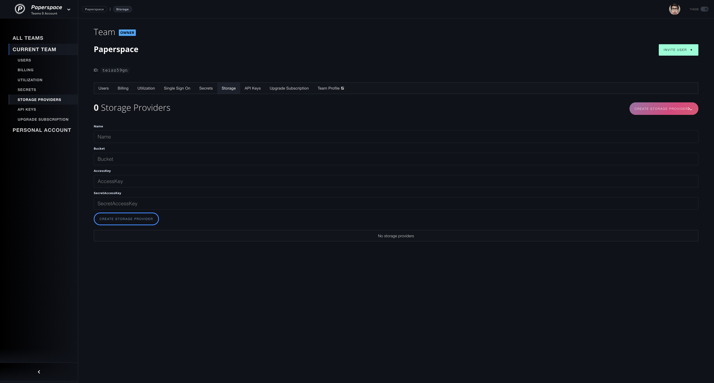

# Storage Providers

Storage providers are a way to connect storage to Gradient. Gradient manages this storage provider to ensure that your is data verified and immutable. Gradient will create a folder with your Paperspace team handle at this storage provider.

**Supported types:**

* S3-compatible storage

## Setup a storage provider

A Storage Provider can be created on your team's setting's page.



#### CLI

A Storage Provider can also be created with the Gradient CLI

```text
$ gradient storageProviders create s3 --name test --bucket my-bucket --accessKey=access-key --secretAccessKey=secret-key
Created storage provider: splgct3arqdh77c
```

