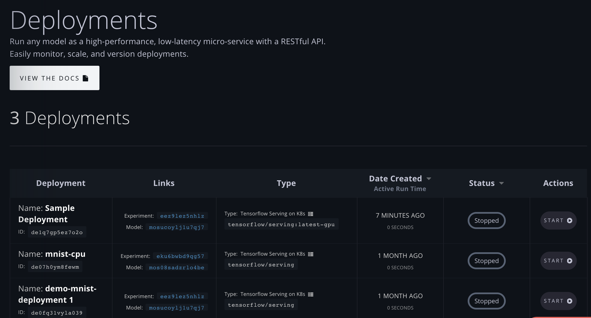

# Create & Manage Deployments via the GUI

In this section, we cover how to perform the following via the GUI:

1. [Create a Deployment](create-a-deployment-ui.md#starting-the-create-deployment-flow)
2. [Edit a Deployment](create-a-deployment-ui.md#edit-a-deployment)
3. [View, Start, & Stop a Deployment](create-a-deployment-ui.md#viewing-starting-and-stopping-deployments)

## Create a Deployment

### Starting the Create Deployment flow

To create a Deployment via the GUI, there are two pathways to start the Create Deployment flow: **a\)** from a Model on the **Models** page; **b\)** from the **Deployments** page. Both of these pathways are shown below, after which we will step through the Create Deployment flow.

#### a\) From the Models page:

1. Navigate to your list of trained Models by clicking **Models** in the side nav.
2. Find the model you want to deploy, and click **Deploy Model**.

#### b\) From the Deployments page:

1. Navigate to your list of Deployments by clicking **Deployments** in the side nav.
2. Click **Create Deployment +**.

Using either of the above **a** or **b** approaches, will let you start the Create Deployment flow.

### Using the Create Deployment flow

Now that you've started the Create Deployment flow, let's walk through the various options and deploy your Model!

#### Choose a Model

If you started the flow via the Models page \(pathway **a** above\), you'll skip this step since you've already chosen a Model to deploy.

If you started the flow via the Deployments page \(pathway **b** above\), you'll first need to choose a Model by clicking the Model selector dropdown and selecting the Model you want to deploy.

#### Choose a Container

Select the base container that will support your trained model to run it as a continuous web service.

As both CPU & GPU serving are available, be sure to select the container corresponding to your selected machine type and what your Model was optimized for.

#### Choose a Machine

Select the GPU or CPU machine type to run your Deployment.

### Additional Input Parameters

#### Name

#### **Instance Count**

Select the number of instances to run the Deployment on.

Below we chose 3, meaning there will be 3x K80 GPU instances backing this Deployment. Automatic load balancing is provided for all multi-instance deployments.

#### **Command**

If applicable, choose a command to run at container launch.

_Note: for the Tensorflow/serving base container used here, the command to run the Deployment is unnecessary and thus disabled. This option can be changed when choosing a different base image to deploy on._

#### Creative Active Deployment

**Create Active Deployment** \(selected by default\) means that the Deployment will be created and then automatically run:

Alternately, if you don't want your Deployment to run automatically after it is created, you can click toggle **Create Inactive Deployment**:

_Note: You are only charged for Deployments when they are running._

#### Enable Basic Authentication

Since your Deployment will run as a continuous web service on the public internet, you may wish to require basic authentication on any requests to it. If so, be sure that **Enable Basic Authentication** is toggled _on_ and then enter a **username** and **password**:

Finally, now that your Deployment is configured, click **Create Deployment** to create it:

## Edit a Deployment

You can edit a Deployment's attributes, such as the underlying model, the Deployment's name, instance count, etc.


Although you can edit a running Deployment, changes to a running Deployment other than **name** will not take effect until that Deployment is Stopped and re-Started.


To edit a Deployment, navigate to the **Deployments** page, find the Deployment you want to edit, and click **Edit** in the Actions column:

This will launch the Edit Deployment flow, which is nearly the same as the Create Deployment flow. The differences are that the Edit Deployment flow will display the **Deployment ID**, the **Deployment Endpoint**, and will always allow you to **Choose a Model**; and it will _not_ display the **Create Active Deployment** toggle. \(If you want to edit and start a stopped Deployment, save your changes and then click **Start** back on the Deployments page.\)

Besides those differences, you can edit any of the other values of your Deployment just like you did in the Create Deployment flow.

When you are done and want to save your changes, click **Edit Deployment** at the bottom:

## View, Start, & Stop a Deployment

Navigating to the Deployments tab, you can see your list of Running and Stopped deployments. Here we have 3 Deployments:

Each Deployment has its own unique ID and is associated with the Experiment and Model it was created from. Click "Start" to launch the Deployment. A Running Deployment and its details \(found by clicking the row\) will appear as follows:

Each Deployment has its own unique RESTful API. Inference can be performed via the shown endpoint: `https://services.paperspace.io/model-serving/<your-model-id>:predict`.

The number of running instances and the instance count are visible as well.

Congrats, you've created a Deployment and can perform inference!

[Learn more about a Deployment's RESTful API here](deployment-restful-api.md).

