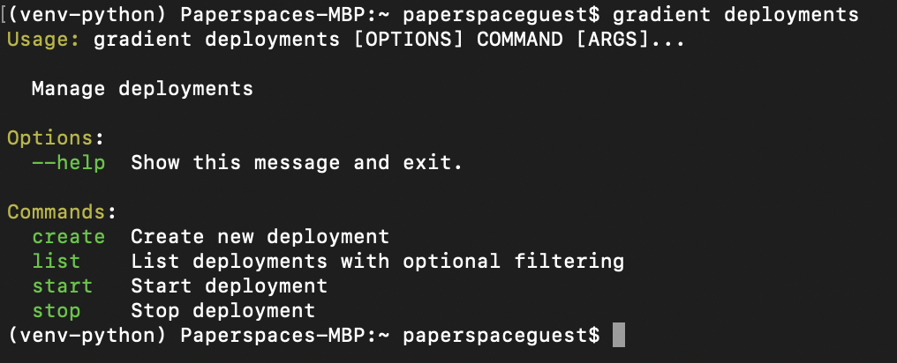
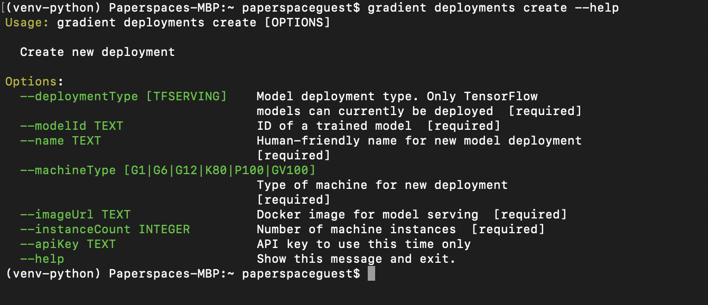
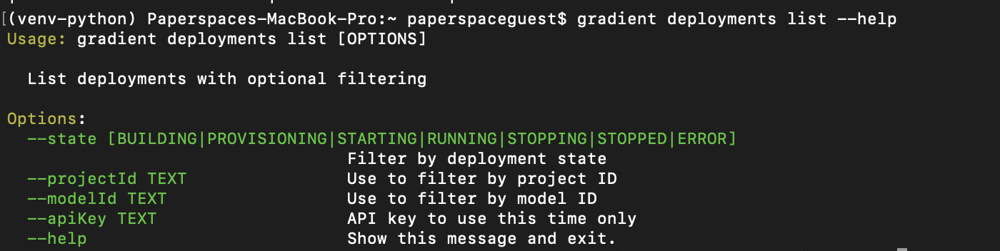
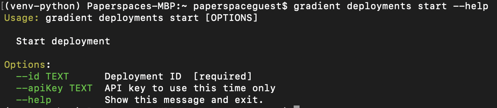
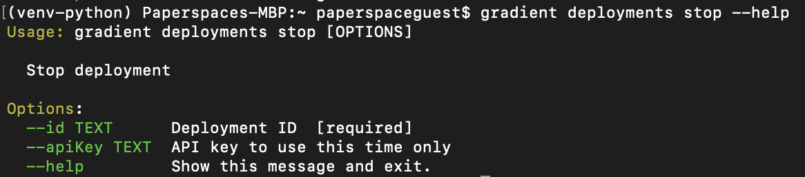

# Create a Deployment via the CLI

Make sure you have the CLI installed as outlined here: [https://docs.paperspace.com/gradient/get-started/install-the-cli](https://docs.paperspace.com/gradient/get-started/install-the-cli). 

The gradient cli contains the following options for deployments: create, list, start, stop. Get access to this by typing the following. You can always get help for a particular command by appending --help

```text
gradient deployments
```



#### gradient deployments create

This creates a brand new deployment, requiring you to already have a model saved via running an experiment. Specify all of the following parameters \(the deployment type, the base image, the name, the machine type, the container image for serving along with the instance count.  



A sample workflow to create the same deployment as in the UI example would be to run the following once you have your api key saved

```text
#get list of models & select 1 for deployment
gradient models list
```

```text
gradient deployments create \
    --deploymentType TFServing \
    --modelId [your-model-id] \
    --name "Sample Model"
    --machineType K80
    --imageUrl tensorflow/serving:latest-gpu
    --instanceCount 2
```

#### gradient deployments list

List deployments with optional filtering



For example, to view all running deployments in your team

```text
gradient list --state RUNNING
```

#### gradient deployments start

Start a previously created but inactive deployment by id



```text
gradient deployments start --id [deployment-id]
```

#### gradient deployments stop

Stop a active deployment by id



```text
gradient deployments stop --id [deployment-id]
```

