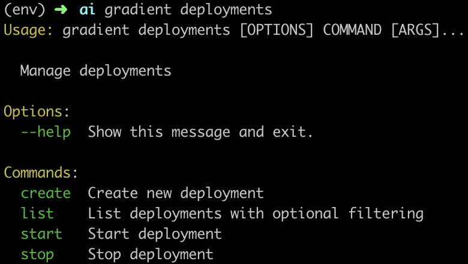
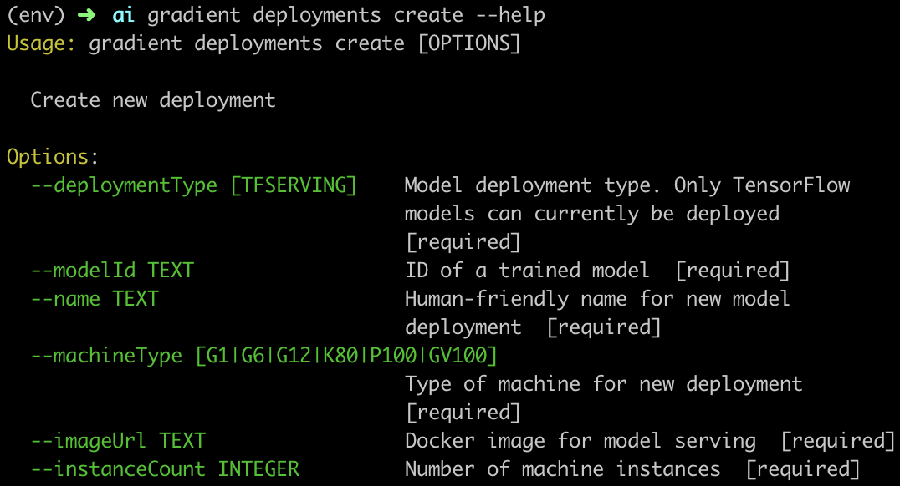
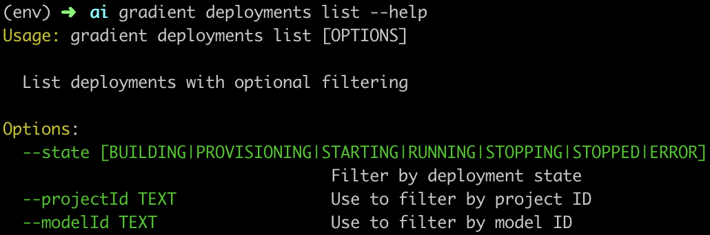
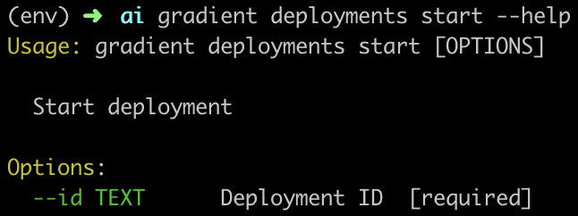
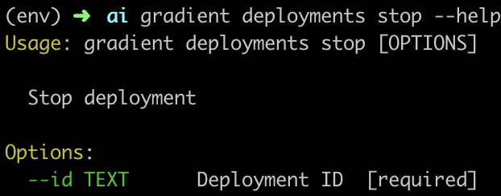

# Create a Deployment \(CLI\)

To create Deployments from the CLI, be sure first to [install the CLI](https://docs.paperspace.com/gradient/get-started/install-the-cli).

The Gradient CLI contains the following subcommands for Deployments: `create`, `list`, `start`, `stop`. You can always see the available subcommands simply by entering `gradient deployments`, and you can always learn more about any command by appending `--help` to it.

### Available Deployments Commands



### Create a Deployment

To create a new Deployment, you must first [create a Model](../models/create-a-model.md). With a Model available, use the `create` subcommand and specify all of the following parameters: deployment type, base image, name, machine type, and container image for serving, as well as the instance count:



A sample command to create the same Deployment as in the [UI example](create-a-deployment-ui.md) would be:

```text
gradient deployments create \
    --deploymentType TFServing \
    --modelId <your-model-id> \
    --name "Sample Model"
    --machineType K80
    --imageUrl tensorflow/serving:latest-gpu
    --instanceCount 2
```

To obtain your Model ID, you can use the command `gradient models list` and copy the target Model ID from your available Models.

### List Deployments

To list your Deployments with optional filtering, use the `list` subcommand:



For example, to view all running deployments in your team, run:

```text
gradient list --state RUNNING
```

### Start a Deployment

To start a previously created but Stopped deployment by ID, use the `start` subcommand:



```text
gradient deployments start --id <your-deployment-id>
```

### Stop a Deployment

To stop a Running deployment by ID, use the `stop` subcommand:



```text
gradient deployments stop --id <your-deployment-id>
```

