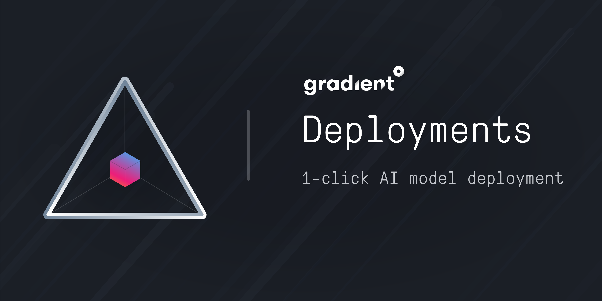

# Deployments


 Note: Gradient Deployments are still in BETA. During the Beta period we do not recommend running mission-critical services. Additionally, API endpoints could be renamed/updated and there are certain restrictions placed on accounts. Learn more about restrictions below


## Overview

Deployments take a pretrained model and expose them as a persistent service at a known URI.

## Creating a Deployment

Deployments can be created through the web console. Deployments can be found under the `Deployments` tab of any Project. A list of all deployments across projects can be found in the `Deployments` tab on the sidebar. 


 Gradient Deployments are not yet supported in the CLI, but we plan to add that functionality.


## Current Limitations

During the Beta period, Gradient Deployments have a number of restrictions.

* Teams are limited to a single running deployment. 
* Only K80 and CPU nodes are supported.
* The exposed endpoint URI is subject to change.
* Billing for deployments is not currently enabled. You will not see Gradient Deployments on your invoice.

## Deployment States

Deployments go through a series of states. They are enumerated here:

| ID | Name |
| :--- | :--- |
| 1 |  `Building`  |
| 2 | `Provisioning` |
| 3 | `Starting` |
| 4 | `Running` |
| 5 | `Stopping` |
| 6 | `Stopped` |
| 7 | `Error` |

