# Managing Deployments

## Create a Deployment



### The Create Deployment flow

To create a Deployment via the UI, there are two pathways to start the Create Deployment flow: **a\)** from a Model on the **Models** page; **b\)** from the **Deployments** page. Both of these pathways are shown below, after which we will step through the Create Deployment flow.

#### a\) From the Models page:

1. Navigate to your list of trained Models by clicking **Models** in the side nav.
2. Find the model you want to deploy, and click **Deploy Model**.

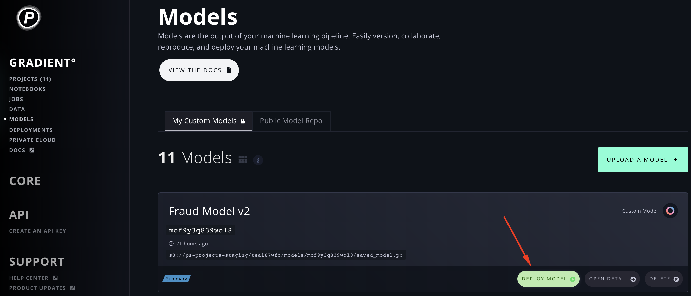

#### b\) From the Deployments page:

1. Navigate to your list of Deployments by clicking **Deployments** in the side nav.
2. Click **Create Deployment +**.

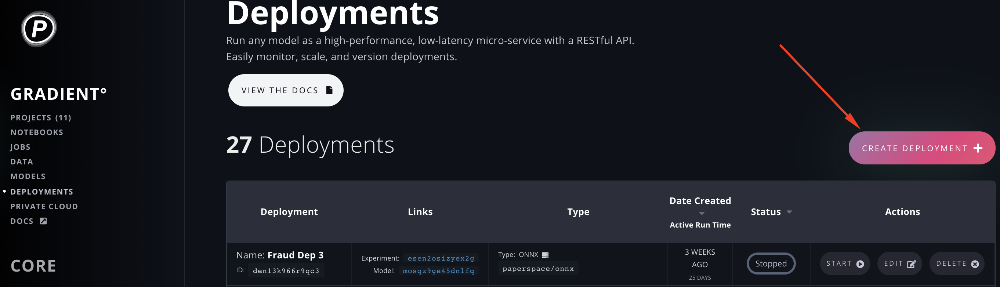

Using either of the above **a** or **b** approaches, will let you start the Create Deployment flow.

### Using the Create Deployment flow

Now that you've started the Create Deployment flow, let's walk through the various options and deploy your Model!

#### Choose a Model

If you started the flow via the Models page \(pathway **a** above\), you'll skip this step since you've already chosen a Model to deploy.

If you started the flow via the Deployments page \(pathway **b** above\), you'll first need to choose a Model by clicking the Model selector dropdown and selecting the Model you want to deploy.

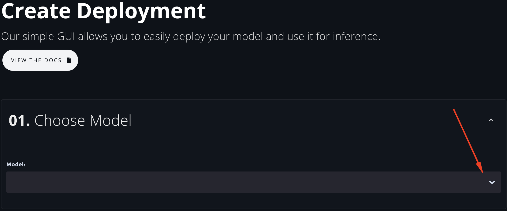

#### Choose a Container

Select the base container that will support your trained model to run it as a continuous web service. As both CPU & GPU serving are available, be sure to select the container corresponding to your selected machine type and what your Model was optimized for.

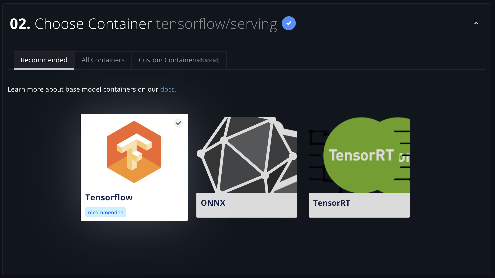

#### Choose an instance type

Select the GPU or CPU machine type to run your Deployment.

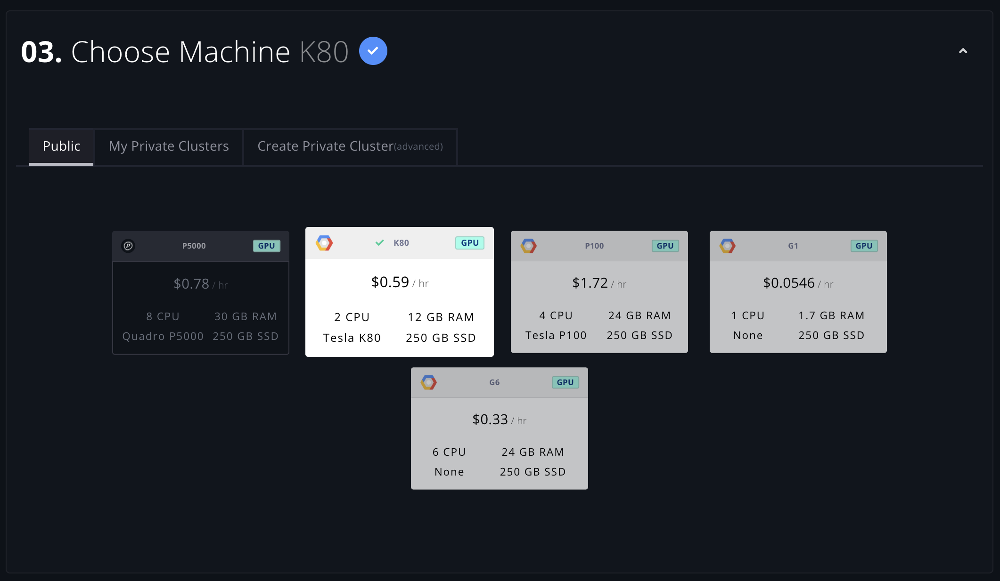

### Additional Input Parameters

#### Name

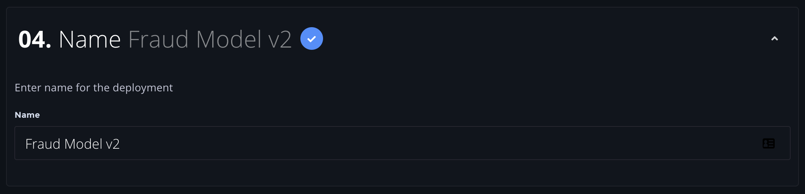

#### **Instance Count**

Select the number of instances to run the Deployment on.  Below we chose 3, meaning there will be 3x K80 GPU instances backing this Deployment. Automatic load balancing is provided for all multi-instance deployments.

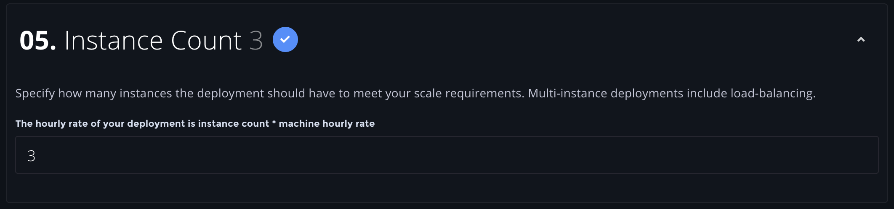

#### **Command**

If applicable, choose a command to run at container launch.


**Note:** for the Tensorflow/serving base container used here, the command to run the Deployment is unnecessary and thus disabled. This option can be changed when choosing a different base image to deploy on_._


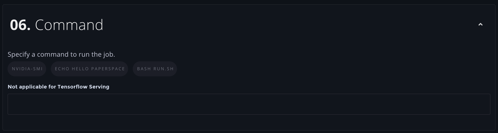

#### Creative Active Deployment

**Create Active Deployment** \(selected by default\) means that the Deployment will be created and then automatically run:


Alternately, if you don't want your Deployment to run automatically after it is created, you can click toggle **Create Inactive Deployment**:



**Note:** You are only charged for Deployments when they are running.


#### Enable Basic Authentication

Since your Deployment will run as a continuous web service on the public internet, you may wish to require basic authentication on any requests to it. If so, be sure that **Enable Basic Authentication** is toggled _on_ and then enter a **username** and **password**:

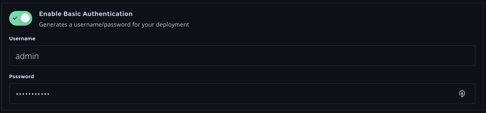

Finally, now that your Deployment is configured, click **Create Deployment** to create it:





To create a new Deployment, you must first [create a Model](../../models/create-a-model/). With a Model available, use the `create` subcommand and specify all of the following parameters you need to deploy your model.  Here's a sample command to create the same Deployment as in the [UI example]() would be:

```bash
gradient deployments create \
    --deploymentType TFServing \
    --modelId <your-model-id> \
    --name "Sample Model"
    --machineType K80
    --imageUrl tensorflow/serving:latest-gpu
    --instanceCount 2
```

To obtain your Model ID, you can use the command `gradient models list` and copy the target Model ID from your available Models.



## View, Start, & Stop a Deployment



Since Deployments are continuous web services, they can be in multiple states, including _Provisioning_, _Provisioned_, _Running_, _Stopped_, and _Error_.

Navigate to the **Deployments** page in the side nav to see your list of Deployments:

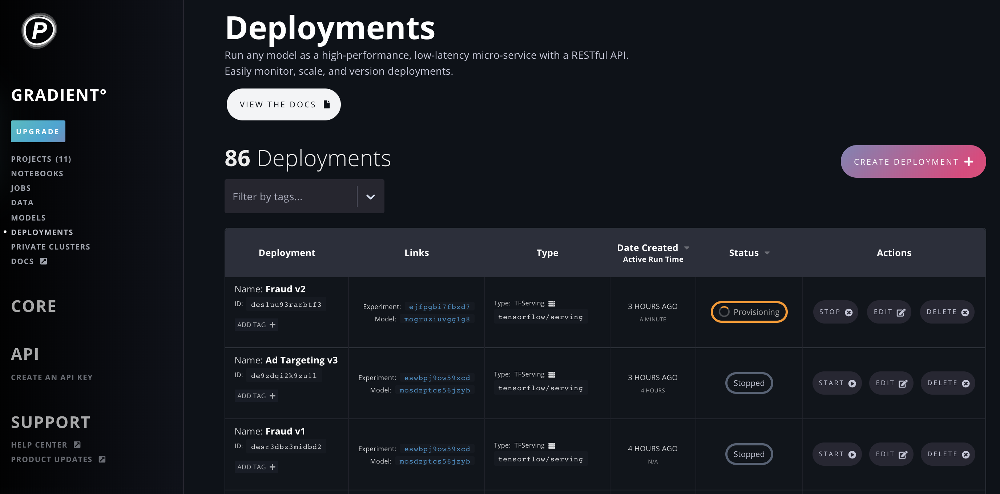

Each Deployment has: a **Name** and a unique **ID**; links to its associated **Experiment** and **Model** \(by ID\) that it was created from; its **Container Type; Date Created; Status;** and **Actions** you can perform.

To start a _Stopped_ Deployment, click **Start** from among that Deployment's **Actions**. The Status will change to _Provisioning_ and, if all goes smoothly, will soon say _Running_. Learn more about [Deployment States](deployment-states.md).

Click the Deployment's row to show its details:

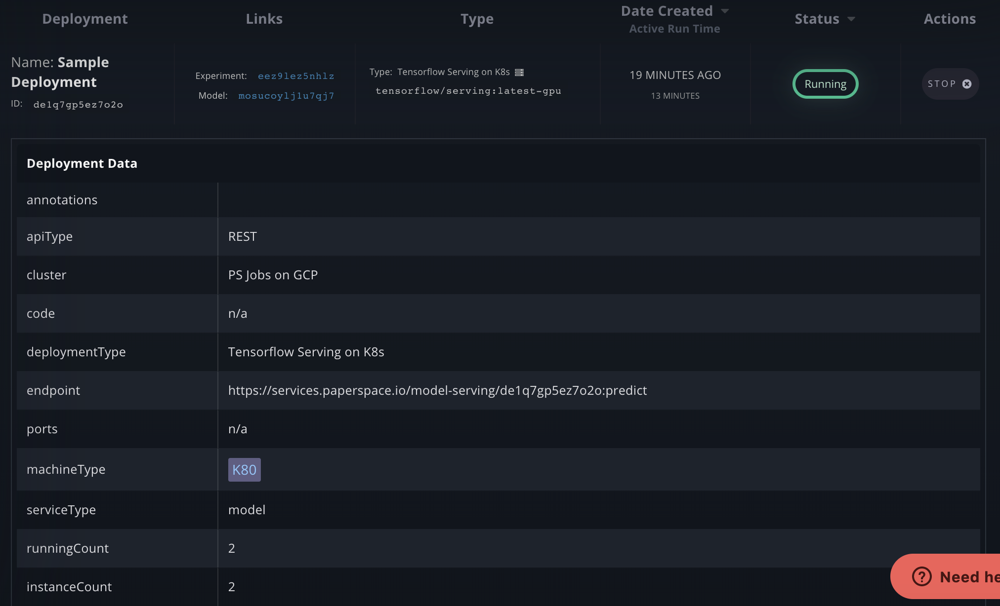

Each Deployment has its own unique RESTful API. Inference can be performed via the shown endpoint: `https://services.paperspace.io/model-serving/<your-model-id>:predict`.  The number of running instances and the instance count are visible as well.

Congrats, you've created a Deployment and can perform inference!

[Learn more about a Deployment's RESTful API here](deployment-restful-api.md).



## List Deployments

To list your Deployments with optional filtering, use the `list` subcommand:

```bash
  --state [BUILDING|PROVISIONING|STARTING|RUNNING|STOPPING|STOPPED|ERROR]
                                  Filter by deployment state
  --projectId TEXT                Use to filter by project ID
  --modelId TEXT                  Use to filter by model ID
  --apiKey TEXT                   API key to use this time only
  --optionsFile PATH              Path to YAML file with predefined options
  --createOptionsFile PATH        Generate template options file
  --help                          Show this message and exit.
```

For example, to view all running Deployments in your team, run:

```bash
gradient list --state RUNNING
```

## Start a Deployment

To start a previously created but Stopped deployment by ID, use the `start` subcommand:

```bash
gradient deployments start --id <your-deployment-id>
```

## Stop a Deployment

To stop a _Running_ Deployment by ID, use the `stop` subcommand:

```bash
gradient deployments stop --id <your-deployment-id>
```



## Edit a Deployment



You can edit a Deployment's attributes, such as the underlying model, the Deployment's name, instance count, etc.


Changes to a running Deployment other than **name** are not possible when the Deployment is running.


To edit a Deployment, navigate to the **Deployments** page, find the Deployment you want to edit, and click **Edit** in the Actions column:

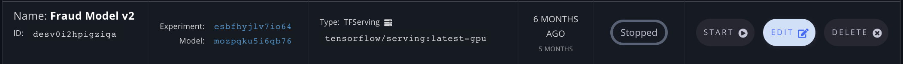

This will launch the Edit Deployment flow, which is nearly the same as the Create Deployment flow. The differences are that the Edit Deployment flow will display the **Deployment ID**, the **Deployment Endpoint**, and will always allow you to **Choose a Model**; and it will _not_ display the **Create Active Deployment** toggle. \(If you want to edit and start a stopped Deployment, save your changes and then click **Start** back on the Deployments page.\)

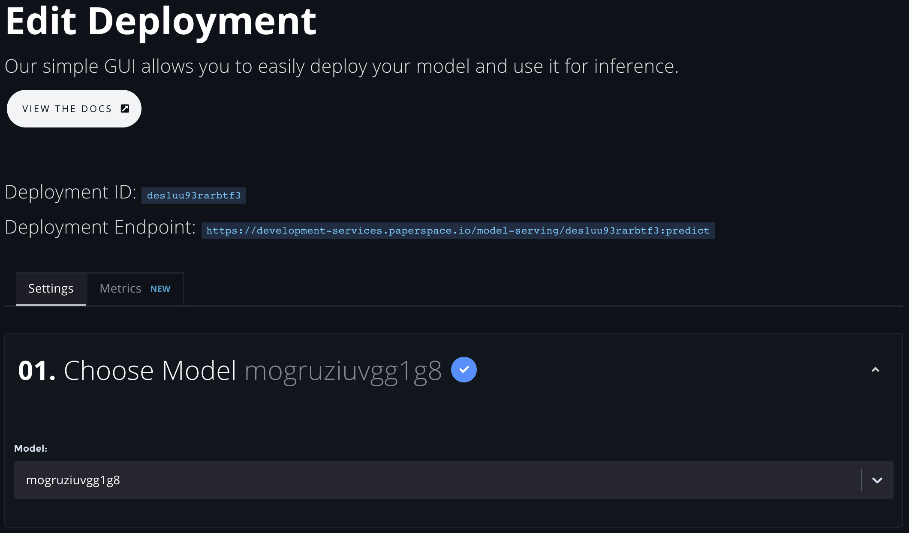

Besides those differences, you can edit any of the other values of your Deployment just like you did in the Create Deployment flow.

When you are done and want to save your changes, click **Edit Deployment** at the bottom:

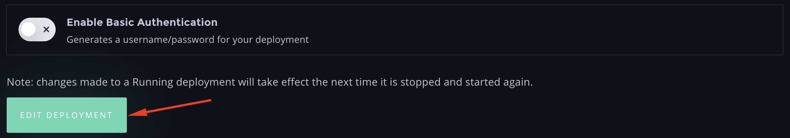



To update a Deployment, use the `update` subcommand:

```bash
gradient deployments update --id <your-deployment-id>
```

All Deployment options can be updated with this command: 

```bash
Options:
  --id TEXT                       ID of existing deployment
                                  [required]
  --deploymentType [TFServing|ONNX|Custom|Flask|TensorRT]
                                  Model deployment type
  --modelId TEXT                  ID of a trained model
  --name TEXT                     Human-friendly name for new model deployment
  --machineType TEXT              Type of machine for new deployment
  --imageUrl TEXT                 Docker image for model serving
  --instanceCount INTEGER         Number of machine instances
  --containerModelPath TEXT       Container model path
  --imageUsername TEXT            Username used to access docker image
  --imagePassword TEXT            Password used to access docker image
  --imageServer TEXT              Docker image server
  --containerUrlPath TEXT         Container URL path
  --endpointUrlPath TEXT          Endpoint URL path
  --method TEXT                   Method
  --dockerArgs JSON_STRING        JSON-style list of docker args
  --env JSON_STRING               JSON-style environmental variables map
  --apiType TEXT                  Type of API
  --ports TEXT                    Ports
  --authUsername TEXT             Username
  --authPassword TEXT             Password
  --clusterId TEXT                Cluster ID
  --apiKey TEXT                   API key to use this time only
  --optionsFile PATH              Path to YAML file with predefined options
  --createOptionsFile PATH        Generate template options file
  --help                          Show this message and exit.
```



