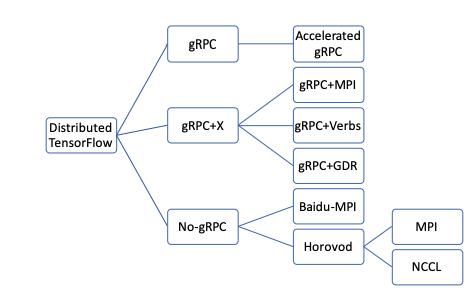

# Distributed Training

Gradient supports distributed training via two orchestration options: gRPC and Open-MPI to enable computation and communication at scale.

## What is gRPC?

gRPC is a modern, open source remote procedure call \(RPC\) framework that can run anywhere. It enables client and server applications to communicate transparently, and makes it easier to build connected systems. It is a generic point-to-point communication library and has no collective communication support. It works in a simple client/server style fashion and has been tightly integrated with [Tensorflow](https://www.tensorflow.org/) and Gradient.

You can learn how to launch and execute distributed experiment using Gradient and gRPC with Tensorflow.  



## What is MPI - [Message Passing Interface](http://www.mpi-forum.org/)

MPI stands for the Message Passing Interface. Written by the MPI Forum \(a large committee comprised of a cross-section between industry and research representatives\), MPI is a standardized API typically used for parallel and/or distributed computing.

All MPI specifications documents can be downloaded from the official MPI Forum web site: [http://www.mpi-forum.org/](http://www.mpi-forum.org/).

Message Passing Interface \(MPI\) is a de facto standard for  expressing distributed-memory programs. Several implementations of the MPI standard like MPICH, MVAPICH, OpenMPI  and CrayMPI have been developed and optimized over the period of several years for various processor architectures and high-performance interconnects like High-speed Ethernet \(HSE\) and InfiniBand. 

[Open MPI](https://www.open-mpi.org/) is an open source, freely available implementation of the MPI specifications. The Open MPI software achieves high performance and reliability and is used by a number of frameworks like [Tensorflow](https://www.tensorflow.org/), [Pytorch](https://pytorch.org/), [XGBoost](https://xgboost.ai/), [ChainerMN](https://docs.chainer.org/en/stable/chainermn/), [Horovod](https://github.com/horovod/horovod) and others.



