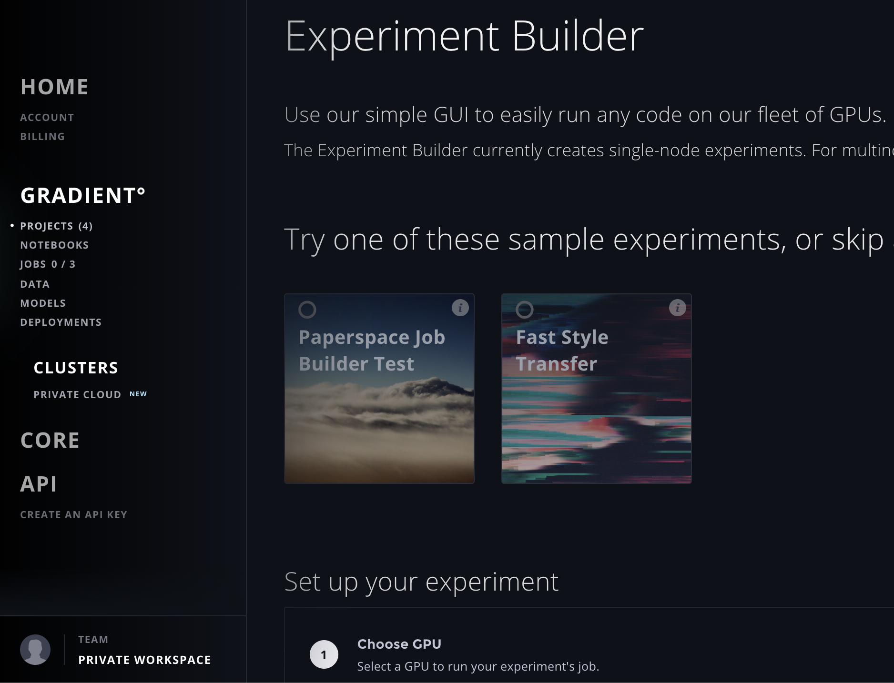

# Run Experiments from the UI

### Experiment Builder: A GUI for Running Single-Node Experiments 

You can run Experiments in Gradient without ever leaving your web browser! The Experiment Builder is a great way to learn more about how Experiments are structured, and you can easily run your first GPU-based Experiment on Gradient without writing a single line of code!

The Experiment Builder is very similar to our Job Builder that you may be familiar with, but it allows you to create Experiments in the context of a Project. Experiments created using the Builder are currently limited to creating single-node jobs.

### Run an Experiment Using the Builder 

To run an Experiment using the Builder:

1. Once logged in, navigate to Projects at [https://www.paperspace.com/console/projects](https://www.paperspace.com/console/projects);
2. Create a Project;
3. Click that Project in the list;
4. In the resulting Project Details view, click the "Create Experiment" button at the right.

You'll now have arrived at the Experiment Builder, so you can click the "Fast Style Transfer" example experiment. The default parameters are filled in below automatically; check those out to familiarize yourself with the default parameters:

**Machine Type.** What type of instance to run your Experiment's job on. We recommend starting with a GPU+. Many Experiments benefit from a machine with a GPU, but some can run just using a CPU.

**Container.** Experiments are run within a docker container. You can run a public or private container. Learn more [here](https://support.paperspace.com/hc/en-us/articles/360003415434).

**Workspace.** The workspace is the collection of code that is run. It can be a Git repository \(public or private\), your local working directory \(if you are using the CLI\) which is uploaded to the docker container during the job running process, or `none` \(default value\).

**Command.** The command is the entry point to the container. This is the line of code that will kick off your experiment's job. It could be a bash script `./run.sh` or `python main.py` as just some examples. 

**Ports.** You have the option to attach a public IP automatically. Supports opening multiple ports simultaneously, separated by `:` . Learn more about opening ports [here](https://support.paperspace.com/hc/en-us/articles/360003412574).

**Custom Metrics.** Enter a list of custom metrics to use with Gradient's statd client, such as `percent_failure` or `percent_success`.

Once you have examined or specified the parameters, hit "Submit Experiment" to create your Experiment, and watch the Experiment's job run!

