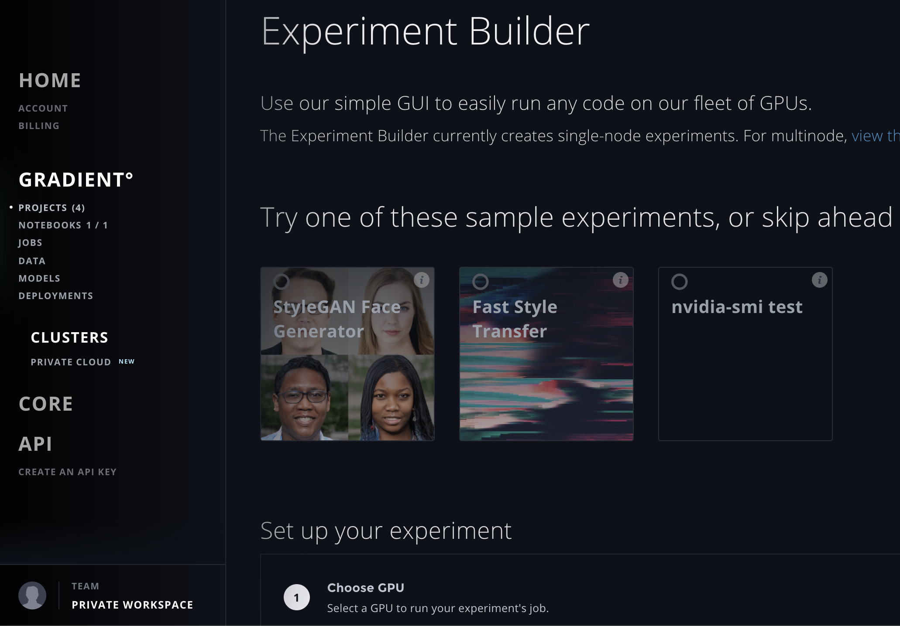

# Using Experiments

## Experiment Modes

There are three modes for Experiments:

**Single-node:** An Experiment that runs on a single compute instance.  This option is very simple and is available in the web UI, CLI, and SDK.  

**Multi-node**: Run a distributed training Experiment on more than one compute instance. This option is more advanced and is available in the CLI and SDK only. You can view examples here and the .

\*\*\*\*[**Hyperparameter Search**](../hyperparameters.md): Run a search using multiple instances.  This is an advanced option and is available in the CLI and SDK only. 

## Creating Experiments



#### Experiment Builder: An interface for Running Single-Node Experiments

You can run Experiments in Gradient without ever leaving your web browser! The Experiment Builder is a great way to learn more about how Experiments are structured, and you can easily run your first GPU-based Experiment on Gradient without writing a single line of code!

The Experiment Builder is very similar to our Job Builder that you may be familiar with, but it allows you to create Experiments in the context of a Project. Experiments created using the Builder are currently limited to creating single-node jobs.



### Run an Experiment Using the Builder <a id="h_39323868261524588004147"></a>

To run an Experiment using the Builder:

1. Once logged in, navigate to Projects at [https://www.paperspace.com/console/projects](https://www.paperspace.com/console/projects)
2. Select an existing Project or [create a new Project](../../projects/managing-projects.md#create-a-standalone-project)
3. In the Project Details view, click the "Create Experiment"

You'll now have arrived at the Experiment Builder, so you can click the "Fast Style Transfer" example experiment. The default parameters are filled in below automatically; check those out to familiarize yourself with the default parameters:

* **Machine Type.** What type of instance to run your Experiment's job on. We recommend starting with a GPU+. Many Experiments benefit from a machine with a GPU, but some can run just using a CPU.
* **Container.** Experiments are run within a docker container. You can run a public or private container. Learn more [here](https://support.paperspace.com/hc/en-us/articles/360003415434). 
* **Workspace.** The workspace is the collection of code that is run. It can be a Git repository \(public or private\), your local working directory \(if you are using the CLI\) which is uploaded to the docker container during the job running process, or `none` \(default value\). 
* **Command.** The command is the entry point to the container. This is the line of code that will kick off your experiment's job. It could be a bash script `./run.sh` or `python main.py` as just some examples. 
* **Ports.** You have the option to attach a public IP automatically. Supports opening multiple ports simultaneously, separated by `:` . Learn more about opening ports [here](https://support.paperspace.com/hc/en-us/articles/360003412574). 
* **Custom Metrics.** Enter a list of custom metrics to use with Gradient's statd client, such as `percent_failure` or `percent_success`.

Once you have examined or specified the parameters, hit "Submit Experiment" and watch the Experiment run!



The Gradient CLI enables you to run experiments manually and programmatically from your command line for maximum flexibility.  Once you have the [CLI installed](../../get-started/install-the-cli.md), use the alias `gradient` plus any further commands you wish to run.

Note that you can use the `--help` option at any time to reveal information in your terminal about the current command you wish to use. Alternately, if you simply try to run a command, the CLI will prompt you for additional subcommands that you may be intending to use, as well as required options that are missing from your command.

```bash
Usage: gradient [OPTIONS] COMMAND [ARGS]...

Options:
  --help  Show this message and exit.

Commands:
  apiKey           Save your api key
  deployments      Manage deployments
  experiments      Manage experiments
  hyperparameters  Manage hyperparameters
  jobs             Manage gradient jobs
  logout           Log out / remove apiKey from config file
  machines         Manage machines
  models           Manage models
  projects         Manage projects
  run              Run script or command on remote cluster
  version          Show the version and exit
```

## Running experiments

For programmatic use of the CLI, there is the `create` command, which simply creates an experiment in a target project, with the specified options.

Alternately, for more interactive use of the CLI, there is `run`, which allows you to both create and automatically start an experiment with one command. With this command, logs will automatically stream once the experiment has been created and started.

There are separate subcommands `singlenode` and `multinode` experiments.

```bash
gradient experiments run singlenode --help
Usage: gradient experiments create singlenode [OPTIONS]

gradient experiments run multinode --help
Usage: gradient experiments create multinode [OPTIONS]
```

### Creating a single-node experiment using the CLI

The following command creates and starts a single-node experiment called `singleEx` and places it within the Gradient Project identified by the `--projectId` option. 

```bash
gradient experiments run singlenode \
  --projectId <your-project-id> \
  --name singleEx \
  --experimentEnv "{\"EPOCHS_EVAL\":5,\"TRAIN_EPOCHS\":10,\"MAX_STEPS\":1000,\"EVAL_SECS\":10}" \
  --container tensorflow/tensorflow:1.13.1-gpu-py3 \
  --machineType K80 \
  --command "python mnist.py" \
  --workspaceUrl https://github.com/Paperspace/mnist-sample.git \
  --modelType Tensorflow \
  --modelPath /artifacts
```


See more info about [model paths](../../models/create-a-model/model-path.md#default-paths) and their default values, including for if you want to deploy your models via Gradient Deployments.


To run this command substitute an existing project ID for &lt;your-project-id&gt;. You can get an existing project id by going to [your projects list](https://www.paperspace.com/console/projects) and creating a new project or opening an existing project and copying the Project ID value. You can also get a list of existing projects and their IDs from the command line using the command `gradient projects list`.

For more information about this sample experiment see the README in the mnist-sample github repo: [https://github.com/Paperspace/mnist-sample](https://github.com/Paperspace/mnist-sample). Note: the code for this experiment can be run in both singlenode and multi-node training modes.

### Creating a multi-node experiment using the CLI

The following command creates and starts a multi-node experiment called `multiEx` and places it within the Gradient Project identified by the `--projectId` option. 

```bash
gradient experiments run multinode \
  --name multiEx \
  --projectId <your-project-id> \
  --experimentType GRPC \
  --workerContainer tensorflow/tensorflow:1.13.1-gpu-py3 \
  --workerMachineType K80 \
  --workerCommand "python mnist.py" \
  --workerCount 2 \
  --parameterServerContainer tensorflow/tensorflow:1.13.1-gpu-py3 \
  --parameterServerMachineType K80 \
  --parameterServerCommand "python mnist.py" \
  --parameterServerCount 1 \
  --workspaceUrl https://github.com/Paperspace/mnist-sample.git \
  --modelType Tensorflow
```


Note: `--modelType Tensorflow` is will automatically parse and store the model's performance metrics and prepare it for [Deployment](../../deployments/about.md) with TensorFlow Serving.


To run this command substitute an existing project ID for &lt;your-project-id&gt;. You can get an existing project id by going to [your projects list](https://www.paperspace.com/console/projects) and creating a new project or opening an existing project and copying the Project ID value. You can also get a list of existing projects and their IDs from the command line using the command `gradient projects list`.

The command above specifies the use of the gRPC framework and names the same Docker container, machine type, and programmatic command for both the 2 workers and the 1 parameter server.

Finally, the command specifies the workspace to pull the Python script from as a public GitHub repository.

For more information about this sample experiment see the README in the mnist-sample GitHub repo: [https://github.com/Paperspace/mnist-sample](https://github.com/Paperspace/mnist-sample). \(Note: the code for this experiment can be run in both singlenode and multinode training modes.\)



## Viewing an Experiment



Open the Project that contains the Experiment:  


Then click on the Experiment to view information about it:





You can view an experiment details, you can use the following command:

```text
gradient experiments details
```



## Stop or Cancel an Experiment



To cancel an Experiment, click the Cancel button below the state indicator:


To Stop an Experiment, click the Stop button below the state indicator:





To stop an Experiment, you can use the following command:

```text
gradient experiments stop 
```



## Delete an Experiment



To Delete an Experiment, click the Stop button below the state indicator:





To delete an Experiment, you can use the following command:

```text
gradient experiments delete  
```




