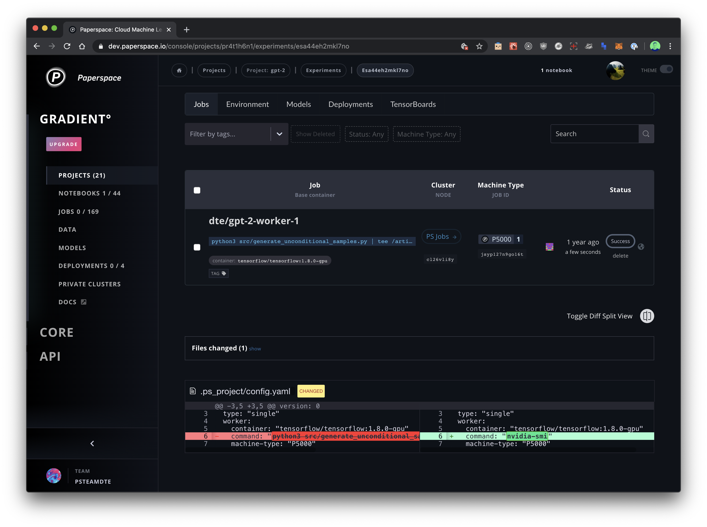
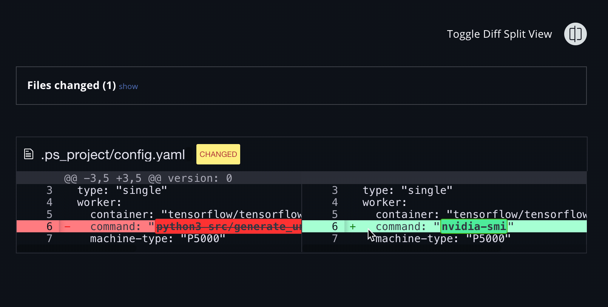

# Diff Viewer


**Note:** The diff viewer is currently only accessible in Experiments launched from [GradientCI](../../projects/gradientci-v2/).  We are investigating how to incorporate the this feature into Experments launched from local and remote code repositories using the web UI, CLI, or SDK. 


### How it works

The diff view helps you compare files, directories, and version controlled projects within Gradient. It provides two-way comparison of both files to make understanding code changes easier.

### Toggle side-by-side view

The Gradient Diff Viewer supports both "**side-by-side**" and "**line-by-line**" visual representations. Toggle between the two with the toggle button as seen in the animation below:

