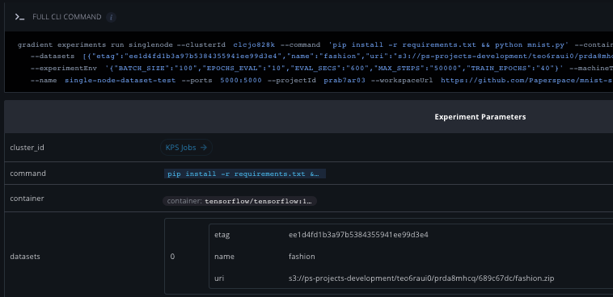

# Experiment datasets

## About

When executing an experiment in Gradient you may optionally supply one or more datasets that will be downloaded into your experiment's environment prior to execution. These datasets can be downloaded from an S3 object or folder \(including the full bucket\). Gradient allows teams to run reproducible machine learning experiments by taking advantage of S3 ETags and Version IDs, which combine to allow you to be sure that datasets exactly match between training sets, and to be sure which version of a dataset you are using.

### S3 Datasets

Datasets are downloaded and mounted readonly on `/data/DATASET` within your experiment jobs using the supplied AWS credentials. The credentials are optional for public buckets. The name of the dataset is the `basename` of the last item in the s3 path, e.g. `s3://my-bucket/mnist.zip` would have the name `mnist` and `s3://my-bucket` would have the name `my-bucket`. The name maybe overridden with the optional `name` parameter.

```text
datasets: [
    {
        "uri": "s3://my-bucket/mnist-modified.zip",
        "awsSecretAccessKey": "<KEY>",
        "awsAccessKeyId": "<ID>",
        "name": "mnist",
    },
]
```



You can launch an experiment & specify the desired S3 dataset with e-tags using the CLI as follows.

```text
$ gradient experiments run singlenode 
--projectId prda8mhcq 
--workspace https://github.com/Paperspace/mnist-sample.git
... 
--datasetAwsAccessKeyId <id> 
--datasetAwsSecretAccessKey <key>
--datasetName fashion
--datasetUri s3://my-bucket-name/fashion-mnist.zip 

```



```
env = {
        "EPOCHS_EVAL":"10",
        "TRAIN_EPOCHS":"40",
        "MAX_STEPS":"50000",
        "EVAL_SECS":"600",
        "BATCH_SIZE":"100",
        
    }

single_node_parameters = { 
    "name": "dataset",
    "project_id": project,
    "container": "tensorflow/tensorflow:1.13.1-py3",
    "machine_type": "p2.xlarge",
    "command": "pip install -r requirements.txt && python mnist.py",
    "experiment_env": env,
    "workspace_url": "https://github.com/Paperspace/mnist-sample.git", #can be local directory, a git repo or commit, or s3 bucket
    "cluster_id" : cluster,
    "model_type" : "Tensorflow",
    "model_path" : "/artifacts",
    "datasets" : [{
         "uri": bucket,
         "aws_secret_access_key": os.getenv('ACCESS_KEY'),
         "aws_access_key_id": os.getenv('ACCESS_KEY_ID'),
         "etag": "ee1d4fd1b3a97b5384355941ee99d3e4",
         "name" : "fashion"
         }]
}

client.experiments.run_single_node(**single_node_parameters)
```



The datasets will show up in the web interface in the environment tab of the experiment you launch.



