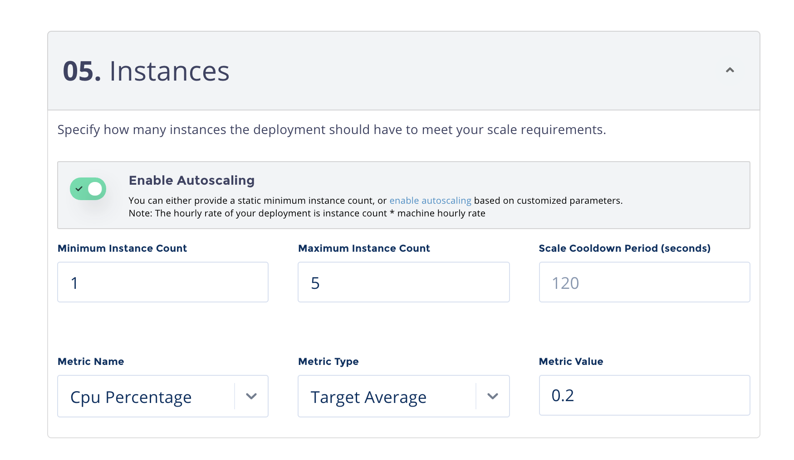

# Deployment Autoscaling

## Deployment Autoscaling 

To autoscale your Model Deployment, you can add autoscaling parameters to the deployment during update or create.



In the "Instances" section of the Deployment Create or Edit forms, you can toggle a switch to enable or disable autoscaling.  If disabled, you are required to provide a static instance count.  If enabled, you must provide minimum and maximum instance counts, as well as a metric name, type, and value to scale upon.  "Scale Cooldown Period" is optional and defaulted to 120 seconds.





```text
  --minInstanceCount TEXT         Minimal instance count
  --maxInstanceCount TEXT         Maximal instance count
  --scaleCooldownPeriod TEXT      Scale cooldown period
  --metric TEXT                   Autoscaling metrics. Example:
                                  my_metric/targetAverage:21.37

  --resource TEXT                 Autoscaling resources. Example:
                                  cpu/target:60
```

Example of autoscaling based on CPU resource set to 90% average utilization: 

```bash
gradient deployments create --deploymentType TFServing --modelId <ModelID> --name <name> --machineType c5.xlarge --minInstanceCount 1 --maxInstanceCount 5 --resource cpuPercentage/targetAverage:90 --imageUrl tensorflow/serving --instanceCount 1 ... 
```



### **Algorithm Details**

From the most basic perspective, the Model Deployment Autoscaler operates on the ratio between desired metric value and current metric value:  
  
Amount of replicas  = `currentReplicas` \* \(`currentMetricValue`/ `desiredMetricValue`\)  
  
For example, if the current metric value is 100, and the desired value is 50, the number of replicas will be doubled, since 100.0 / 50.0 == 2.0 If the current value is instead 25, we’ll halve the number of replicas, since 25 / 50 == 0.5. We’ll skip scaling if the ratio is sufficiently close to 1.0 \(within a globally-configurable tolerance, lets say 10%\).  
  
When a `targetAverage` is specified, the `currentMetricValue` is computed by taking the average of the given metric across all replicas in the Model Deployment Autoscaler’s scale target. Before checking the tolerance and deciding on the final values, we take pod readiness and missing metrics into consideration  
  
If a particular deployment pod replica is missing metrics, it is set aside for later. Deployment replicas with missing metrics will be used to adjust the final scaling amount.

