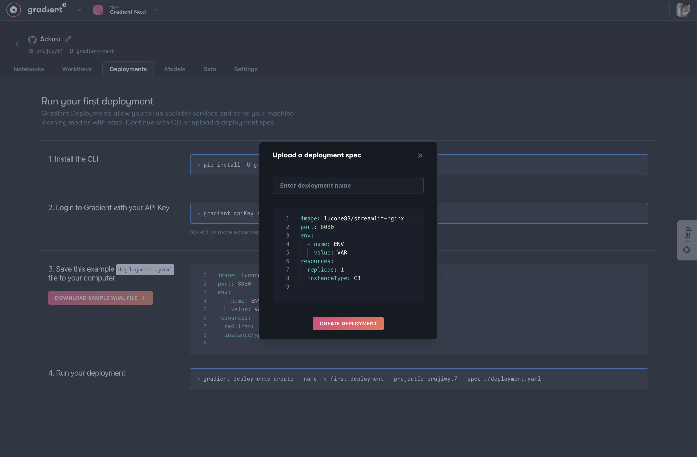
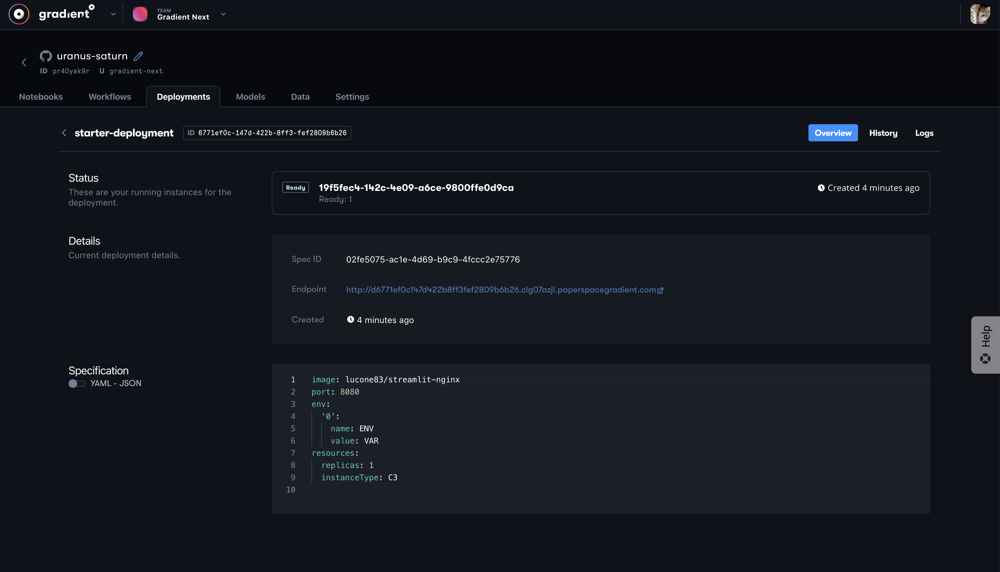
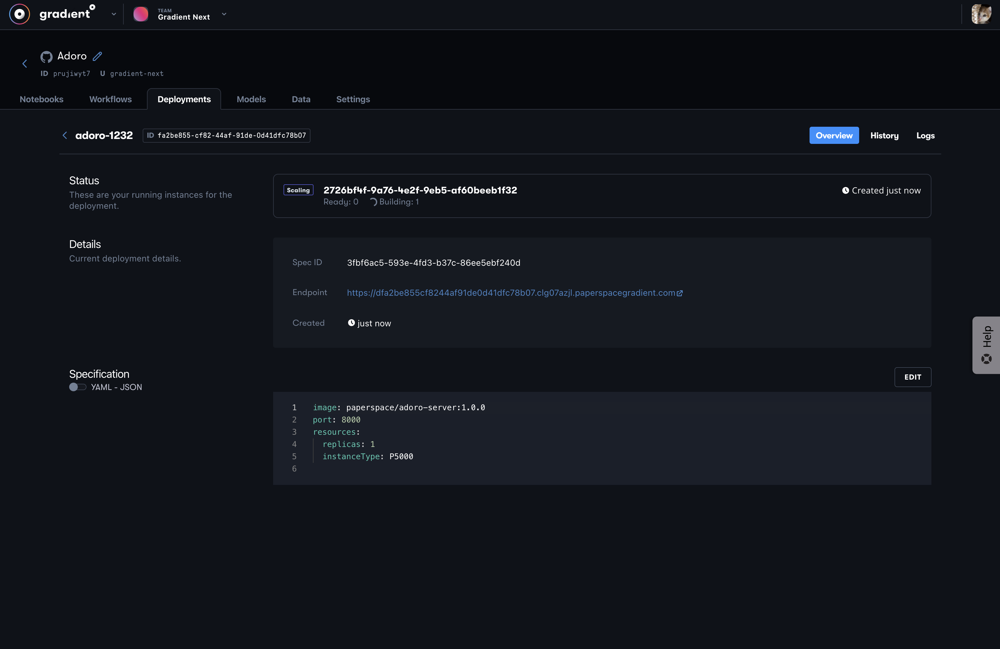

# Getting started with Deployments

## Create a deployment

You can create deployments using the[ Gradient CLI](../../get-started/quick-start/install-the-cli.md) and linking an API key. You will also need an existing project to run your deployment.

### Web UI



### Gradient CLI

#### 1. Create a YAML spec to manage your deployment

```yaml
image: lucone83/streamlit-nginx
port: 8080
env:
  - name: ENV
    value: VAR
resources:
  replicas: 1
  instanceType: C3
```

#### 2. Start a deployment

```bash
gradient deployments create --name [deployment-name] --projectId [project-id] --spec deployment.yaml
```

#### 3. View your running deployments and logs

You can view your running deployment in the console UI, which will information on the current spec applied and the current status of your deployment. 



You can also see the status of your deployment via the CLI

```text
gradient deployments get --id [deployment-id]

{
    "id": "6771ef0c-147d-422b-8ff3-fef2809b6b26",
    "name": "starter-deployment",
    "deploymentSpecs": [
        {
            "id": "02fe5075-ac1e-4d69-b9c9-4fccc2e75776",
            "data": {
                "image": "lucone83/streamlit-nginx",
                "port": 8080,
                "resources": {
                    "instanceType": "C3",
                    "replicas": 1
                },
                "command": null,
                "env": [
                    {
                        "name": "ENV",
                        "value": "VAR"
                    }
                ],
                "models": null
            },
            "endpointUrl": "d6771ef0c147d422b8ff3fef2809b6b26.clg07azjl.paperspacegradient.com",
            "actor": {
                "avatarUrl": "https://s3.amazonaws.com/ps.profile.images/profileImages/production/te7molbs/2020-08-03T15%3A09%3A11.236Z.png",
                "fullName": null
            },
            "cluster": {
                "id": "clg07azjl"
            },
            "deploymentRuns": [
                {
                    "id": "19f5fec4-142c-4e09-a6ce-9800ffe0d9ca",
                    "availableReplicas": 1,
                    "readyReplicas": 1,
                    "replicas": 1,
                    "deploymentRunInstances": [
                        {
                            "id": "0831f045-a876-4b99-b60c-ce2b653b2825",
                            "phase": "Running",
                            "dtStarted": "2021-09-21T17:47:36.000Z",
                            "dtFinished": null
                        }
                    ]
                }
            ]
        }
    ]
}
```

## Scaling your deployments

You can manage the state of your deployment by updating your spec file and updating the deployment. To stop your deployment from running you can set the replicas to 0, which turn off all workloads. You are able to edit your deployment spec from the Web UI or using the Gradient CLI

### Web UI

You can clicked the edit button in the Web UI to update your deployment spec to change the number of desired replicas as well as the other parts of the spec.



### Gradient CLI

```text
gradient deployments update --id [deployment-id] --spec update-deployment.yaml
```

## Using deployments in a workflow

You can manage deployments in a workflow using the Gradient CLI. Your paperspace API key and project id are available as environment variables

```text
jobs:
  createdDeployment:
    uses: script@v1
    with:
      script: |
        cat > ./deployment.yaml <<EOF
        image: paperspace/first-order-model:server
        port: 8000
        resources:
          replicas: 1
          instanceType: P5000
        EOF
        gradient deployments create --name my-deployment --projectId ${PROJECT_ID} --spec ./deployment.yaml
      image: paperspace/gradient-sdk
```


