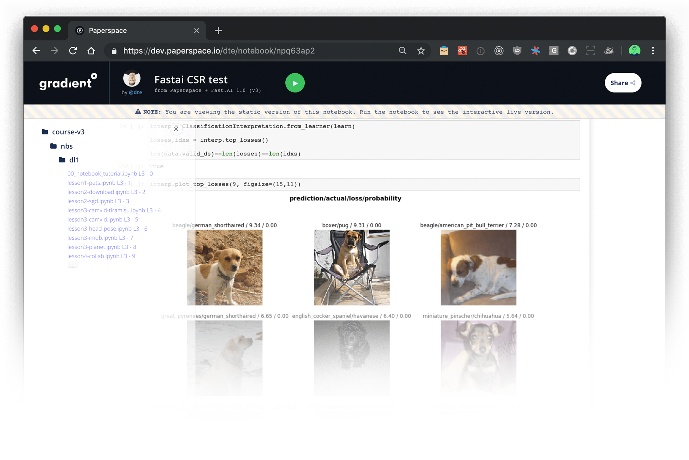

# Notebooks

## What is a Notebook?

Gradient notebooks are an interactive environment \(based on the open source [Jupyter project](https://jupyter.org/)\) for developing and running code. You can run Jupyter notebooks on CPU or GPU instances. 

A Gradient ****Notebook gives you access to a full Jupyter Notebook environment. Within the Notebook, you can store an unlimited number of documents and other files. You can think of a Gradient Notebook as your persistent, on-demand workspace in the cloud.


**NEW!**  Visit the new [ML Showcase](https://ml-showcase.paperspace.com/) for a list of sample projects you can fork into your own account.


## File Storage

Any data stored in `/storage` will be preserved for you across restarts. Persistent storage is backed by a filesystem and is ideal for storing data like images, datasets, model checkpoints etc.  Learn more about persistent storage [here](../../data/data-overview/#persistent-storage).

## Containers

Notebooks run within Docker containers behind the scenes. Gradient includes a handful of pre-built containers and you can easily use a custom container as well.  View the list of pre-built containers [here](create-a-notebook/notebook-containers/).

### Sharing Notebooks

You can easily generate a link to [share your Notebook](create-a-notebook/share-a-notebook.md) with friends and colleagues or the general public. Public Notebooks can be forked by others into their own account. To learn more about how Notebooks work, you can fork a public demo Notebook [here](https://console.paperspace.com/ps-dan/notebook/pr3k0bq87).  The [ML Showcase](https://ml-showcase.paperspace.com/) ****includes several working examples of projects you can run with a couple clicks \(project [submissions welcome](https://blog.paperspace.com/write-for-paperspace/)!\)

## Tutorial

View a quick tutorial on creating a notebook [here](../../get-started/tutorials-list/getting-started-with-gradient-notebooks-old.md).

