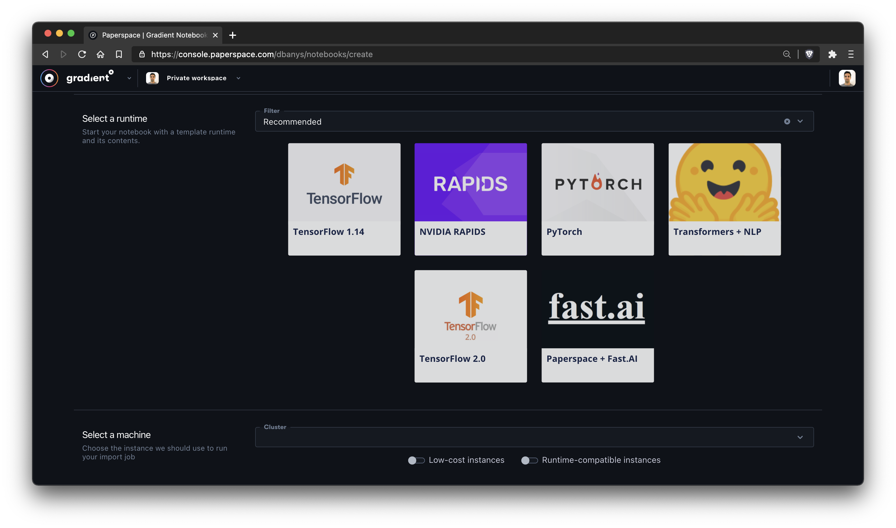
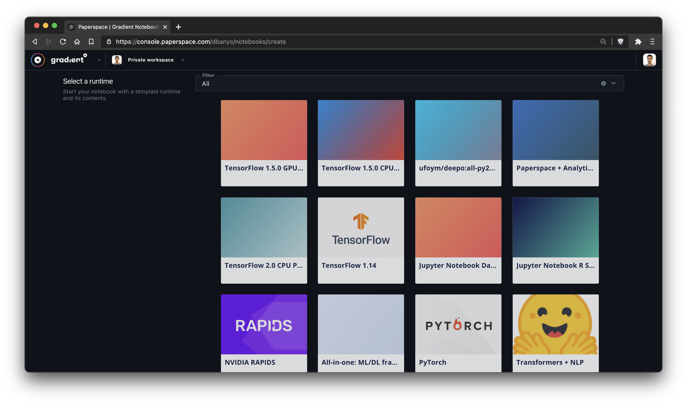
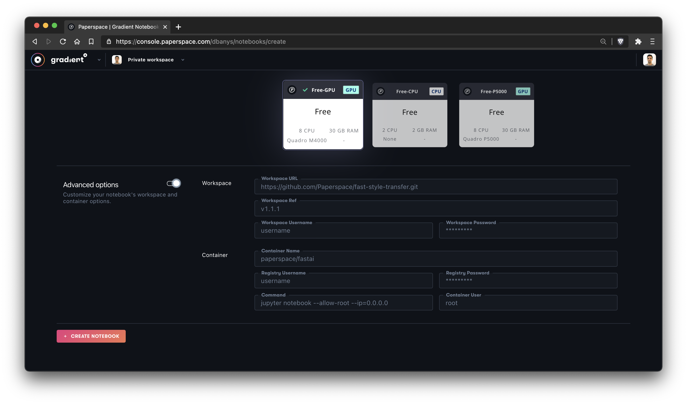

# Using Notebooks



## Create a Notebook



### Choose your Base Container

Notebooks can be created by clicking _Create Notebook _button on the Notebooks tab.  There are three types of base containers:

#### Recommended Containers (Basic)

These are the templates that are most popular on Gradient.  They include the most common ML frameworks and libraries.  [Click here](notebook-containers/) to discover which Notebook Base Container will best suit your use case, then choose it from the options below:



#### All Containers (Basic)

These are additional templates that are made available in Gradient as a 1-click option.  [Click here](notebook-containers/) to discover which Notebook Base Container will best suit your use case, then choose it from the options below:



#### Custom Containers (Advanced)

If you need to import an existing container, visit the Custom Containers section. Learn more [here](notebook-containers/).



### Choose the instance type

This is [instance type](../../../more/instance-types/) that your notebook will run on. Our hardware is configured to work with the tools and packages in each of the provided containers.

.png>)

### Optional Settings:

#### Name your Notebook

Provide a friendly name for your Notebook in the text field

#### Auto-shutdown

If you have a [Gradient subscription](https://gradient.paperspace.com/pricing), you will have the ability to set a custom auto-shutdown interval.&#x20;

**Workspace**

Additionally, you have the option to select a remote git repository to serve as the starting point for your Notebook.  If the repository is private, you need to provide access credentials (username and a password/apiKey). The password field supports subsitution using the `secret:` syntax. Also, you can provide an optional git ref that points to a specific version of the repository.

### Click Create

That's it! Your Notebook will start once it has been created 🚀

Once created, your Notebook will automatically start.  Just click _Open _and your Notebook will appear in a new browser tab.



## Create a Notebook

### Syntax

```bash
gradient notebooks create [options...]
```

### Notebook Parameters Basics

* Machine Type: Such as `--P100` or `--C7` or `--TPU`
* Container: Such as `--tensorflow/tensorflow:1.5.1-gpu`

### Example Use

```bash
Usage: gradient notebooks create \
    --name "my job" \
    --container "http://dockerhub.com/mycontainer" \
    --machineType "P5000" \
    --command "/paperspace/run.sh"
    --projectId "someProjectID"
```

## Notebook Parameters Complete List

| Argument            | Description                                                                                                                                                                                                                                                                                                                                                                                            |
| ------------------- | ------------------------------------------------------------------------------------------------------------------------------------------------------------------------------------------------------------------------------------------------------------------------------------------------------------------------------------------------------------------------------------------------------ |
| `name`              | Notebook name                                                                                                                                                                                                                                                                                                                                                                                          |
| `projectId`         | Project ID                                                                                                                                                                                                                                                                                                                                                                                             |
| `machineType `      | An optional machine type to run the job on: either 'GPU+', 'P4000', 'P5000', 'P6000', 'V100', 'K80', 'P100', or 'TPU'. \[Required]                                                                                                                                                                                                                                                                     |
| `container `        | A reference to a docker image in a public or private docker registry. Docker image repository references must be in lowercase and may include a tag and a hostname prefix followed by a slash; if committed the hostname defaults to that of the public Docker Hub registry. An example docker image reference: `docker.io/mynamespace/myimage:mytag`. A container name may be mixed case. \[Required] |
| `containerUser`     | Container user                                                                                                                                                                                                                                                                                                                                                                                         |
| `command`           | Command (executed as `/bin/sh -c 'YOUR COMMAND'`)                                                                                                                                                                                                                                                                                                                                                      |
| `clusterId`         | ID of the cluster to run the notebook.                                                                                                                                                                                                                                                                                                                                                                 |
| `registryUsername`  | Registry username                                                                                                                                                                                                                                                                                                                                                                                      |
| `registryPassword`  | Registry password. Supports secrets subsitution with `secret:` syntax                                                                                                                                                                                                                                                                                                                                  |
| `shutdownTimeout`   | Shutdown timeout in hours                                                                                                                                                                                                                                                                                                                                                                              |
| `isPreemptible`     | Use a preemptible instance type                                                                                                                                                                                                                                                                                                                                                                        |
| `tag`               | One or multiple tags that you want to add to&#xD; the notebook                                                                                                                                                                                                                                                                                                                                         |
| `workspace`         | S3 url or git repository. Directory uploads&#xD; are not yet supported`apiKey`                                                                                                                                                                                                                                                                                                                         |
| `workspacePassword` | Workspace password. Supports secrets subsitution with `secret:` syntax                                                                                                                                                                                                                                                                                                                                 |
| `workspaceRef`      | Git commit hash, branch name or tag                                                                                                                                                                                                                                                                                                                                                                    |
| `environment`       | Environment variables. Secret subsitution is preformed on environment variable with keys like `secret:`                                                                                                                                                                                                                                                                                                |
| `shutdownTimeout `  | Shutdown timeout in hours                                                                                                                                                                                                                                                                                                                                                                              |
| `apiKey`            | API key to use this time only                                                                                                                                                                                                                                                                                                                                                                          |





## Start a Notebook

.png>)

When you click _Start_, a window will appear that presents a few options such as the name, the instance type, and the Auto-Shutdown interval.



## Start a Notebook

Start a _stopped _notebook again.  The notebook can be started on a different cluster or machine type.

### Syntax

```bash
gradient notebooks start [options...]
```

**Options:**

|   Option          | Description                                       |
| ----------------- | ------------------------------------------------- |
| `id`              | Notebook ID \[required]                           |
| `machineType`     | Virtual Machine type label e.g. P5000 \[required] |
| `clusterId`       | Cluster ID                                        |
| `name`            | Notebook name                                     |
| `shutdownTimeout` | Shutdown timeout in hours                         |





## Stop a Notebook

Click the _Stop _button to stop your Notebook from running. When your Notebook is stopped, the billing session will end. You'll see how long your Running Time was for the latest session.



## Stop a Notebook

Stop a _running _notebook. &#x20;

### Syntax

```bash
gradient notebooks stop [options...]
```

**Options:**

|   Option | Description                   |
| -------- | ----------------------------- |
| `id`     | Notebook ID \[required]       |
| `apiKey` | API key to use this time only |





## Delete a Notebook

Click Delete to remove your Notebook. Careful - this will permanently delete your Notebook!


You can only delete a notebook once it has stopped running.






## Delete a Notebook

Delete an existing notebook.

### Syntax

```bash
gradient notebooks delete [options...]
```

**Options:**

|   Option | Description                   |
| -------- | ----------------------------- |
| `id`     | Notebook ID \[required]       |
| `apiKey` | API key to use this time only |



## Rename a Notebook

You can rename any Notebook, whether it is running or stopped, in order to help organize your work. Simply click on the notebook name and it will become an editable text field; press enter to commit the change:

.png>)


