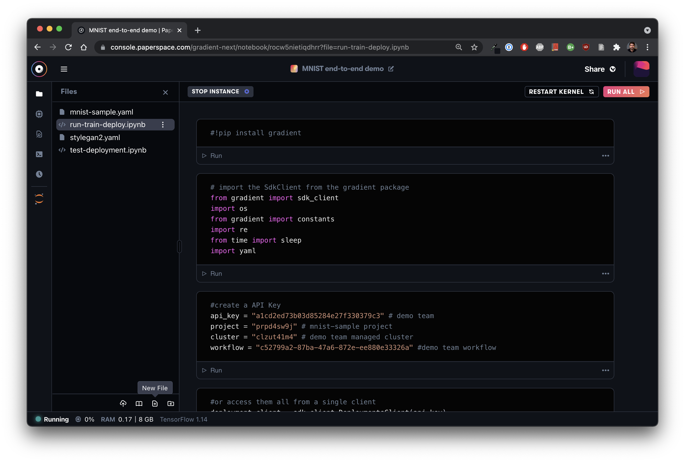

# File organization

## Initial notebook file structure

Each account will have a `/storage` directory automatically generated during account creation. When a notebook is created, a directory matching the notebook ID is created within the root `/storage` directory. If the user needs to share data across notebooks, just copy or move the data to the root `/storage` directory. As long as the account is not deleted, the data will persist.   &#x20;

## File management

Use the files tab to **upload** data, organize your files and folders, and **download** files stored in your notebook. You'll find most file operations available at the bottom of the files sidebar.  Some options such as renaming files and folders, downloading files, and duplicating files are available by clicking the menu icon on the individual entity.&#x20;

### Importing files and data

When uploading files and data, they reside in `/notebook` , this data is retained until the notebook is deleted. If a user wants to share these files with other notebooks or teammates then it can be moved to `/storage` which is persistent.

#### Importing from the file manager

Just click the upload icon to import data from your computer.&#x20;

****:bulb:**Tip:** Your notebook must be running in order to import data.&#x20;

 (1).png>)

#### Importing from the terminal

Downloading data to `/storage` is as simple as using `curl` or `wget` from a Notebook [terminal](notebook-terminals.md) or Jupyter cell. &#x20;

### Exporting files and data

Downloading files is as simple as clicking the menu icon on a file (the three vertical dots) and clicking Download. **Note:** Your notebook must be running in order to download data.&#x20;

 (1) (1).png>)
