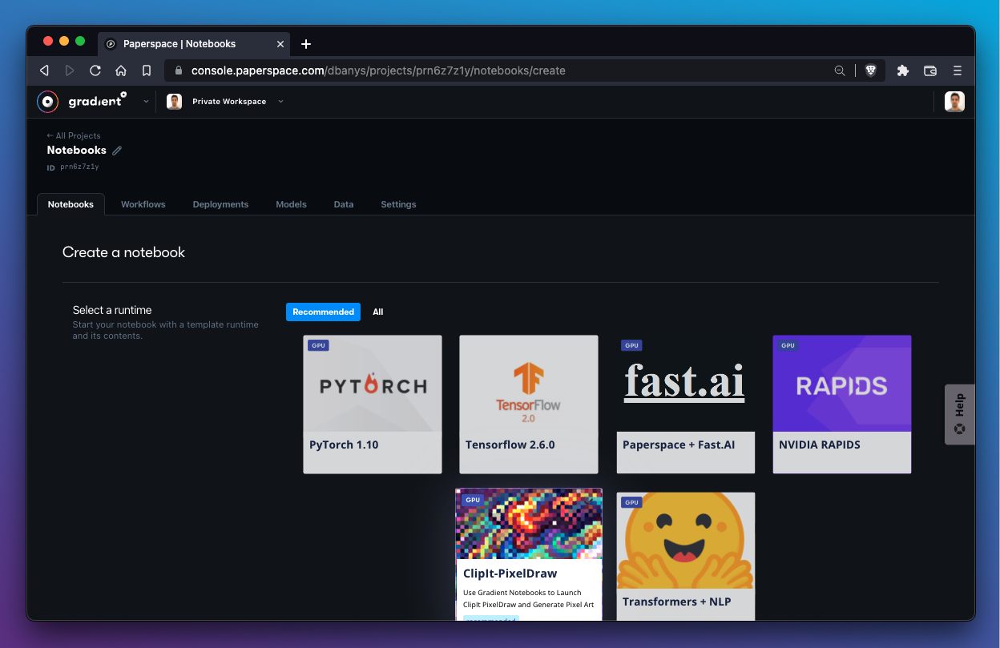
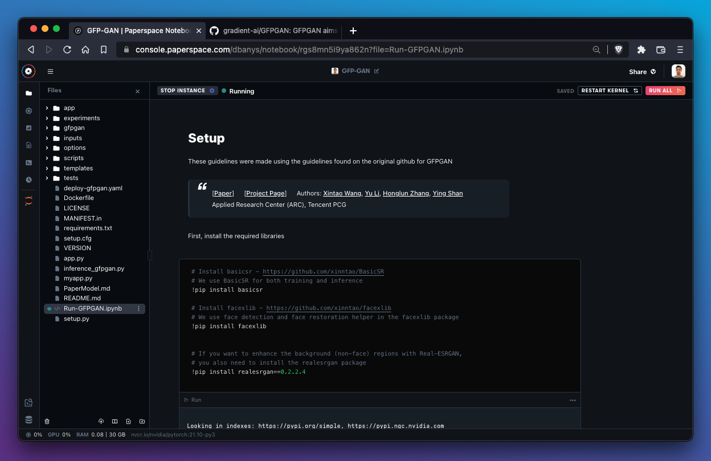

# Runtimes

## Introduction to runtimes in Gradient Notebooks

In Gradient Notebooks, a runtime is defined by its container and workspace.

A workspace is the set of files managed by the Gradient Notebooks IDE while a container is the DockerHub or NVIDIA Container Registry image installed by Gradient.

A runtime does **not** specify a particular machine or instance type. One great benefit of Gradient Notebooks is that runtimes can be swapped across a wide variety of instances.



When creating a new notebook, Gradient offers a list of runtimes to select sorted by `Recommended` and `All`.  We can use these runtime tiles or we can create our own runtimes.

## How to use a runtime provided by Gradient

To explore the details of a particular runtime provided by Gradient, expand the **Advanced Options** section of the `Create a notebook` flow.

In this example, we will explore the PyTorch 1.10 runtime tile:


The PyTorch 1.10 tile consists of the following:

* `Workspace URL` - [https://github.com/gradient-ai/PyTorch](https://github.com/gradient-ai/PyTorch)
* `Container Name` - nvcr.io/nvidia/pytorch:21.10-py3

The `Workspace URL` parameter tells Gradient which files to load into the notebook file manager.&#x20;

The `Container Name` parameter tells Gradient where to fetch the container image that will be used to build the notebook.

When we select `Start Notebook`, Gradient imports the file(s) located in the `Workspace URL` directory into the file manager and then imports and runs the container image specified defined in the `Container Name` field.&#x20;

In this example, our new PyTorch 1.10 notebook contains the files from [https://github.com/gradient-ai/PyTorch](https://github.com/gradient-ai/PyTorch) running on the container from nvcr.io/nvidia/pytorch:21.10-py3.

.png>)

We can confirm this fact by noticing that our file manager is populated with the contents from the GitHub repository (in this case a single file) and that the bottom bar is displaying the name of the container image as expected.

## List of base runtimes

Paperspace maintains a number of runtimes that make it easy to get started with preloaded notebook files and dependencies. These runtimes are provided as tiles when creating a new notebook in Gradient.


### Recommended runtimes

The following is a list of recommended runtimes that Paperspace maintains:

| Name                             | Description                                                                                                                                            | Container Name                                                | Container Registry                                                           | Workspace URL                                                                                      |
| -------------------------------- | ------------------------------------------------------------------------------------------------------------------------------------------------------ | ------------------------------------------------------------- | ---------------------------------------------------------------------------- | -------------------------------------------------------------------------------------------------- |
| _**PyTorch 1.10**_               | Latest PyTorch release (1.8) with GPU support.                                                                                                         | `nvcr.io/nvidia/pytorch:21.09-py3`                            | [DockerHub](https://hub.docker.com/r/pytorch/pytorch)                        | [https://github.com/gradient-ai/PyTorch](https://github.com/gradient-ai/PyTorch)                   |
| _**TensorFlow 2.6.0**_           | TensorFlow 2 with GPU support.                                                                                                                         | `nvcr.io/nvidia/tensorflow:21.09-tf2-py3`                     | [DockerHub](https://hub.docker.com/r/tensorflow/tensorflow/)                 | [https://github.com/gradient-ai/TensorFlow](https://github.com/gradient-ai/TensorFlow)             |
| _**Paperspace + Fast.ai**_       | _**Fast.ai**_ Paperspace's Fast.ai template is built for getting up and running with the enormously popular [Fast.ai online MOOC](http://www.fast.ai). | `paperspace/fastai:2.0-CUDA9.2-fastbook-v0.1.0`               | [GitHub](https://github.com/Paperspace/fastai-docker)                        | [https://github.com/fastai/fastbook.git](https://github.com/fastai/fastbook.git)                   |
| _**NVIDIA RAPIDS**_              | NVIDIA's library to execute end-to-end data science and analytics pipelines on GPU.                                                                    | `nvcr.io/nvidia/rapidsai/rapidsai:0.18-cuda11.0-base-centos7` | [NVIDIA](https://ngc.nvidia.com/catalog/containers/nvidia:rapidsai:rapidsai) | [https://github.com/gradient-ai/RAPIDS.git](https://github.com/gradient-ai/RAPIDS.git)             |
| _**ClipIt-PixelDraw**_           | A creative library for generating pixel art from simple text prompts.                                                                                  | `paperspace/clip-pixeldraw:jupyter`                           | [DockerHub](https://hub.docker.com/r/paperspace/clip-pixeldraw)              | [https://github.com/gradient-ai/ClipIt-PixelDraw](https://github.com/gradient-ai/ClipIt-PixelDraw) |
| _**Hugging Face Transformers**_​ | A state-of-the-art NLP library from Hugging Face                                                                                                       | `paperspace/transformers-gpu:0.4.0`​                          | [DockerHub](https://hub.docker.com/r/paperspace/transformers-gpu)            | [https://github.com/huggingface/transformers.git](https://github.com/huggingface/transformers.git) |

### Additional runtimes

These are a sampling of additional runtimes available in the `Create a notebook` section of the Gradient console. Runtimes are added frequently.&#x20;

| Name                                | Description                                     | Container Name                                                     | Container Registry                                                  | Workspace URL                                                                |
| ----------------------------------- | ----------------------------------------------- | ------------------------------------------------------------------ | ------------------------------------------------------------------- | ---------------------------------------------------------------------------- |
| _**Analytics Vidhya CV**_           | Analytics Vidhya container                      | `jalfaizy/cv_docker:latest`                                        | [GitHub](https://github.com/ufoym/deepo)                            | N/A                                                                          |
| _**TensorFlow (1.14 GPU)**_         | Official docker images for TensorFlow version 1 | `paperspace/dl-containers:tensorflow1140-py36-cu100-cdnn7-jupyter` | [DockerHub](https://hub.docker.com/r/tensorflow/tensorflow/)        | N/A                                                                          |
| _**JupyterLab Data Science Stack**_ | Jupyter Notebook Data Science Stack             | `jupyter/datascience-notebook`                                     | [DockerHub](https://hub.docker.com/r/jupyter/datascience-notebook/) | N/A                                                                          |
| _**JupyterLab Data R Stack**_       | Jupyter Notebook R Stack                        | `jupyter/r-notebook`                                               | [DockerHub](https://hub.docker.com/r/jupyter/r-notebook/)           | [https://github.com/gradient-ai/R.git](https://github.com/gradient-ai/R.git) |

## How to specify a custom workspace

Gradient provides the ability to import a workspace during notebook creation.&#x20;

Let's say we're interested in working with [GFP-GAN](https://github.com/gradient-ai/GFPGAN), an exciting library that helps us restore and upscale images. Rather than clone the files from GitHub after we create the notebook, we can instantiate the notebook with the files already there.&#x20;

All we need to do is specify the GFP-GAN GitHub repo in the `Workspace URL` parameter of `Advanced options` during notebook creation.&#x20;


Gradient automatically copies all of the files from the GitHub repo into the notebook IDE.&#x20;

The resulting notebook looks like this:



A custom workspace can be specified at the time of notebook creation only.

It's also possible to pull files from private or password-protected repositories by filling in `Workspace Username` and `Workspace Password` fields.&#x20;


The same logic can be applied to containers, which is demonstrated in the next section.

## How to specify a custom container

A container is a disk image pre-loaded with files and dependencies. Gradient provides the ability to import an image from a container registry such as DockerHub during notebook creation.

In this example, we'll tell Gradient to pull the latest container from [NVIDIA RAPIDS](https://rapids.ai/start.html#get-rapids) by specifying the Docker image in the `Container Name` field.


Note that the larger the container, the longer it will take for Gradient to pull it into a notebook.

## How to create a custom Docker container to use with Gradient Notebooks

Paperspace recommends using [Docker](https://www.docker.com) to get the container image from the local machine to Gradient.&#x20;

`jupyter` must be run on port `8888` and connections from ip address `0.0.0.0` must be allowed.

If running `jupyter notebook`, the following flags must be included in the `Command` field to support the Gradient Notebooks IDE:

```
--no-browser --NotebookApp.trust_xheaders=True --NotebookApp.disable_check_xsrf=False --NotebookApp.allow_remote_access=True --NotebookApp.allow_origin='*' 
```

If running `jupyter lab`, these flags should be used in the `Command` field instead:

```
--no-browser --LabApp.trust_xheaders=True --LabApp.disable_check_xsrf=False --LabApp.allow_remote_access=True --LabApp.allow_origin='*'
```

## Custom container reference

The following fields are available in the `Container` section of `Advanced options` when creating a new Gradient Notebook:


.png>)

| Field             | Required | Description                                                                                                                                                                                                                                                     |
| ----------------- | -------- | --------------------------------------------------------------------------------------------------------------------------------------------------------------------------------------------------------------------------------------------------------------- |
| Container Name    | true     | Path and tags of image from DockerHub or NVIDIA Container Registry. E.g. `ufoym/deepo:all-jupyter-py36`                                                                                                                                                         |
| Registry Username | false    | Private container registry username. Can be left blank for public images.                                                                                                                                                                                       |
| Registry Password | false    | Private container registry password. Can be left blank for public images. Secrets may be used in this field using the substitution syntax `secret:`                                                                                                             |
| Command           | false    | Must be Jupyter compatible. If left blank, defaults to `jupyter notebook --allow-root --ip=0.0.0.0 --no-browser --NotebookApp.trust_xheaders=True --NotebookApp.disable_check_xsrf=False --NotebookApp.allow_remote_access=True --NotebookApp.allow_origin='*'` |
| Container User    | false    | Optional user. Defaults to 'root' if left blank.                                                                                                                                                                                                                |

##
