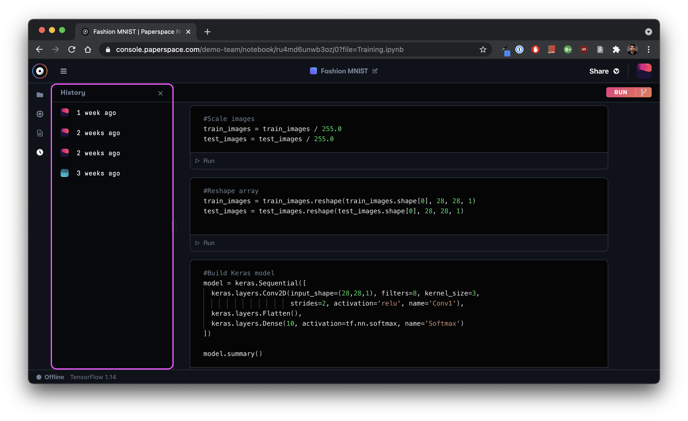

# Notebook versioning

Within the notebook interface, you will find a _history_ tab where you can manage different versions of your notebook. Each notebook session will automatically generate a new version. By clicking on a previous version, you can easily rollback your changes. Doing so will create a fork of the notebook so you do not lose access to later versions.  

