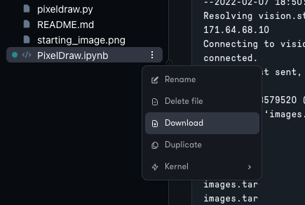

# Files and storage volumes

## Introduction to the file structure of Gradient Notebooks

Every notebook in Gradient has a file management interface that looks like this:


The file manager within the notebook does **not** represent the full file structure of the notebook.&#x20;

The full file structure of a notebook is as follows:


`/notebooks` is the directory that contains the files commonly displayed in the file manager of the notebook IDE.

`/datasets` is a persistent directory where public datasets are stored. Public datasets include a handful of datasets that Gradient makes available out of the box such as [MNIST](http://yann.lecun.com/exdb/mnist/).&#x20;

`/storage` is a shared persistent directory and is accessible by any user who is part of the current team. It is the primary method for sharing data across notebooks and users. In the case of the **Private Workspace** team, the `/storage` volume cannot be shared with other users.

`/storage/notebooks` is a legacy volume that is no longer in use on newer Paperspace accounts.

For more information on persistent storage, please continue to the next sections.

## How to persist data in a notebook

Refer to [Introduction to the file structure of Gradient Notebooks](file-organization.md#introduction-to-the-file-structure-of-a-gradient-notebook) to understand the file structure of Gradient Notebooks.

Files stored in the file manager are persisted across notebook sessions. This is the same directory that is represented by the yellow box labeled `{ notebook IDE }` in the previous section.


The notebook must be in the **Running** state to display files. Offline file view for notebooks is currently under development.&#x20;

## How to use the file manager <a href="#how-to-use-the-file-manager" id="how-to-use-the-file-manager"></a>

Use the file management tab to upload data, organize files and folders, and download files stored in a notebook.&#x20;

Additional options such as renaming, duplicating, and deleting files and folders are available by clicking the menu icon on the individual entity.​


There are multiple ways to upload files to a notebook, which are discussed in the following sections.

## How to import files with the file manager <a href="#how-to-import-files-from-the-file-manager" id="how-to-import-files-from-the-file-manager"></a>

The simplest way to upload to a notebook is to click the **Upload** icon in the file manager.​


The `Upload` feature in the file manager provides upload capability for many (but not all) situations. If we need to upload a large number of files or a large dataset, we are better served using tools in code.

Note that a notebook must be in the **Running** or online state to upload data.

## How to upload large files and folders <a href="#how-to-upload-large-files-and-folders" id="how-to-upload-large-files-and-folders"></a>

To upload a large number of files or a large amount of data, it is best to use command-line libraries such as [curl](https://curl.se), [Wget](https://www.gnu.org/software/wget/), or [gdown](https://github.com/wkentaro/gdown).

Here is an example of how to use Wget to download the [Stanford Dogs dataset](http://vision.stanford.edu/aditya86/ImageNetDogs/) to our notebook:


This command downloads the dataset to our current folder:

```
!wget http://vision.stanford.edu/aditya86/ImageNetDogs/images.tar
```

That's all there is to it! We can also perform the same command from the terminal if we are on the Pro or Growth subscription plans.

### Exporting files and data <a href="#exporting-files-and-data" id="exporting-files-and-data"></a>

To download a file from a notebook, use the `Download` feature located in the the three dot menu in the file manager.



As with all data operations, a notebook must be running in order to download data.

## How to access _shared_ persistent storage&#x20;

Data can be shared between users on a team and between notebooks that belong to users on a team.

Access to shared persistent storage must be done through code, either via the notebook terminal or via a code cell within a notebook, as there is currently no way to access shared persistent storage from the GUI.

### How to access shared persistent storage from a notebook code cell

We can access shared persistent storage from a code cell within a notebook using the `!` operator and issuing our bash commands on a single line connected with the `&&` operator.&#x20;

For example, to create a new directory within our persistent `/storage` directory, we'll input the following:

```
!cd /storage && mkdir data && cd data
```

This is what that would look like in a notebook code cell:


We can also access persistent storage via the terminal, as described in the next section.

### How to access shared persistent storage from a notebook terminal

The terminal feature requires Gradient Pro or Gradient Growth subscriptions.

To access persistent storage in a Gradient Notebooks terminal, we can use the `cd` command to change into the persistent directory `/storage`.

Let's say we'd like to create a new persistent directory called `data`. We can accomplish this as follows:

```
cd /storage
mkdir data
cd data
```

Let's try it out:


We can now use the directory located at `/storage/data` to store any files we need to access across users and notebooks.

## How to view storage limits

Storage in Gradient is scoped to the team level. By default, storage tiers are as follows:

|         | Free | Pro   | Growth | Enterprise |
| ------- | ---- | ----- | ------ | ---------- |
| Storage | 5 GB | 15 GB | 50 GB  | ∞ GB       |

Excess storage is billed at $0.29 per GB per month and this is prorated for the duration of the month.&#x20;

As an example, if we are on the Pro plan, which grants us 15 GB of storage, and we use 50 GB of storage for an entire month, we will be billed (50 - 15) \* 0.29 = $10.15 on top of our normal bill.&#x20;

To view storage utilization, visit the **Storage** tab in the workspace settings.

Here we have an example of the **Storage** tab for a new team that is not yet using any volume storage:


Here we have an example of a Private Workspace team that is using a good amount of storage:


If we expect to be billed for storage overages, we can use the **Utilization** tab to explore our storage use further.

Use the file management tab to upload data, organize files and folders, and download files stored in a notebook.&#x20;

Some additional options such as renaming, duplicating, and deleting files and folders are available by clicking the menu icon on the individual entity.&#x20;


There are multiple ways to upload files to a notebook, which are discussed in the following sections.

## How to import files from the file manager

The simplest way to upload to a notebook is to click the **Upload** icon in the file manager.

 (1).png>)

Note that a notebook must be in the **Running** or online state to upload data.

## How to upload large files and folders

To upload a large number of files or a large amount of data, it is recommended to use command-line libraries such as [curl](https://curl.se), [Wget](https://www.gnu.org/software/wget/), or [gdown](https://github.com/wkentaro/gdown).

These libraries are simple to run in a notebook cell using line magic or in the terminal and they provide a level of reliability for large data transfers beyond that which the GUI can provide.


To upload data to shared persistent storage, try changing into a directory within `/storage` before running the upload command.

### Exporting files and data

Downloading files is as simple as clicking the menu icon on a file (the three vertical dots) and clicking Download.&#x20;

Note that the notebook must be in the **Running** state in order to download data.&#x20;


