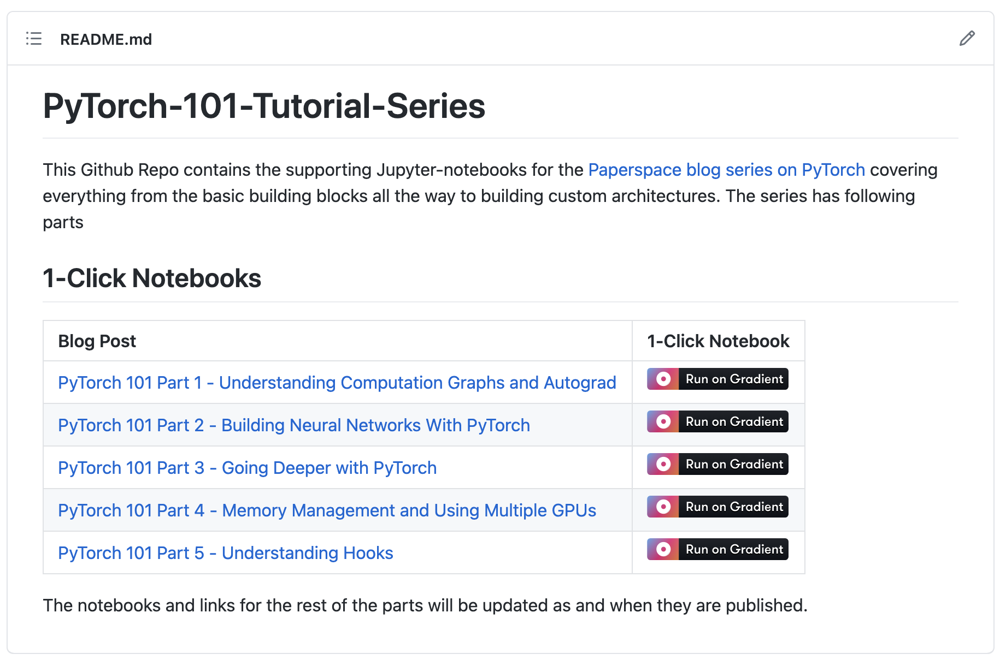
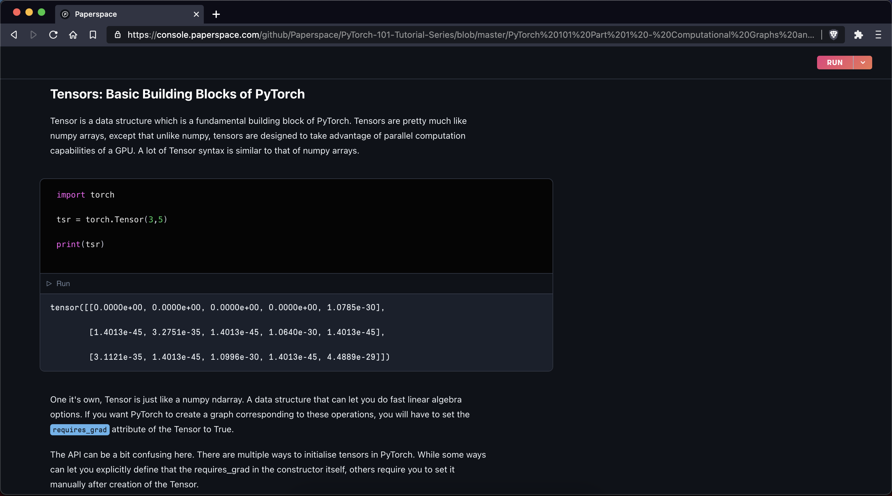
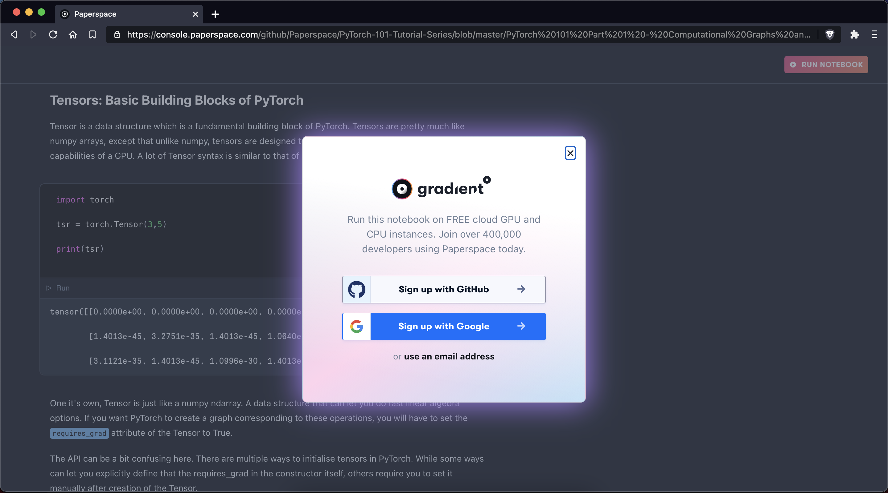

# Run on Gradient (GitHub badge)


## What is it?

The Run on Gradient badge allows you to run a Gradient Notebook from any public GitHub repository on a free GPU. Gradient Notebooks are a hosted Jupyter notebook service from Paperspace that requires no setup and provides free access to computing resources including GPUs.

## How it Works

The "Run on Gradient" badge allows you to run a Gradient Notebook from any GitHub repository.&#x20;

Clicking the badge brings the user to a static page where they can view the full contents of a notebook generated from the repository .ipynb file.&#x20;

From this page, the user can either sign in or create an account to run the notebook for free.

Paperspace accounts are free and access to a free-tier GPU-backed notebook does not require a credit card.







## Using the Run on Gradient badge

To use the badge, add the following code snippet to `README.md` in a **public** GitHub repo:

```
[](https://console.paperspace.com/github/huggingface/nlp/blob/master/notebooks/Overview.ipynb)
```

The HTML equivalent is:

```
<a href="https://console.paperspace.com/github/huggingface/nlp/blob/master/notebooks/Overview.ipynb">
  
</a>
```

Remember to replace the notebook URL in this template with the notebook you want to link.

The formula for the link is as follows:

```
https://console.paperspace.com/github/{github_file_path}.ipynb
```

Therefore if a file is located at [https://github.com/gradient-ai/GauGAN/blob/main/GauGAN\_ML\_Showcase/GauGAN\_ML\_showcase.ipynb](https://github.com/gradient-ai/GauGAN/blob/main/GauGAN\_ML\_Showcase/GauGAN\_ML\_showcase.ipynb) then the correct Run on Gradient link would be:

```
https://console.paperspace.com/github/gradient-ai/GauGAN/blob/main/GauGAN_ML_Showcase/GauGAN_ML_showcase.ipynb
```

### **Notes**

**Workspace**: When you launch a new notebook from this button, Gradient will pull in the individual `.ipynb` file (specified in the snippet above) as a workspace. Optionally, if you would like to pull in the entire cloned GitHub repo as a workspace, append a `?clone=true` query parameter.\
\
**Runtime:** You can also optionally specify a Docker container to run this workspace in. You can point to any public container by appending `?runtime=paperspace/fastai` where you replace `paperspace/fastai` with your container name.\


## **FAQ**

### Does this work with private GitHub repos?

Currently, the 1-click "launch on gradient" button will only work with public GitHub repositories. If you would like to use a private GitHub repository or a container that is in a private registry, you can do so by clicking "Change instance type (advanced)" before running the notebook (or alternatively, visiting the "Create Notebook" page in the Paperspace Console.&#x20;

### Where can I find the "Run on Gradient" Badge

The badge can be found here: [https://assets.paperspace.io/img/gradient-badge.svg](https://assets.paperspace.io/img/gradient-badge.svg) .&#x20;

It looks like this:


