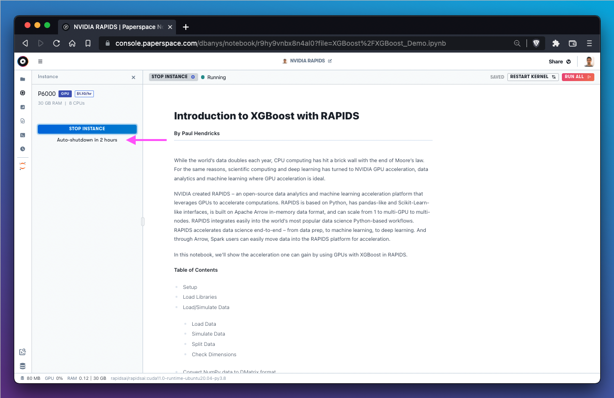
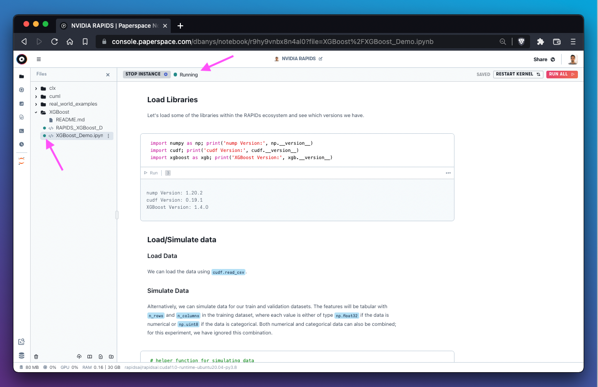
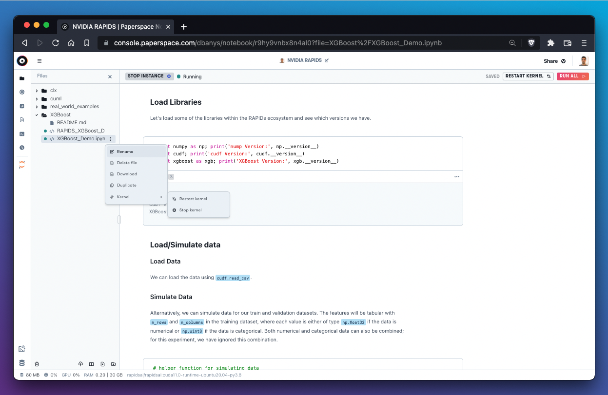

# Machines

## Introduction to notebook machines

Gradient makes a wide variety of machines available for use with notebooks. A full list of instance types provided by Gradient is available here:


[instance-types](../../more/instance-types/)


The first opportunity to select a machine is in the `Select a machine` section when creating a new notebook.

Gradient Notebooks makes it easy to swap out a machine for a different machine at any time -- so keep that in mind when deciding what machine to select. It's common to start with a less powerful machine and upgrade as needed over time.

## How to select a machine when creating a notebook

When creating a new notebook, the `Select a machine` section of the notebook create workflow provides a list of GPU-backed and CPU-backed machines available for use.

If a machine is available for use it will be listed under the `Available` heading. If a machine is out of capacity it means that all instances are currently being used by other Paperspace users.&#x20;

## How to swap machines in an existing notebook

To swap instances in an existing notebook, use the **Instance** selector available on the left side of the notebook.&#x20;

If the notebook is currently in the **Running** state, it will first need to be stopped.

After the instance is stopped, a new instance can be selected from the list of available machines.

The top bar will indicate when a notebook is again in the **Running** state.

## How to use a machine that is unavailable

If an instance type is at capacity it will be listed as `Unavailable`. Popular instance types, such as instances providing free gpus, sometimes reach capacity during busy periods.&#x20;

If the machine type that we require is listed as unavailable, we'll need to wait until capacity frees up. We should first try waiting a few minutes and refreshing the page. If capacity is still not available, we might try a different instance with better availability or come back during a less busy time of day.


Free GPU instances in particular are often in high demand. Try using popular free resources outside of peak hours (MF 9:00AM - 5:00PM ET) or try using more powerful paid machines.


Paperspace is constantly adding capacity to its datacenters. The [Changelog](https://updates.paperspace.com) is a good resource to hear about capacity upgrades. If you are repeatedly running into capacity issues with a particular machine type, please [let us know](https://support.paperspace.com/hc/en-us/requests/new).&#x20;

## How to use the auto-shutdown timer

The auto-shutdown timer is a useful feature that automatically shuts down a notebook after a pre-determined amount of time. The timer starts from the moment that the notebook is started.

When a notebook is running, the amount of time remaining until auto-shutdown is displayed in the **Instance** tab.

It is currently not possible to alter the auto-shutdown interval after it has been set.

## How to view kernel state

By default, all .ipynb files are run on a python3 kernel with a number of preinstalled packages depending on the [runtime](create-a-notebook/notebook-containers/) you choose. This is meant to provide an environment that works right out of the box for the majority of projects.

Gradient allows the user to start an arbitrary number of kernels within the notebooks IDE. A kernel is [a programming language specific process](https://docs.jupyter.org/en/latest/projects/kernels.html) that runs independently of other kernels on a virtualized machine. Gradient uses the [IPython](https://ipython.readthedocs.io/en/stable/index.html#ipython-documentation) Jupyter kernel.&#x20;

Each time a .ipynb file is created, uploaded or run,a new kernel is created to manage that file. The kernel state is visible in the file manager as well as in the top bar.&#x20;

The kernel state is made accessible in the top bar as text. In the image above, for example, the top bar is indicating that the kernel state is **Running**.

## How to restart a kernel

One of the benefits of kernels is the ability to restart a single kernel without disrupting the rest of the notebook. This is useful when a notebook is stuck or unresponsive.&#x20;

An individual kernel may be restarted using the `Restart Kernel` button in the top right of the notebooks IDE.&#x20;

It's also possible to stop or restart the kernel using the 3-dot menu next to an individual file in the file manager.

If restarting the kernel does not fix an issue with a stuck process, it may be necessary to stop and restart the entire notebook. In this case we would select `Stop Instance` and wait for the instance to shutdown before selecting a new instance to start.
