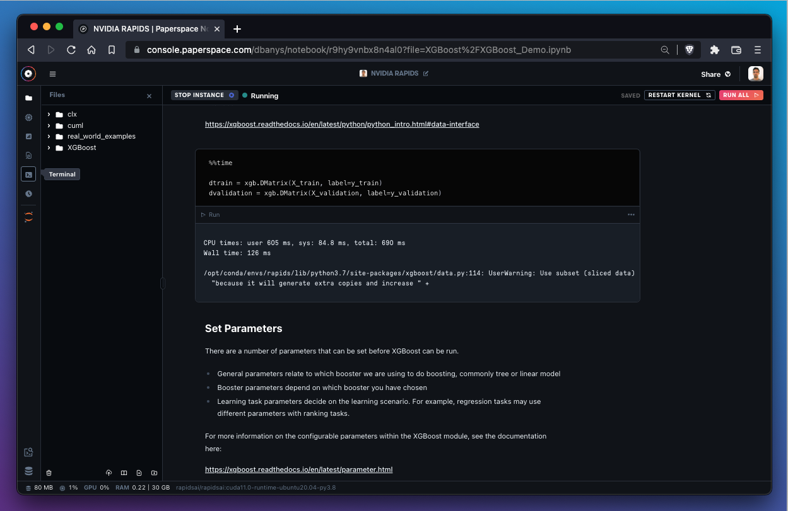
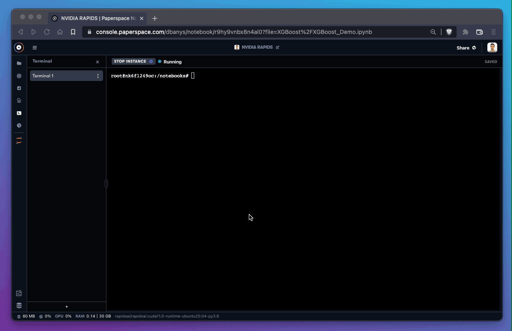

# Terminal

## Introduction to notebook terminal

Terminals are useful for interacting with the underlying OS environment to perform a variety of tasks such as installing packages, organizing files, and more.&#x20;


In Gradient Notebooks, the terminal has root access to the underlying machine, which can be useful for a variety of tasks.

## How to gain terminal access in Gradient Notebooks

The terminal is currently available to Pro and Growth plan subscribers. [Gradient Pricing](https://gradient.run/pricing) provides a more detailed description of what else is available on upgraded plans, including superior free instance types and availability, additional storage, and more.

To open a terminal, use the **Terminal** icon in the sidebar. The notebook must be in the **Running** state.



To create a new terminal instance, use the `+` button in the left sidebar.


There is no limit on the number of terminal windows that may run simultaneously.

## How to use bash in the terminal

Some users report that using bash in the terminal improves their work and reduces unexpected errors.

To use bash, enter the following command in the default shell:

```
bash
```



The terminal is now using bash.

