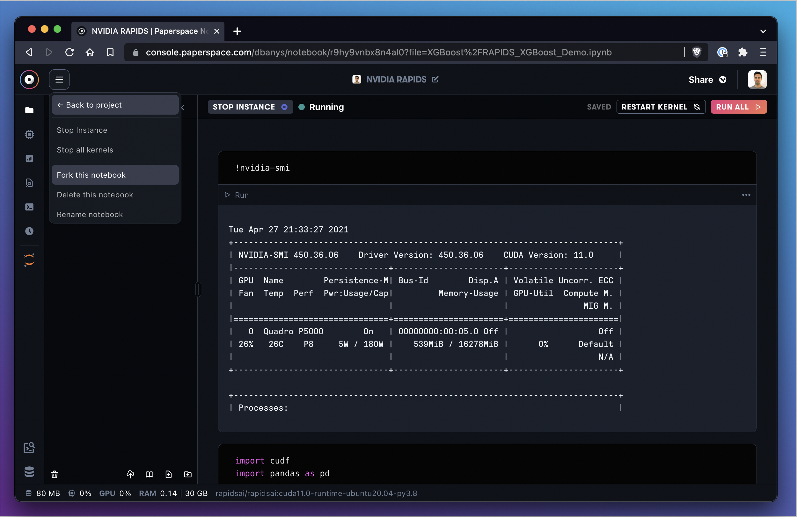

# Sharing

## Introduction to sharing and forking notebooks

Gradient Notebooks makes it easy to collaborate with teammates. Notebooks are shared at the team level and can take advantage of [shared persistent storage](file-organization.md) at the team level. Notebooks can also be made public or private.&#x20;

## How to share a notebook

The `Share` button in the notebook IDE provides a quick and easy way to generate a shareable link for a notebook.


If public access is granted, anyone with the link will be able to view the contents of the notebook.

## How to fork a notebook

Forking is useful to clone a public notebook into our workspace or to duplicate a notebook that is already in our workspace. Forking a notebook creates a new history for the notebook.

Fork a notebook from within the notebook IDE by using the hamburger menu in the top left of the IDE:



Fork a notebook from the Gradient Notebooks console using the 3-dot menu:

.png>)

The files copied to the notebook are those listed in the [notebook include file](https://github.com/Paperspace/Docs/tree/9f5869e1aef4b75067075530e65c9764279782bf/notebook-include.md), which is explained in the next section.

## How to configure a notebook for forking

When a notebook is offline, some files are copied to the [storage provider](../../data/data-overview/private-datasets-repository/storage-providers.md) to enable offline viewing. By default, the list of files includes `.ipynb` and `.md` files. Additionally, if the notebook was instantiated using a git repo as a workspace, Gradient will upload any files that are tracked by git.&#x20;

It's possible to specify exactly which files should be available offline by providing a `.notebookinclude` file in the `/notebooks` [directory](file-organization.md).&#x20;

The file is similar to syntax found in a [`.gitignore`](https://git-scm.com/docs/gitignore) file, however in this case we will be _including_ files instead of ignoring them. Negative patterns are supported.&#x20;

The default `.notebookinclude` file looks like this:

```
*.md
*.ipynb

# and all of the files from `git ls-files`
```

In the following example, we tell gradient to upload all `.png` files to the storage provider while skipping dataset files:

```
*.png # include all png files
!datasets/**/*.png # exclude the ones in my datasets
```

Now we will use a negative example to exclude `.md` files:

```
!*.md
```

## Reference for operations within .notebookinclude file

| Item       | Description                                        |
| ---------- | -------------------------------------------------- |
| `#`        | Comments out the line                              |
| `!`        | Negates the pattern                                |
| `/`        | Directory separator                                |
| `\*`       | Wildcard                                           |
| `?`        | Wildcard exactly one character                     |
| `[a-zA-Z]` | Range notation to match a character in the range   |
| `**/`      | Match in all directories                           |
| `/**`      | Match all files within a directory                 |
| `a\*\*/b`  | Match zero or more directories between `a` and `b` |
