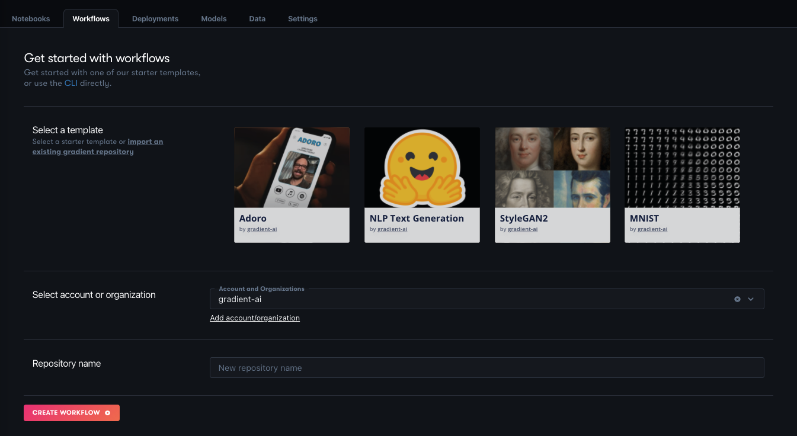
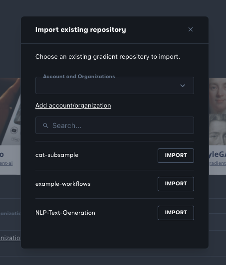

# Getting Started with Workflows

The following sections cover creating and running Workflows, and authoring new Workflow YAML specs. If you have never run a Workflow before we recommend you step through the Workflows demo in the [quick-start guide](https://docs.paperspace.com/gradient/get-started/quick-start#create-a-project) then return here for more details.

## Create a Workflow

Workflows can be created via the GUI / Web UI, or command line \(CLI\).



* 1: Create a [Gradient Project](../../get-started/managing-projects/)
* 2: Navigate to its main page by clicking on its entry in the projects list
* 3: Click the Workflows tab, which gives this screen



* 4: Choose one of the illustrated boxes under **Select a template** \(basic\), or click **import an existing gradient repository** \(advanced\)

If you did **Select a template**:

* 5: Choose your GitHub username from the dropdown list under **Account and Organizations** \[1\]
* 6: Give your repository a name
* 7: Click **Create Workflow.** This will create and run the Workflow in your new repository.

If you did **import an existing gradient repository:**

* 5: Choose your GitHub username from the dropdown list under Account and Organizations in the **Import existing repository** window that pops up \[1\]



* 6: Choose the repository to import
* 7: This will take you to the **Let's create a Workflow** screen, where you can follow its instructions to create one, or run an existing Workflow.

See [Run the Workflow](https://docs.paperspace.com/gradient/explore-train-deploy/workflows/getting-started-with-workflows#run-the-workflow) below for more details on how Workflows run.

\[1\] If your username doesn't show up, try clicking the **x** in the circle on the right of the dropdown, or if it still isn't there, make sure you have the Gradient GitHub app installed from the [Quick Start](https://docs.paperspace.com/gradient/get-started/quick-start) section, and configured so that it can see your repositories.



1. Make sure you have the latest version of the [Gradient CLI](../../get-started/quick-start/install-the-cli.md)
2. Create a [Gradient Project](../../get-started/managing-projects/) and [grab your project ID](../../get-started/managing-projects/#get-your-projects-id). You can create a project that integrates with a Github repo or a create a standalone project. Use a **Github project** if you already have code you are working with in **Github**.
3. Create your first Workflow using the Gradient CLI

```bash
gradient workflows create --name <my-workflow-name> --projectId <project-id>
```

The command will return an ID for the Workflow, for example, `7634c165-5034-4f49-95fa-005fc0e7970b`



## Create a Workflow Spec

To write your own Workflow, create a Workflow spec in [YAML](https://yaml.org) using a text editor. There is one in the [Gradient Notebook](https://docs.paperspace.com/gradient/explore-train-deploy/notebooks) interface, or you can use your own.

_Note:_ even though YAML and JSON are closely related, Gradient Workflows need to be formatted as YAML and not JSON.

Below is an example of a valid **workflow.yaml** spec. It clones the repository from `https://github.com/NVlabs/stylegan2`, generates images from the repo script `run_generator.py`, and outputs the results to the Gradient-managed dataset `demo-dataset`.

You will learn more about writing Workflow specs on the following pages.

```yaml
jobs:
  CloneRepo:
    resources:
      instance-type: C5
    outputs:
      repo:
        type: volume
    uses: git-checkout@v1
    with:
      url: https://github.com/NVlabs/stylegan2.git
  StyleGan2:
    resources:
      instance-type: P4000
    needs:
      - CloneRepo
    inputs:
      repo: CloneRepo.outputs.repo
    outputs:
      generatedFaces:
        type: dataset
        with:
          ref: demo-dataset
    uses: script@v1
    with:
      script: |-
        pip install scipy==1.3.3
        pip install requests==2.22.0
        pip install Pillow==6.2.1
        cp -R /inputs/repo /stylegan2
        cd /stylegan2
        python run_generator.py generate-images \
          --network=gdrive:networks/stylegan2-ffhq-config-f.pkl \
          --seeds=6600-6605 \
          --truncation-psi=0.5 \
          --result-dir=/outputs/generatedFaces
      image: tensorflow/tensorflow:1.14.0-gpu-py3
```

## Create Datasets for the Workflow

Datasets referenced in the Workflow spec need to be created before running the Workflow for the first time. On subsequent runs of the Workflow the Datasets will be used again, but different **Dataset versions** will be created for each output Dataset. For more information about Datasets see [Versioned Data](https://docs.paperspace.com/gradient/data/data-overview#versioned-data).

The above Workflow creates a new output Dataset version in the Dataset named `demo-dataset`. So before running this Workflow make sure a Dataset with that name already exists. You can run this command to list your Datasets: `gradient datasets list`.

If you completed the Workflows demo in the [quick-start guide](https://docs.paperspace.com/gradient/get-started/quick-start#create-a-project) you will already have a Dataset with this name. If not, you can create it on the CLI using the following commands.

First, get a list of storage providers that are already part of your account. You should have at least one called **Gradient Managed**.

```bash
gradient storageProviders list
+------------------+-----------------+------+------------------------------------------+
| Name             | ID              | Type | Config                                   |
+------------------+-----------------+------+------------------------------------------+
| Gradient Managed | splXXXXXXXXXXXX | s3   | accessKey: XXXXXXXXXXXXXXXXXXXX          |
|                  |                 |      | bucket: XXXXXXXXX                        |
|                  |                 |      | endpoint: XXXXXXXXXXXXXXXXXXXXXXXXXXXXXX |
|                  |                 |      | secretAccessKey: ********                |
+------------------+-----------------+------+------------------------------------------+
```

Then create a dataset named **demo-dataset** using the **Gradient Managed** storage provider ID:

```bash
gradient datasets create \
  --name demo-dataset \
  --storageProviderId splXXXXXXXXXXXX
```

Datasets with other names can be created similarly. The dataset name should match the name referred to in the YAML. Note that Datasets can also be referred to directly by their IDs, but names are usually more convenient unless a specific Dataset version needs to be referenced.

### Dataset creation in the GUI

You can also create a Dataset using the GUI. See [Creating a Dataset and Dataset Version](https://docs.paperspace.com/gradient/data/data-overview/private-datasets-repository#creating-a-dataset-and-dataset-version).

## Run the Workflow

Workflows can be run by triggering them to run by making a change to your linked GitHub repository, or by invoking them directly using the command line.



Workflows can be triggered to run from Gradient by placing them in the `.gradient/workflows` directory in your linked repository. This directory should be created if it does not exist.

Within the Workflow YAML, the `on:` field is used to indicate that this Workflow is to be triggered to run when the given conditions are met. For the general case of any change to the repo triggering the Workflow to run, the YAML lines are

```text
on:
  github:
    branches:
      only: main
```

Currently, this is the condition set that works, so to prevent a Workflow being triggered, comment the lines out. In future, more general cases such as only changes to specific file types being a trigger will be supported.



Run the Workflow with the specified Workflow spec file and the **`workflow-id`** from the previously created Workflow. \(You can also get a list of Workflows by running `gradient workflows list`.\)

```bash
gradient workflows run \
    --id <worklow-id> \ 
    --path ./workflow.yaml
```

A Workflow can be run multiple times, each with the same or a different Workflow YAML spec. The Workflow spec is recorded as part of the Workflow run so you can distinguish different runs.



The next sections cover the syntax for authoring new Workflow specs, inputs and outputs to Workflow steps, and various Workflow actions.


View the full CLI/SDK Docs for **Workflows** here [https://paperspace.github.io/gradient-cli/gradient.cli.html\#gradient-workflows](https://paperspace.github.io/gradient-cli/gradient.cli.html#gradient-workflows)


