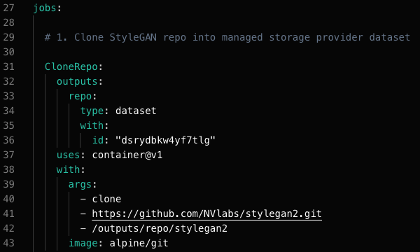
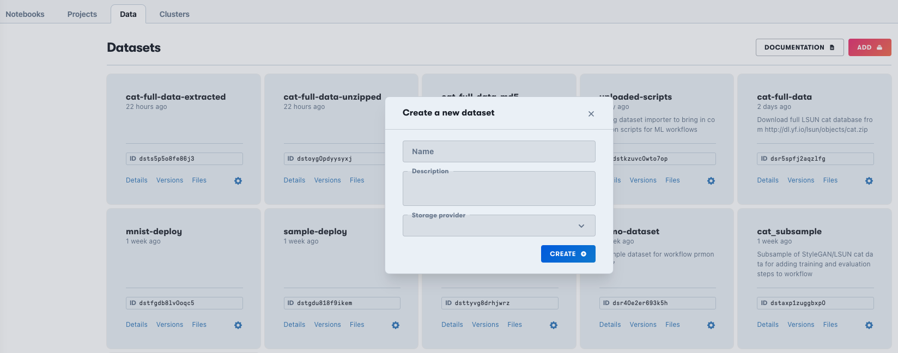
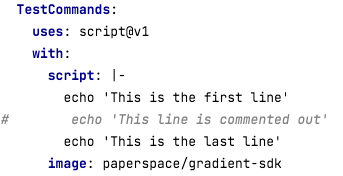
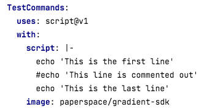

# Using YAML for Data Science

YAML provides a powerful and precise configuration for a data science pipeline to run to a production standard, and as such it needs care to specify it correctly. While it is relatively intuitive to see what is going on at a high level, there is a lot going on in the details. The combination of YAML syntax, Gradient actions, implicit information, and the conceptual variety of steps being performed for data science \(data preparation, model training, model deployment, etc.\), means that it can be tricky to get everything right at first.

We therefore collect here some examples likely to come up in practice when implementing data science Workflows.

## Indentation & syntax highlighting

YAML requires precise indentation, and tabs are not allowed. The Gradient Notebook allows easy creation and editing of YAML files, with aids such as visual prompts for indentation, and syntax highlighting.



## Multi-line commands

Many jobs within a Workflow spec will not be complex enough to require a script to be imported, but will need several commands. The YAML syntax `|-` \(pipe, dash\) sequence allows this to be laid out such that they don't all have to be on one line, and can be written with their arguments.

```yaml
uses: container@v1
with:
  args:
    - bash
    - -c
    - |-
      pip install scipy==1.3.3
      pip install requests==2.22.0
      pip install Pillow==6.2.1
      cp -R /inputs/repo/stylegan2 /stylegan2
      cd /stylegan2
```

Alternatively, Gradient's script action achieves a similar effect:

```yaml
uses: script@v1
with:
  script: |-
    pip install scipy==1.3.3
    pip install requests==2.22.0
    pip install Pillow==6.2.1
    cp -R /inputs/repo/stylegan2 /stylegan2
    cd /stylegan2
```

## Directory names

Jobs have inputs and outputs which results in some standard directory names that need to be given correctly. The inputs to a job are in `/inputs`, and the outputs from a job are in `/outputs`. The outputs from one job can become the inputs to the next, so what was, e.g., `/outputs/my_directory` becomes `/inputs/my_directory` in the next job.

The name of your output must match the directory name, e.g., in the example the output is named my-dataset \(line 10\), so for the output to be seen the directory under `/outputs` must also be named my-dataset \(line 7\).

```yaml
my-job:
  uses: container@v1
  with:
    args:
      - bash
      - '-c'
      - cp -R /my-trained-model /outputs/my-dataset
    image: bash:5
  outputs:
    my-dataset:
      type: dataset
      with:
        ref: my-dataset-id
```

## Inputs directory is not writable

The inputs to a job are in the `/inputs` directory, and this directory is not writeable. So to change the contents of this directory it needs to be copied out of `/inputs`. For example, the StyleGAN2 onboarding Workflow job to generate images contains the commands

```yaml
cp -R /inputs/repo/stylegan2 /stylegan2
cd /stylegan2
```

## Directory paths may be unexpected

A wrong directory path will cause the Workflow to fail with `No such file or directory`, or some related consequence, so it is important to be pointing to the right places.

An example of a not-necessarily-intuitive path is when the `git-checkout@v1` action is used to mount that repo to a volume, e.g.,

```yaml
CloneCatRepo:
  outputs:
    repoCat:
      type: volume
  uses: git-checkout@v1
  with:
    url: https://github.com/nmb-paperspace/cat-subsample
    username: nmb-paperspace
    password: secret:GIT_PASSWORD
```

but then the repo content, here `cat_images_tfrecords.tgz` is put directly into `/outputs`, so the path is `/outputs/repoCat/cat_images_tfrecords.tgz`, without the original repo URL. This can be remedied by adding the path explicitly, via `path:`, e.g.,

```yaml
  path: /outputs/repo/subfolder
```

in the `with:` section.

## Dataset identifiers

Datasets must be referred to by their names or IDs within the YAML file. The dataset must therefore be [created outside of the YAML file](https://docs.paperspace.com/gradient/explore-train-deploy/workflows/getting-started-with-workflows#create-datasets-for-the-workflow) currently \[1\]. This can be done in the GUI under the Data tab by clicking Add:



Alternatively the dataset can be created using the CLI command:

```bash
gradient datasets create \
  --name <my-dataset-name> \
  --storageProviderId <storage-provider-id`
```

See [Versioned Data](https://docs.paperspace.com/gradient/data/data-overview/private-datasets-repository) for more information on creating datasets.

\[1\] Unless you are using one of our tutorials that point to the pre-existing `demo-dataset`, which are a special case

## Dataset versions

Datasets can be referred to by their version \(e.g. `datasetId:version`\), or just by name or ID \(e.g. `datasetId`\). The latter can be useful when you want to refer to the latest version of a dataset, perhaps produced in a preceding Workflow. Additionally, you can reference a dataset by team namespace \(e.g. `namespace/datasetId:version`\).

Gradient Public Datasets utilize the namespace notation, being referred to by `gradient/<public dataset name>`.

## Some GitHub action syntax is not supported

Gradient Workflows overlap with GitHub Actions, but are not a duplicate of them. We do some things it doesn't do, such as parallel processing, but not all of its keywords are supported by us, so for example, using `name:` will fail.

## Linting

YAML is flexible with its syntax in some ways, for example comments can be placed somewhat freely. But some arrangements don't work and will cause a syntax error, often manifesting as some other error like`Failed to fetch data`. If desired, you can check that their YAML is valid in a syntactical sense by using one of several YAML checkers online, for example [https://yamllint.com](https://yamllint.com) , before expending compute resources on running a job.

## Commands that contain YAML special characters

Supplying commands in YAML can sometimes conflict with what it deems to be special characters, for example this command to download a large file using curl:

```yaml
- curl
- -C
- -
- -o
- /outputs/catImageDatabase/cat.zip
- 'http://dl.yf.io/lsun/objects/cat.zip'
```

will fail with `Failed to fetch data: "spec.jobs.TestCommands.with.args[2]" must be a string`because the dash is misread. \(`curl -C - -o` means resume downloading a file after an interrupted network connection.\) In these cases, enclosing the character in quotes can help, and this form succeeds:

```yaml
- curl
- -C
- "-"
- -o
- /outputs/catImageDatabase/cat.zip
- 'http://dl.yf.io/lsun/objects/cat.zip'
```

In this case one could also use the `|-` script syntax as detailed above.

## Command multiple arguments

Often when constructing a Workflow you may want to sanity check what is being done, e.g., what files are where. But this can hit YAML syntax too: `ls -a` will work, but `ls -al` will fail with `TypeError: Object of type bytes is not JSON serializable`. As with special characters, a solution is to use the script formulation, so not

```yaml
- bash
- -c
- ls -al
```

but

```yaml
- bash
- -c
- |-
  ls "-al"
```

and the same under the `script@v1` Gradient Action.

## Creating and referring to a dataset in the same Workflow

An example of information implicit in the Workflow that might not match intuition is that there is a difference between referring to a dataset under `inputs: type: dataset`, and the dot syntax. So if you populate the dataset `dstoyg0pdyysyxj` for the first time in the current Workflow \(not including the GUI creation step above to get the ID\), and then try to refer to it with

```yaml
inputs:
  repo: CloneStyleGAN2Repo.outputs.repo
  catImagesUnzipped:
    type: dataset
    with:
      ref: "dstoyg0pdyysyxj"
```

the run will fail because it is expecting an input from outside the Workflow, which in this case does not exist. However, using the dot syntax

```yaml
inputs:
  repo: CloneStyleGAN2Repo.outputs.repo
  catImagesUnzipped: UnzipFile.outputs.catImagesUnzipped
```

does work, because now it means the instance of cat images created by the earlier job that contained

```yaml
outputs:
  catImagesUnzipped:
    type: dataset
    with:
      ref: "dstoyg0pdyysyxj"
```

does exist, assuming the job succeeded. The dots correspond to indentation in this context.

## Datasets are _versioned_

So if you run one Workflow and output to a dataset ID:

```yaml
GetCatImageDatabase:
  outputs:
    catImageDatabase:
      type: dataset
      with:
        ref: "dsr5spfj2aqzlfg"
```

then run another Workflow and output an additional file to the same dataset ID, it won't update the earlier dataset version to add the new file alongside the first one. Instead a new dataset version is created, with a new `datasetId:version`, that intentionally does not include the previous file. This behavior is so that everything is versioned and immutable, which is desirable in a production setting. However this does require you to have a good understanding of when new dataset versions are created implicitly.

## Test whether a Python import will work

To see if a Python module is present on the container you are using without having to run a Python script, run, e.g.,

```yaml
- bash
- -c
- python3 -c "import <name of module>"
```

## Commenting in scripts

YAML allows comments in scripts under the `script@v1` Gradient Action, but the syntax is strict. This form will fail with a parser error:



However, placing the comment symbol next to the line succeeds:



with the expected output of two echoed lines.

This is useful for the common situation of wanting to run a script with commented out lines.

