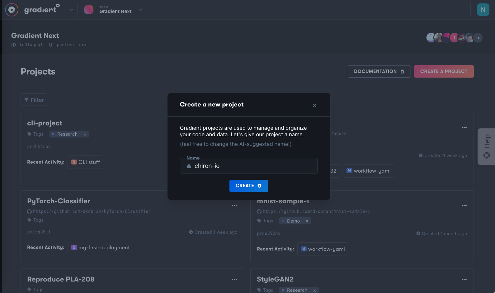
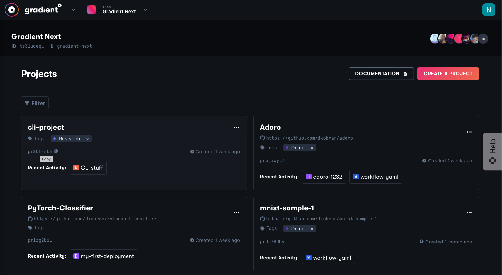
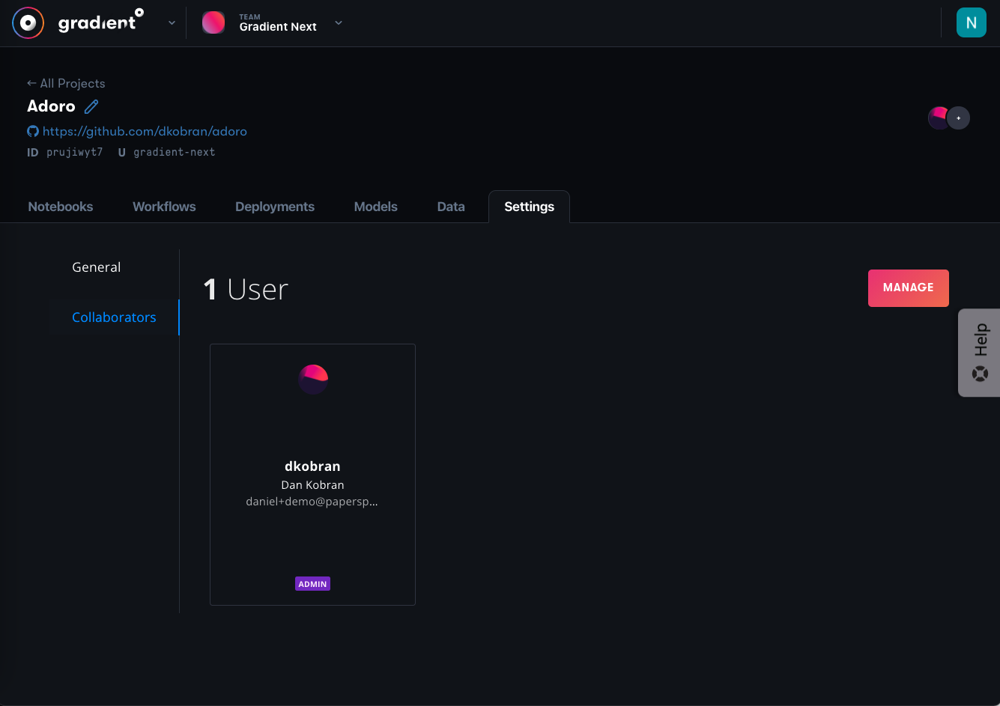
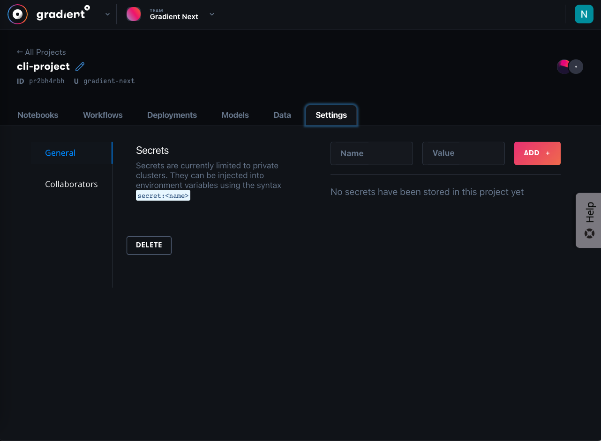

# Organizing Projects

A Gradient Project is a workspace for you or your team to run Notebooks and Workflows, store Models, and manage Deployments. Projects create an additional isolation layer of organization and control \(e.g., managing access\) within your team. You can create a project in the web UI or the CLI.

## Create a Project



On your [main Gradient workspace page](https://console.paperspace.com/projects), click _Create Project_.


Provide a name and then click _Create_.





The following command creates a Project called `ExampleProject`

```text
gradient projects create --name ExampleProject
```

For a project name with spaces in it, enclose the name in quotes, as in `--name "Example Project"`.

You will need to be logged into Gradient via having run `gradient apiKey <your API key>`, or pass the `--apiKey` argument, along with your key, to the command.

For other command line options, see the [CLI command reference](https://paperspace.github.io/gradient-cli/gradient.cli.html#gradient-projects), or `gradient projects create --help`



## Get Your Project's ID

A Project's ID is a required parameter for several commands within Gradient.



To find the ID, click the ID on the left of any entry in the Projects list to copy it to your clipboard. The ID is 9 characters long and begins with `p`.





To get a Project ID, you can use the following command:

```bash
gradient projects list
```

The output table includes an `ID` column. The projects for your current team \(API key\) will be listed.



## Managing access to a Project

To add other team members to a project, click any Project in the projects list to navigate to its Project details page and then click the Settings tab. On the resulting sidebar, click Collaborators.



You will then find a list of users who already have access to the Project. Add an Accessor by clicking the "Manage" button on the right side of the page. Assign other team members to the Project by selecting their name in the drop-down and clicking on "Assign User":


You can also remove members' access to a Project by clicking the "Remove Access" button next to the member's name.


Note: Only existing team members will be displayed in the drop-down list. Only Team admins can add additional team members to this list.

Additionally, project access can only be controlled through the web console – Accessors cannot be added or removed through the Gradient CLI.


## Linking a Project to a GitHub repository

Projects can be linked to a GitHub repository chosen by the user. This is done when the user [creates a Workflow](https://docs.paperspace.com/gradient/explore-train-deploy/workflows/getting-started-with-workflows#create-a-workflow), and in the Workflow creation steps the repository to which to link is chosen.

In future, other components of a Project, such as Notebooks and Deployments, may also become able to be linked to a repository.

## Deleting a Project



You can delete a project by visiting the project's `Settings` page and hitting the `Delete Project` button.



Deleting a Project will delete its associated Notebooks, Workflows, Deployments, and Models.



To delete a Project, you can use the following command:

```bash
gradient projects delete --id <Project ID>
```

Deleting a Project will delete its associated Notebooks, Workflows, Deployments, and Models.



