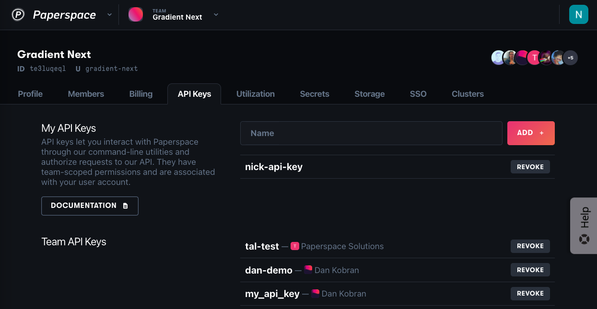
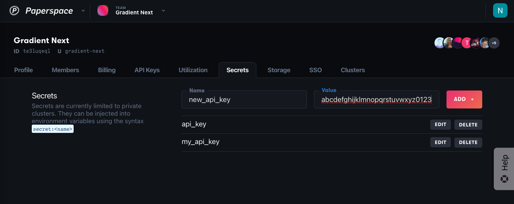

# Storing an API key as a Secret

Certain actions within Gradient require incorporating your API key to authenticate requests.  In cases where your API key is used within your code or commands that may be visible within your Gradient team \(e.g., a Notebook\) or other locations \(e.g., when checking your code into source control\), you will want to use Secrets to mask your unique API key.  

### 1. Create a new API key

Go to the API Keys tab under team settings, type a name for the key, and click Add.

Once your key is created, copy the key to your clipboard.

### 2. Save the key as a Secret

API keys can be added in a similar way to other secrets: type a name, paste the API key in the Value field, and click Add.

