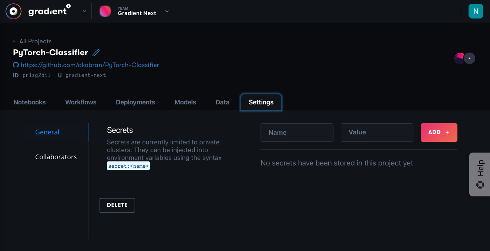
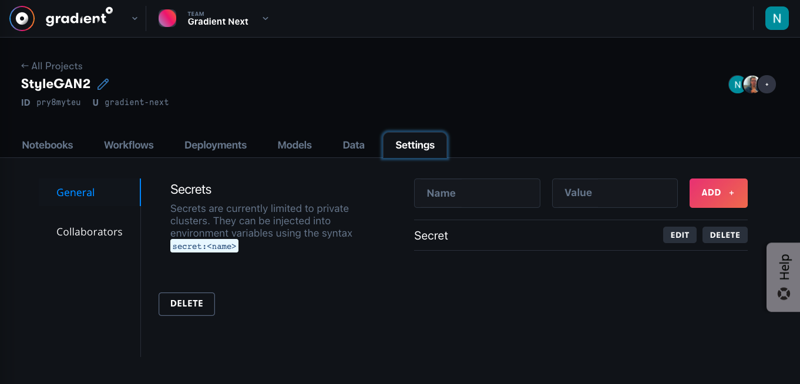
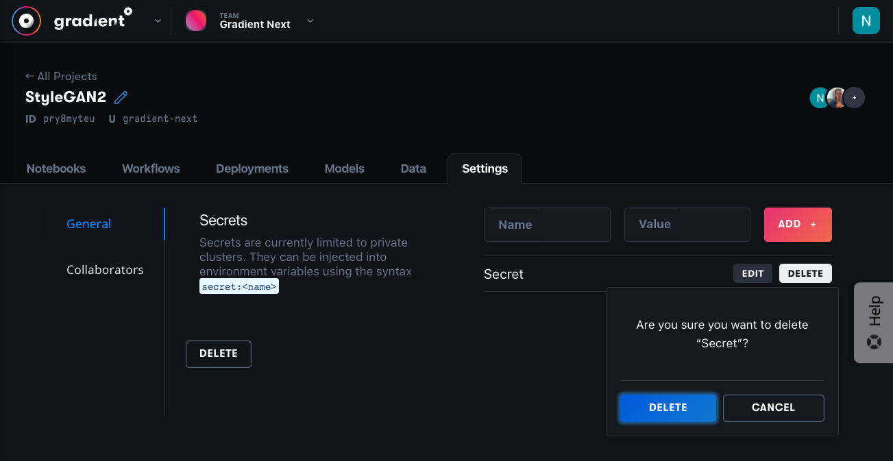

# Secrets

## Managing and Using Secrets

Secrets allow you to store sensitive information at the team, private cluster, and project level. The secrets you create are available to use in Workflows run on private clusters.

Secrets can be created at the following levels:

* Team: these secrets are applied to all projects and all clusters
* Project: these secrets are applied to all Workflows in a project
* Cluster: these secrets are applied to all Workflows in a cluster

Secrets can be set from the Settings tab in the web UI or through the CLI.


View the full CLI/SDK Docs for **Secrets** here: [https://paperspace.github.io/gradient-cli/gradient.cli.html\#gradient-secrets](https://paperspace.github.io/gradient-cli/gradient.cli.html#gradient-secrets)


### Set a Secret



Navigate to one of:

* The Secrets tab under Team settings
* The Settings tab under a Project
* The Secrets tab in the details of a Cluster under the Team settings Clusters tab

These correspond to Team, Project, and Cluster secrets respectively. Type in the name and value of the secret, and click Add to save.





Set team secret

```text
gradient secrets set team --name=<name> --value=<secret>
```

Set project secret

```text
gradient secrets set project --id=<project_id> --name=<name> --value=<secret>
```

Set cluster secret

```text
gradient secrets set cluster --id=<cluster_id> --name=<name> --value=<secret>
```



### List Secrets



Navigate to the Project, Team, or Cluster page, as with setting a secret above. The names of secrets in that scope that are already stored are listed.





List team secrets

```text
gradient secrets list team
```

List project secrets

```text
gradient secrets list project --id=<Project ID>
```

List cluster secrets

```text
gradient secrets list cluster --id=<Cluster ID>
```



### Delete a Secret



Navigate to the Project, Team, or Cluster page, as with setting a secret above. Click the **Delete** button and confirm the dialog.





Delete team secret

```text
gradient secrets delete team --name=<name>
```

Delete project secret

```text
gradient secrets delete project --id=<Project ID> --name=<name>
```

Delete cluster secrets

```text
gradient secrets delete cluster --id=<Cluster ID> --name=<name>
```



### **Secret scoping**

If the same secret name is created for more than one scope, only one will be applied.

Secrets with the same name have the following precedence:

* Cluster secrets take precedence over Team secrets
* Project secrets take precedence over both Cluster secrets and Team secrets.

