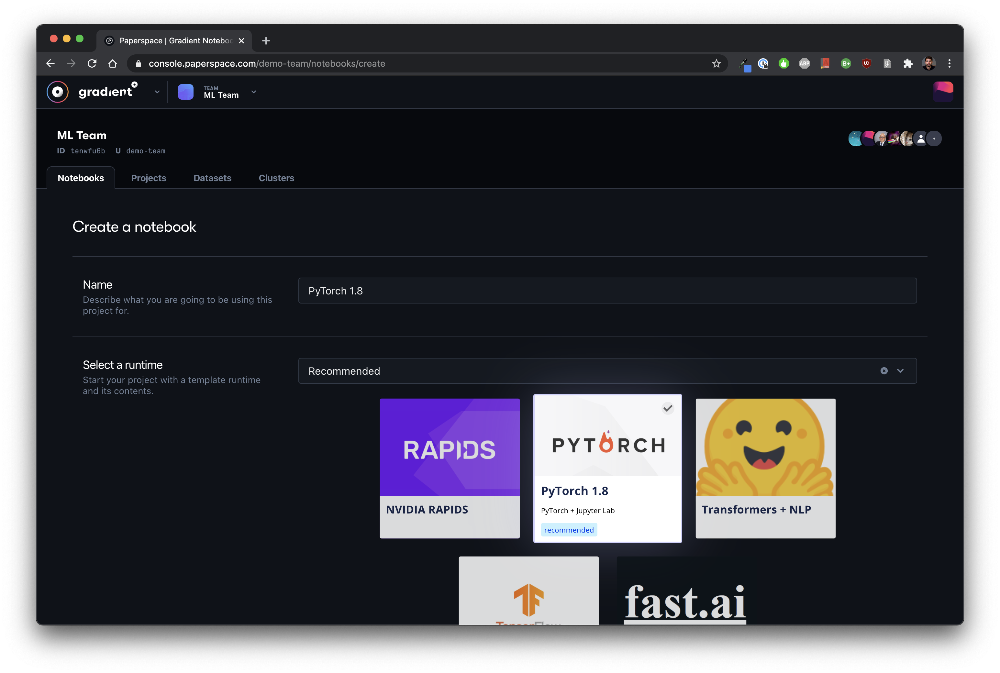

# Quick Start

## Prerequisites

To begin using Gradient, follow these preliminary steps:

1. [Create a Paperspace account ](https://console.paperspace.com/signup?gradient=true)
2. Optional: [Create a team ](https://support.paperspace.com/hc/en-us/articles/360010359213-Creating-and-Managing-Paperspace-Teams)to invite collaborators

Now you can create Notebooks, Workflows, Models, Deployments, and more!  Note: if you are self-hosting Gradient, please visit the [Gradient Private Cloud ](../../gradient-private-cloud/about/setup/self-hosted-clusters/)section for more info.


In order to unlock Workflows, Models, and Deployments, please [contact](https://info.paperspace.com/contact-sales-gradient) our solutions team. 


## Logging in for the first time

When you first log into the Paperspace Console, you can select Gradient from the product dropdown:


## Create a Notebook

Notebooks can be created on the Notebooks tab. Just select a [template](../../explore-train-deploy/about/create-a-notebook/notebook-containers/), choose your [instance type](../../more/instance-types/), and then click create. 


Check out the [FREE GPU](../../more/instance-types/free-instances.md) option when launching Notebooks!





Check out the [ML Showcase](https://ml-showcase.paperspace.com/) for a list of projects you can fork into your own account


You can stop, start, fork, and swap out the instance type anytime. Choose from a wide selection of pre-configured templates or bring your own. View the overview video to learn more:



## Advanced MLOps


In order to unlock Workflows, Models, and Deployments, please [contact](https://info.paperspace.com/contact-sales-gradient) our solutions team. 


### Create a Project

Projects organize your work.  To create a Project, navigate to **Gradient** &gt; **Projects** in the UI and click **Create Project**, provide a name, and click **create**. 


### Running your first Workflow


Using Workflows requires [creating a cluster](../../gradient-private-cloud/about/setup/managed-installation.md).  


You can run Workflows from the web interface or CLI. The first step is to create a new Workflow.


### **Steps**

1. \*\*\*\*[**Install the CLI**](install-the-cli.md)\*\*\*\*
2. **Download or copy the sample Workflow YAML file to your computer**
3. **Run the Workflow from the CLI**

```bash
gradient workflows run  \ 
--id <your-workflow-id>  \
--clusterId <your-cluster-id>  \
--path ./workflow.yaml 
```


**Note:** We recommend stashing your API key with `gradient apiKey XXXXXXXXXXXXX` or you can add your API key as an option on each Experiment. See [Connecting Your Account](install-the-cli.md#connecting-your-account).


The following command will create and start a Workflow that will run a sample project. Be sure to replace `<your-workflow-id>` with your **Workflow ID** and `<your-cluster-id>` with your **Cluster ID**.

Behind the scenes, your Workflow will be executed on your cluster. Congratulations! You ran your first Workflow on Gradient 🚀

## Explore the rest of the platform

From [Models](../../data/models/) to [Deployments](../../explore-train-deploy/deployments-overview/), there's a lot more to the Gradient platform.  We recommend using the Web UI to explore the primary components and also be sure to install the [CLI](install-the-cli.md) and check out the [SDK](../../more/gradient-python-sdk-1/).

