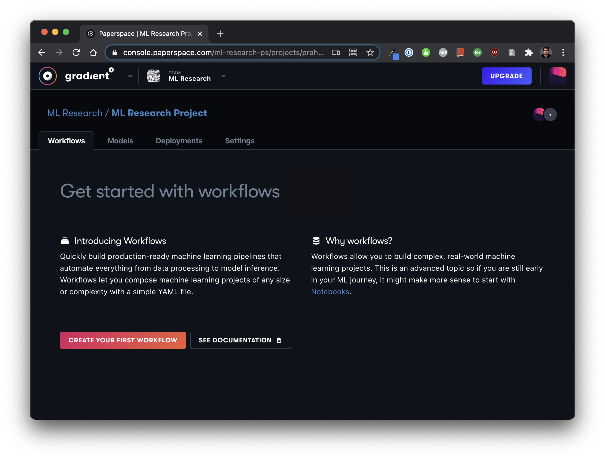

# Quick Start

## Prerequisites

To begin using Gradient, follow these preliminary steps:

1. [Create a Paperspace account ](https://console.paperspace.com/signup?gradient=true)
2. Optional: [Create a team ](https://support.paperspace.com/hc/en-us/articles/360010359213-Creating-and-Managing-Paperspace-Teams)to invite collaborators

Now you can create Notebooks, Workflows, Models, Deployments, and more! Note: if you are self-hosting Gradient, please visit the [Gradient Private Cloud ](../../gradient-private-cloud/about/setup/self-hosted-clusters/)section for more info.


In order to unlock Deployments, please [contact](https://info.paperspace.com/contact-sales-gradient) our solutions team.


## Logging in for the first time

When you first log into the Paperspace Console, you can select Gradient from the product dropdown:


## Create a Notebook

Notebooks can be created on the Notebooks tab. Just select a [template](../../explore-train-deploy/notebooks/create-a-notebook/notebook-containers/), choose your [instance type](../../more/instance-types/), and then click create.


Check out the [FREE GPU](../../more/instance-types/free-instances.md) option when launching Notebooks!




Check out the [ML Showcase](https://ml-showcase.paperspace.com/) for a list of projects you can fork into your own account


You can stop, start, fork, and swap out the instance type anytime. Choose from a wide selection of pre-configured templates or bring your own. View the overview video to learn more:



## Workflows and MLOps

You can perform advanced MLOps functions using Workflows, Models and Deployments. Workflows allow you to work with Data, Models, and Deployments in a reproducible and fully tracked manner. You can define a workflow one time using a text editor and use it repeatedly to perform simple or complex MLOps activities, such as pre-processing data, training models, creating/updating deployments, and/or performing inference.


In order to unlock Deployments, please [contact](https://info.paperspace.com/contact-sales-gradient) our solutions team.


### Create a Project

Projects organize your work. To create a Project, navigate to **Projects** and click **Create Project**, provide a name, and click **create**.


Make a note of the projectId, for example `pr1234567`.

### Running your first Workflow

You can run Workflows from the web interface or CLI. First you need to create a new Workflow. This will allow you to keep track of related runs of the Workflow.

If you have never run a workflow before you can create and run a demo workflow all in one step in the web interface, by clicking on the Workflows tab within the project, then clicking the **Create Your First Workflow** button. This will create a Workflow named `demo workflow` and a dataset named `demo-dataset`. The resulting images generated by the running the workflow will be stored in the dataset.



Follow the instructions on the page to run the workflow as is, or download the Workflow Spec and run it from the CLI.

### **Run Workflow from the CLI**

1. [**Install the Gradient CLI**](install-the-cli.md)
2. [**Connect your account**](install-the-cli.md#connecting-your-account)
3. **Create a Workflow**

   This step is only needed if you didn't already create a default `demo workflow` in the web interface. Specify a name for the Workflow and a `projectId`. Use the `projectId` from the project you created earlier.

   ```bash
   gradient workflows create  \ 
   --name <your-workflow-name>  \
   --projectId <your-project-id>
   ```

   To see a list of your projects and `projectIds` run `gradient projects list`. For a list of Workflows within a project run `gradient workflows list --projectId <your-project-id>`.

4. **Download or copy the sample Workflow Spec from the web interface to your computer**

   Here is the Workflow Spec for reference:

   ```yaml
   jobs:
     CloneRepo:
       resources:
         instance-type: C5
       outputs:
         repo:
           type: volume
       uses: git-checkout@v1
       with:
      url: https://github.com/NVlabs/stylegan2.git
     StyleGan2:
       resources:
         instance-type: P4000
       needs:
         - CloneRepo
       inputs:
         repo: CloneRepo.outputs.repo
       outputs:
         generatedFaces:
           type: dataset
           with:
             ref: demo-dataset
       uses: script@v1
       with:
         script: |-
           pip install scipy==1.3.3
           pip install requests==2.22.0
           pip install Pillow==6.2.1
           cp -R /inputs/repo /stylegan2
           cd /stylegan2
           python run_generator.py generate-images \
             --network=gdrive:networks/stylegan2-ffhq-config-f.pkl \
             --seeds=6600-6605 \
             --truncation-psi=0.5 \
             --result-dir=/outputs/generatedFaces
         image: tensorflow/tensorflow:1.14.0-gpu-py3
   ```

   Place the contents in a file named `workflow.yaml`.

5. **Run the Workflow from the CLI**

   The following command will run an instance of the Workflow in your project. Be sure to replace `<your-workflow-id>` with your **Workflow ID**.

   ```bash
   gradient workflows run  \ 
   --id <your-workflow-id>  \
   --path ./workflow.yaml
   ```


**Note:** We recommend stashing your API key with `gradient apiKey XXXXXXXXXXXXX` or you can add your API key as an option on each command. See [Connecting Your Account](install-the-cli.md#connecting-your-account).


Behind the scenes, your Workflow will be executed on the Gradient public cluster. Congratulations! You ran your first Workflow on Gradient 🚀

## Explore the rest of the platform

From [Models](../../data/models/) to [Deployments](../../explore-train-deploy/deployments/), there's a lot more to the Gradient platform. We recommend using the Web UI to explore the primary components and also be sure to install the [CLI](install-the-cli.md) and check out the [SDK](../../more/gradient-python-sdk-1/).

