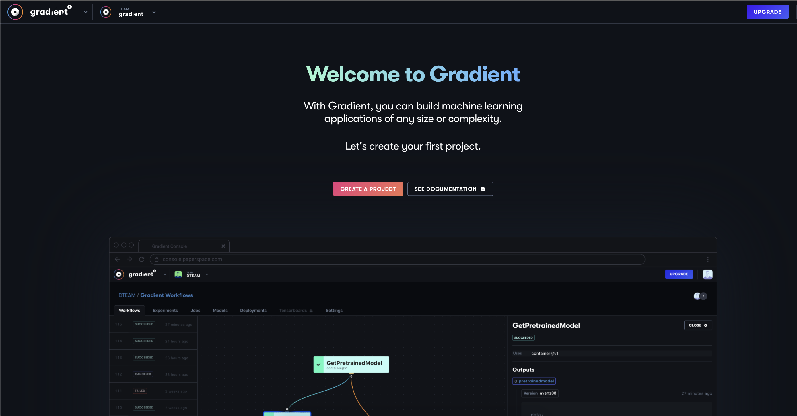
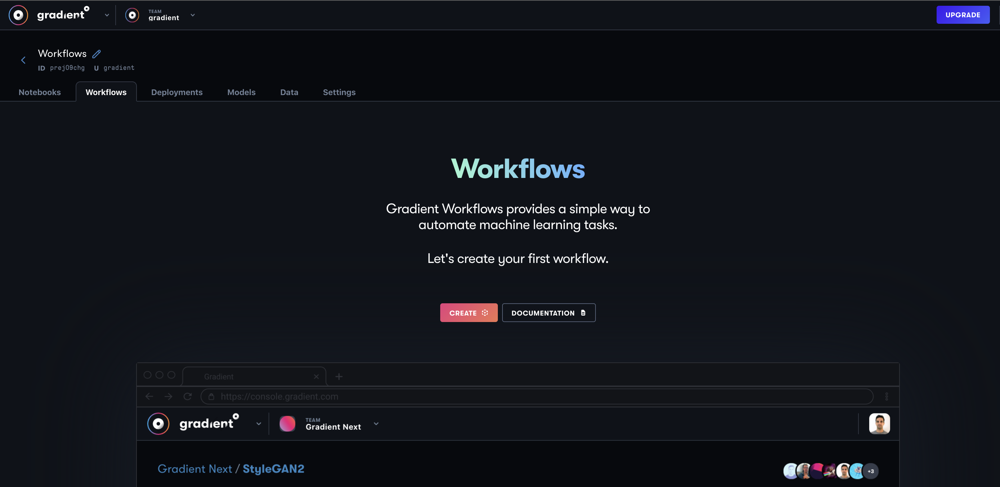
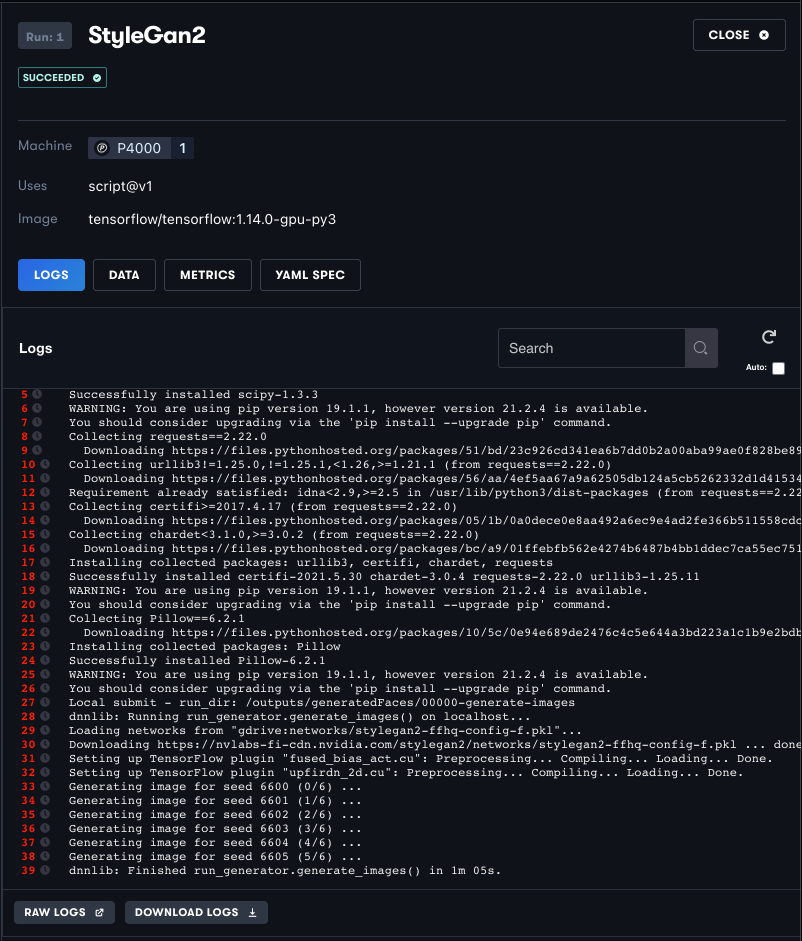
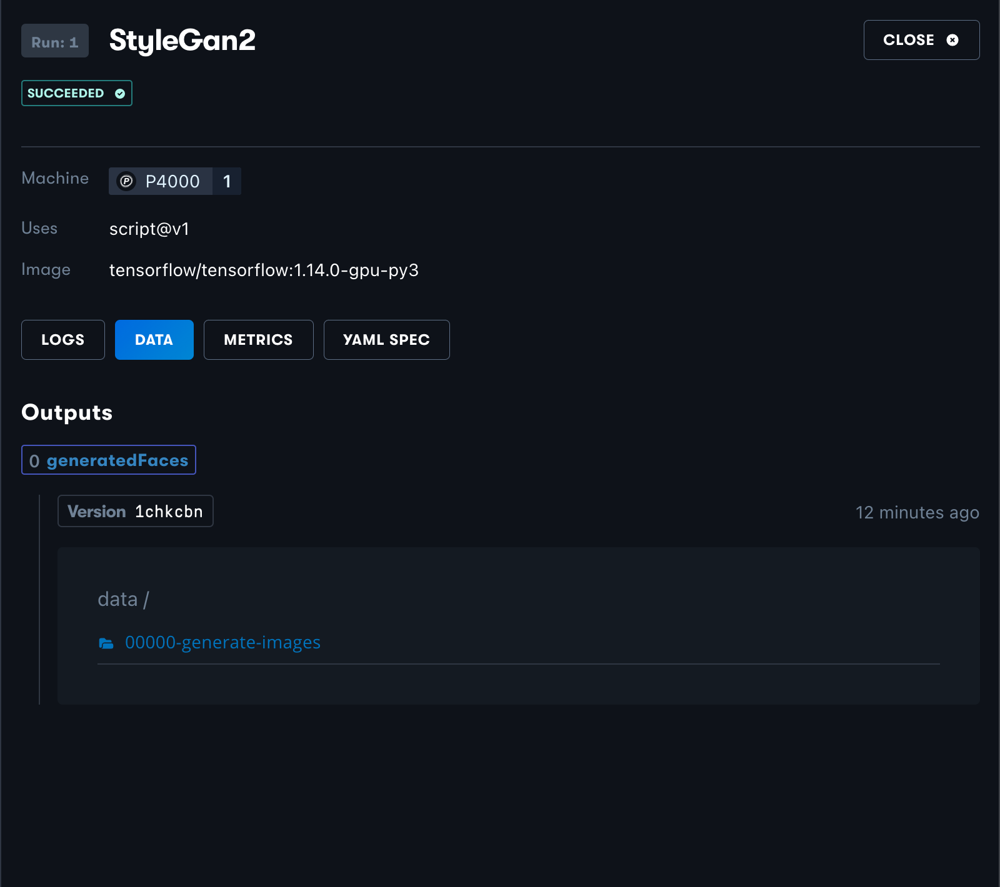

# Getting Started: Build and Run a Sample Workflow

## Overview

In this tutorial, we will learn how to set up a Project on Gradient, connect your GitHub account to Paperspace, and create a Workflow from one of the templates we provide, in this case StyleGan2. 

### Context 

Workflows are designed to help you automate machine learning tasks. Workflows can be used independently or in conjunction with Notebooks and Deployments.

 StyleGan2 is one of the premiere unconditional generative image modeling methodologies, and we will use this workflow to generate images of faces.

### What we will learn

In this tutorial we will apply Notebook findings to an automatic, iterative training process using Workflows and the accompanying [YAML Workflow spec](../../explore-train-deploy/workflows/using-yaml-for-data-science.md).

Finally, after running a successful Workflow, we will discuss possibilities for additional Workflow capabilities like modifying the Workflow YAML syntax for customization of our Workflow.

## Getting Started

### Create a Project

From the Projects tab in the Gradient console, select `Create A Project`. Name your Project.

### Create and Run a Sample Workflow

Navigate to the Workflows tab once you are in your new project. Select `Create` to make your Workflow. It will then as you to set up GitHub integration. Configure your Paperspace account to connect to your GitHub.

Next, we can either run an automatic sample Workflow, or we can set up our own custom Workflow. Before creating our own custom Workflow, we will select `Automatically run a Workflow` which will clone [StyleGAN2](https://github.com/nvlabs/stylegan2) and run a simple face generator.

### The Workflow UI

We will soon see a Workflow spinning up in the UI:

By clicking on the green box representing each job, we can look at the outputs, logs, compute metrics, and YAML for each component job in the Workflow. When the Workflow completes we will see something like this:

It looks like our Workflow successfully completed! 

In the same panel in the UI, let's select `Data` to see if we can view the results of our face generator.

If we click into our data folder we find a list of generated files:

And we can preview one of the faces we just generated using StyleGAN2!

### Results

Congratulations! You've run your first Workflow. At this point here is everything we've done:

* Learned how to create a Project and Workflow on Gradient within your browser 
* How to connect your Github account to Gradient
* How to interact with Workflows UI in the browser

### Further Reading

* Part 2 of this tutorial, detailing how to run a custom Workflow from the Gradient CLI, can be found here
* If you feel comfortable with this classical ML implementation of Workflows and are ready to move on to using more advanced or deep learning techniques, work through the tutorial on creating a [recommender system using Notebooks and Workflows](https://docs.paperspace.com/gradient/get-started/tutorials-list/end-to-end-example)
* Learn how to deploy your new models created using Workflows in our[ Using Deployments ](https://docs.paperspace.com/gradient/get-started/tutorials-list/dealing-with-gradient-deployments)doc

