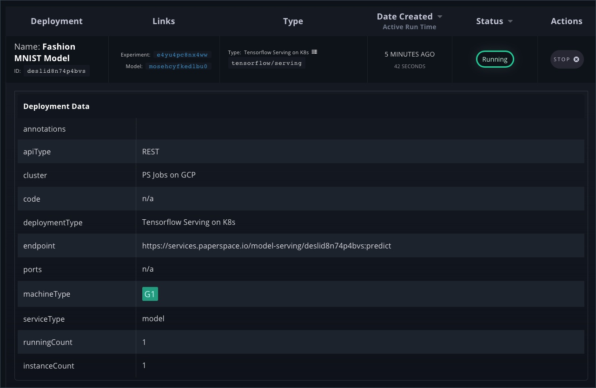

# Using Deployments

## Objectives 

* Understand the workflow involved in deploying models 
* Consuming a deployment URL for model inferencing

## Introduction

Gradient Deployments enable a hassle-free, automatic “push to deploy” option for any trained model. These allow ML practitioners to quickly validate “end-to-end” services from R&D to production.

Gradient deployments come with out-of-the-box integration with TensorFlow models, which can be easily extended to serve other types of models and data. The deployments support a variety of GPU & CPU machine types with per-second billing. Deployments can be scaled to multiple instances running behind a load balancer that exposes a dedicated endpoint.


In order to unlock Deployments, please [contact](https://info.paperspace.com/contact-sales-gradient) our solutions team.


In this tutorial, we will create a deployment from an existing TensorFlow model. This guide is a continuation of the tutorial, [Registering Models](registering-models-in-gradient.md).

Clone the repo [https://github.com/gradient-ai/fashionmnist](https://github.com/gradient-ai/fashionmnist) to access the inference code.

## Turning a Registered Model into a Deployment 

Once a model is registered and available in Gradient, it can be used for model serving and inferencing.

Make sure that the model is registered with Gradient.

```bash
gradient models list
```

```text
+------+-----------------+------------+------------+
| Name | ID              | Model Type | Project ID |
+------+-----------------+------------+------------+
| None | mosdnkkv1o1xuem | Tensorflow | prioax2c4  |
+------+-----------------+------------+------------+
```

Run the below command to convert the registered model into a scalable deployment. Note: You can also perform the same operations from the user interface.

```bash
gradient deployments create \
    --deploymentType TFServing \
    --modelId mosdnkkv1o1xuem \
    --name "Fashion MNIST Model" \
    --machineType C5 \
    --imageUrl tensorflow/serving \
    --instanceCount 1
```

`New deployment created with id: deslid8n74p4bvs`

The above command has multiple switches that are important for the deployment configuration. Let’s understand each of them.

`--deploymentType` specifies the model serving mechanism. In this tutorial, we are using `TFServing` which represents TensorFlow Serving.

`--modelId` indicates the id of the registered model. This should be already present in the model list. Notice that we are using `mosdnkkv1o1xuem` which is the id of the model registered in the previous tutorial.

`--name` provides an arbitrary name to the deployment.

`--machineType` represents the instance type used for hosting the container.

`--imageUrl` points Gradient to the container image responsible for model serving.

`--instanceCount` defines the number of instances hosting the deployment.

Now, start the deployment with the below command:

```bash
gradient deployments start --id deslid8n74p4bvs
```

This should return:

```text
Deployment started
```

You can list all the deployments with the Gradient Deployments list command.

```bash
gradient deployments list
```

```text
+---------------------+-----------------+----------------------------------------------------------------------+----------+---------------------------+
| Name                | ID              | Endpoint                                                             | Api Type | Deployment Type           | 
+---------------------+-----------------+----------------------------------------------------------------------+----------+---------------------------+ 
| Fashion MNIST Model | deslid8n74p4bvs | https://services.paperspace.io/model-serving/deslid8n74p4bvs:predict | REST     | Tensorflow Serving on K8s | 
+---------------------+-----------------+----------------------------------------------------------------------+----------+---------------------------+
```

The list of deployments can also be accessed from the web UI.



## Accessing the Deployment for Inferencing

Each Gradient Deployment results in an endpoint URL that’s compatible with TensorFlow Serving scheme. The last step of this tutorial generated an endpoint URL [https://services.paperspace.io/model-serving/deslid8n74p4bvs:predict](https://services.paperspace.io/model-serving/deslid8n74p4bvs:predict) that can be used for inference.

Switch to the infer folder of the cloned repo and execute the following commands:

```text
export SERVE_URL=https://services.paperspace.io/model-serving/deslid8n74p4bvs:predict
```

```text
python infer.py
```

You should see the following output:

```text
The model predicted this as a Ankle boot, and it was actually a Ankle boot
The model predicted this as a Pullover, and it was actually a Pullover
The model predicted this as a Trouser, and it was actually a Trouser
The model predicted this as a Trouser, and it was actually a Trouser
The model predicted this as a Shirt, and it was actually a Shirt
```

For inferencing, we load the test data along with the associated labels and send the first five images to the Tensorflow Serving REST endpoint. 

From the output, it is clear that the model is performing well in predicting the type of apparel.

Feel free to explore [infer.py](https://github.com/janakiramm/fashionmnist/blob/master/infer/infer.py) as an example of how to perform inferencing with Gradient Deployments based on Tensorflow Serving.

## Summary 

Gradient Deployments provide a highly scalable one-click deployment of machine learning models.

