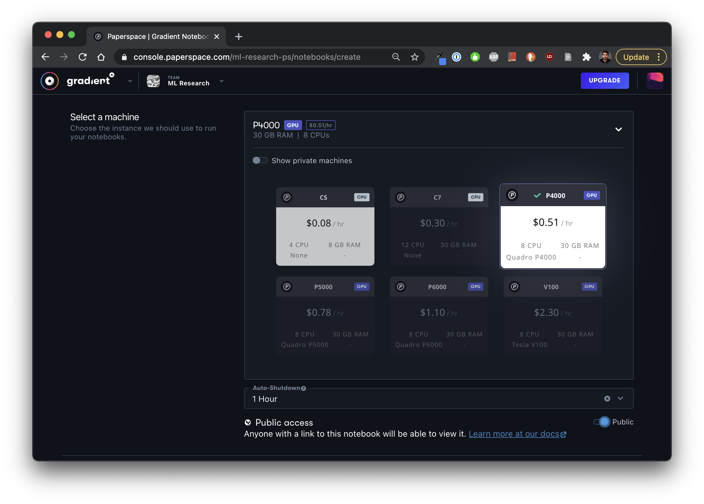
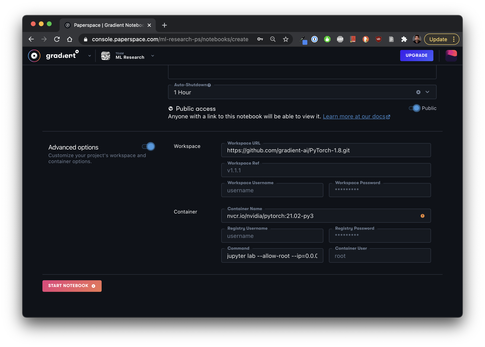
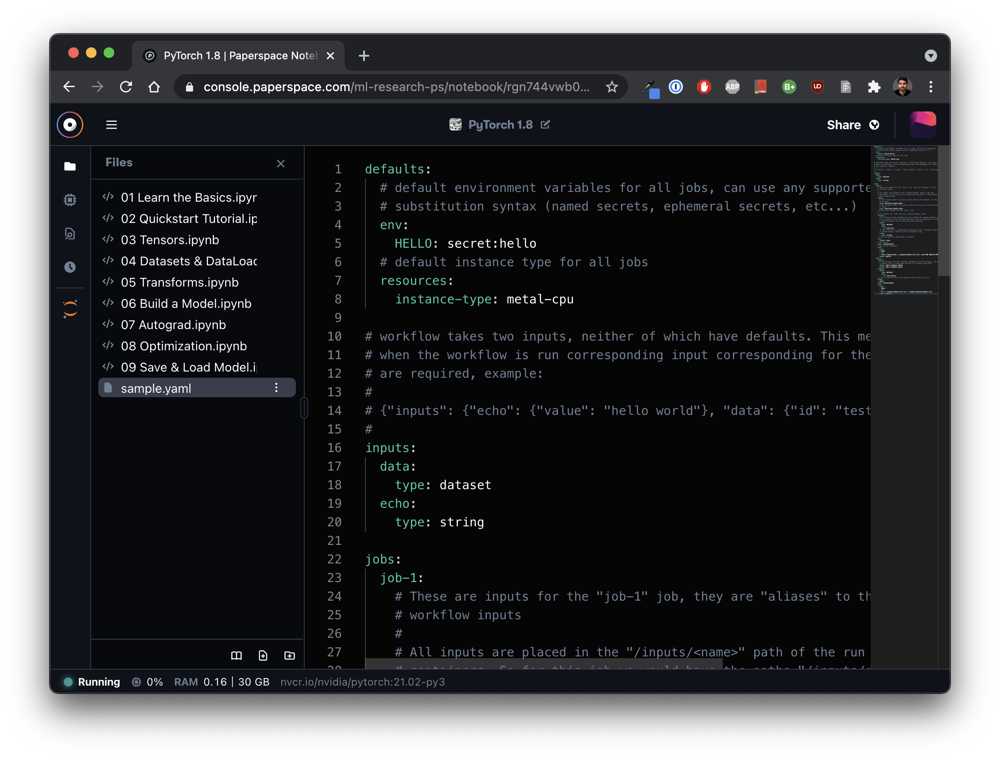

# Get started with Notebooks




Check out Notebook examples in the [ML Showcase](https://ml-showcase.paperspace.com/)!


## **Key Concepts**

**Supported languages & file types**

Any Jupyter notebook \(`.ipynb` file\) is supported natively.   You can also treat a Notebook as a full IDE and both write and execute code written in other languages such as Python.   

#### Compute options

Gradient provides one-click access to Jupyter Notebooks that run on a variety of [instance types](../../more/instance-types/), including our [free tier](../../more/instance-types/free-instances.md), as well your own [compute clusters](../../gradient-private-cloud/about/setup/self-hosted-clusters/) e.g. your AWS account. 

#### Runtime 

Notebooks run within a Docker container so they are lightweight, portable, and easy to work with. You can start your Notebook with one of our [pre-configured templates](../../explore-train-deploy/notebooks/create-a-notebook/notebook-containers/) or use a custom docker image. 

Your runtime behaves like a traditional operating system: You can download files and install and run any package with standard tools available in Linux e.g. `wget`, `pip`, etc. from within the provided terminal or within a Jupyter cell.  Any changes to your environment are persisted across multiple sessions.  

#### Workspace \(optional\)

When you launch a Notebook, you can provide a workspace which is a source of notebook \(`.ipynb`\) or other files that will be downloaded and added to your Notebook instance when it starts.  Common workspace sources include GitHub repos or individual files stored on GitHub.

#### Storage

Gradient provides a [persistent storage directory](../../explore-train-deploy/notebooks/create-a-notebook/notebooks-storage.md) which is automatically mounted at `/storage`.  You can use this directory to store any files. 

## Launching a Notebook Instance

Open the **Notebooks** tab to create a new notebook. After naming your notebook, the next step is to choose a pre-configured template or custom container. We'll select **PyTorch** which includes the PyTorch framework and the necessary NVIDIA libraries to enable GPU support. You can learn about using custom containers [here](../../explore-train-deploy/notebooks/create-a-notebook/notebook-containers/#custom-containers).

In the next step, choose the machine type. Here you can choose from the managed service or your [private cluster](../../gradient-private-cloud/about/) instances if you have created a private cluster. Select the **Free GPU** machine to access free GPU instances. On this step, you can also select auto-shutdown which is especially useful when using paid instances.  Finally, you can toggle the Notebook to be [public](../../explore-train-deploy/notebooks/create-a-notebook/public-notebooks.md) or private.   

The last \(optional\) step is to customize the **Workspace** and the **Container**.  The Workspace option provides the ability to pull down files into the notebook when it's created.  A common example is to pull a GitHub repository \(see image below\).  The [container option ](../../explore-train-deploy/notebooks/create-a-notebook/notebook-containers/#custom-containers)allows you to provide a custom Docker image from a public or private container registry.  

The final step is to click **start notebook**.

## The Notebook interface

On the **files** tab, you can create, rename, and delete files and folders.  Once your Notebook is online, you can edit and run notebook or other code files. 

Jupyter operations, such as adding and removing cells, are fully supported.  You can right-click on cells to view additional options.

Standard code files are also supported with full syntax highlighting.

