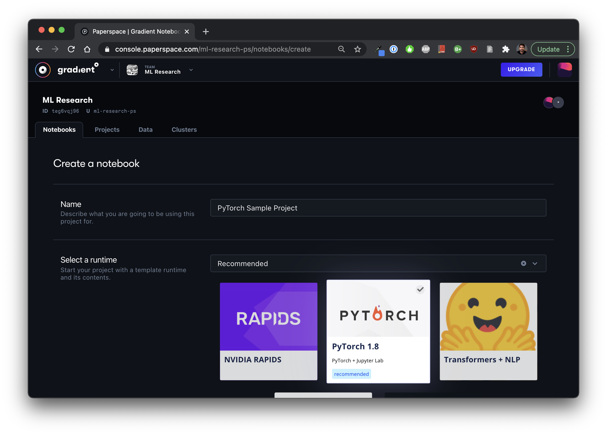

# Get started with Notebooks



## **Objectives**

* Launch a Jupyter Notebook with a single click
* Train a machine learning model
* Save the model for inferencing


This example is available in our ML Showcase!  You can clone the notebook [here](https://ml-showcase.paperspace.com/projects/logistic-regression-with-scikit-learn). 


## **Key Concepts**

#### Compute options

Gradient provides one-click access to Jupyter Notebooks that run on a variety of [instance types](../../more/instance-types/), including our [free tier](../../more/instance-types/free-instances.md). 

#### Runtime 

Notebooks run within a Docker container so they are lightweight, portable, and easy to work with. You can start your Notebook with one of our [pre-configured templates](../../explore-train-deploy/about/create-a-notebook/notebook-containers/) or use a custom docker image. 

Your runtime behaves like a traditional operating system: You can download files and install and run any package with standard tools available in Linux e.g. `wget`, `pip`, etc. from within the provided terminal or within a Jupyter cell.  Any changes to your environment are persisted across multiple sessions.  

#### Workspace \(optional\)

When you launch a Notebook, you can provide a workspace which is a source of notebook \(`.ipynb`\) or other files that will be downloaded and added to your Notebook instance when it starts.  Common workspace sources include GitHub repos or individual files stored on GitHub.

#### Storage

Gradient provides a [persistent storage directory](../../explore-train-deploy/about/create-a-notebook/notebooks-storage.md) which is automatically mounted at `/storage`.  You can use this directory to store any files. 

## Launching a Notebook Instance

Open the **Notebooks** tab to create a new notebook. After naming your notebook, the next step is to choose a pre-configured template or custom container. We'll select **PyTorch** which includes the PyTorch framework and the necessary NVIDIA libaries to enable GPU support. You can learn about using custom containers [here](../../explore-train-deploy/about/create-a-notebook/notebook-containers/#custom-containers).

In the next step, choose the machine type. Since we don’t need high-end machines with GPUs, we can choose a low-cost instance. Select the **Free GPU** machine to access free GPU instances.

The notebook will now provision. The notebook status will be **Provisioning** or **Pending** for a minute or two.

