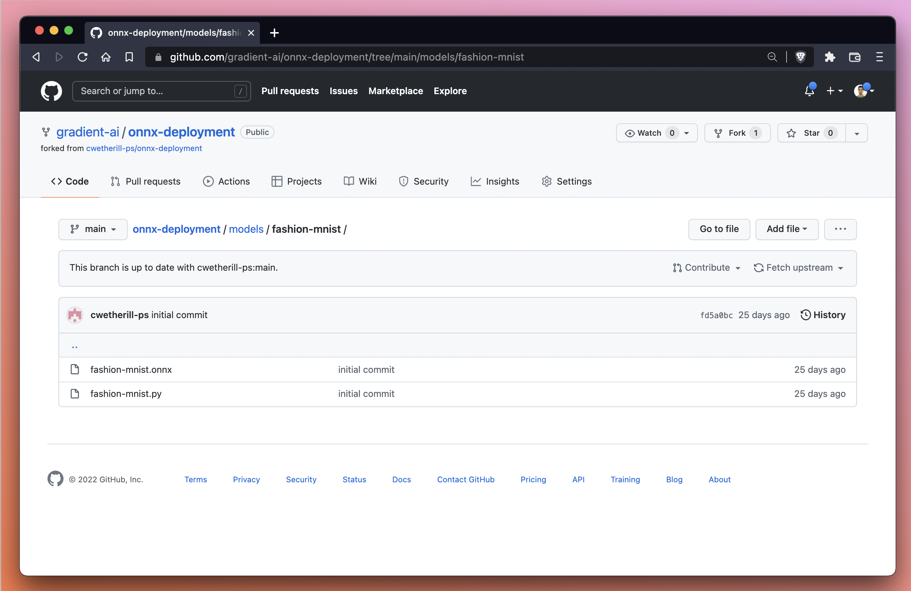
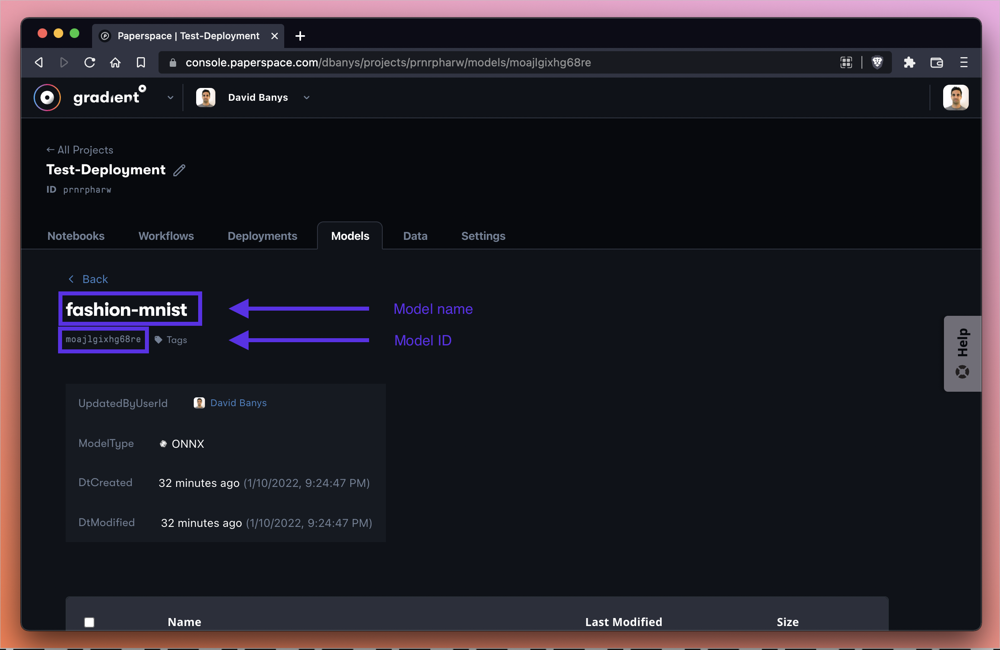
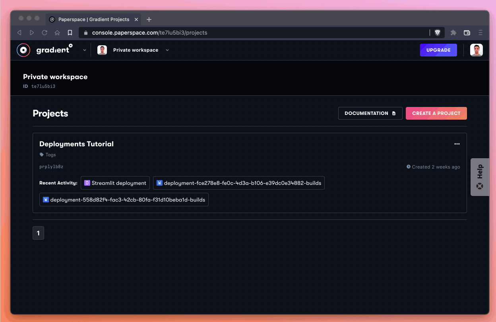
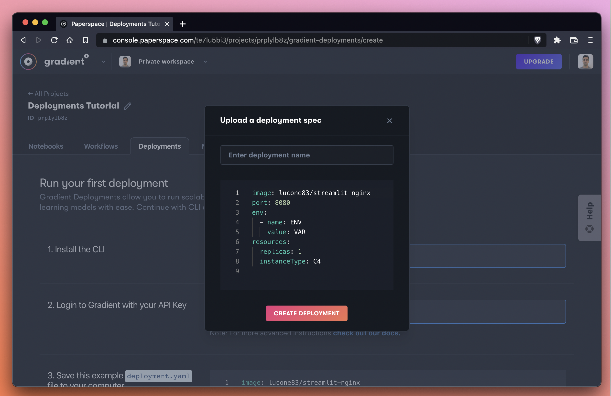
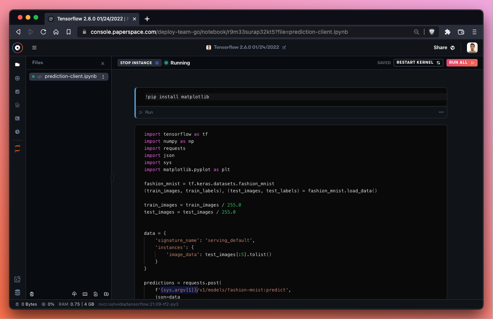

# Gradient Deployments Tutorial

## Introduction

[Gradient Deployments](https://gradient.run/deployments) helps us perform effortless model serving to an API endpoint.&#x20;

During this tutorial we'll learn how to use Gradient to deploy a machine learning model using a high-performance, low-latency microservice with a RESTful API.

 (1) (1).png>)

Gradient Deployments makes it easy to deploy a container image to an API endpoint for hosting or inference.&#x20;

In [Part 1](gradient-deployments-tutorial.md#part-1-deploy-a-simple-streamlit-application) of this tutorial, we're going to deploy a generic version of [Streamlit](https://streamlit.io) to an endpoint. This will be an extremely quick exercise to demonstrate how quickly we can serve a container to an endpoint in Gradient.

In [Part 2](gradient-deployments-tutorial.md#part-2-deploy-from-gradient-model-registry), we're going to increase complexity and serve an inference endpoint. We'll first train a simple model with Gradient Workflows and then deploy it.

Let's get started!

## Part 1: Deploy a simple Streamlit application

In Part 1 of this tutorial, our goal is to deploy an application as fast as possible. Once we get a handle on the look and feel of a deployment, we'll then move on to Part 2 during which we'll train and deploy an inference server capable of responding to a query.&#x20;

To make this first part easy, we're going to use the [Streamlit](https://streamlit.io) demo application that is available as a starter deployment within the Gradient console.

Here is what we're going to do:

* Create a new project in Gradient
* Create a Streamlit deployment within this project
* Confirm that our new deployment is online and functional

Let's create our new project!

### Create a project

If we haven't already created a project in the Gradient console, we'll need to do that first. We're going to select `Create a Project` from the homepage of our workspace. Alternatively, if we already have a project that we'd like to use, we can select that project as well. Note that we can create as many projects as we like no matter what service tier we're on -- so feel free to create a new project just to keep things nice and tidy.

Here we've named our new project `Deployments Tutorial`. We'll be adding more than one deployment to this project as we progress through his tutorial.&#x20;

 (1).png>)

Great! We should now have a new project in Gradient with the name `Deployments Tutorial`.

After we create a new project, we're going to create a new Deployment within that project.

### Create a deployment using a basic template in the console

Let's go ahead and create a deployment within our project. Once we're within the project in the UI (we can confirm this by seeing the name of our project in the top left along with the button to navigate back to `All Projects`) let's tab over to the `Deployments` panel and select `Create`.

Let's name our new deployment `Streamlit deployment` and then press the big button `Create Deployment`.&#x20;

 (1).png>)

Excellent! While our deployment is spinning-up, let's take a look at the deployment spec that we just ran:

.png>)

The spec for this deployment looks like this:

```
image: lucone83/streamlit-nginx
port: 8080
env:
  - name: ENV
    value: VAR
resources:
  replicas: 1
  instanceType: C4
```

Let's break down our instructions to Gradient:

* `image` - the [specified image](https://hub.docker.com/r/lucone83/streamlit-nginx) or container for Gradient to pull from DockerHub
* `port` - the communication endpoint that the deployment server should expose to the open internet
* `env` - environment variables to apply at runtime
* `resources` - compute instance to apply to this job

As we can see, there is a good amount of configuration options available. If we wanted to change the instance type, for example, we would simply need to modify the `resources` block. If we wanted to upgrade our processor to a C5 instance, for example, we would write:

```
resources:
  replicas: 1
  instanceType: C5
```

That's all there is to it! For more information on the deployment spec, be sure to [read the docs](https://docs.paperspace.com/gradient/explore-train-deploy/deployments/deployment-spec).&#x20;

Meanwhile, let's see the result of our deployment:

 (1).png>)

Excellent! It takes about 30 seconds for our deployment to come up, but once it does the UI state changes to `Ready` and the link to our Streamlit deployment brings us to a hosted endpoint where we can demo a number of Streamlit features.&#x20;

We've now successfully launched our first deployment!&#x20;

In the next part of the tutorial we'll take a look at doing a more end-to-end Gradient Deployments project where we will train a model first and then host it to an endpoint.

## Part 2: Deploy from Gradient model registry

In Part 2 of this tutorial, we're going to upload an ONNX model to Gradient and serve it to an endpoint as a deployment. By the end of this section we'll be able to query the endpoint to run inference.&#x20;

For Part 2 of this tutorial, we'll be referencing the following GitHub repository which contains the sample ONNX model as well as a sample deployment spec:


Sample ONNX model and deployment spec on GitHub.


To deploy a model endpoint, we'll first need to upload the model to Gradient. After that, we'll reference the model in our deployment spec which will allow us to serve the model as an endpoint.

### Download the model files from GitHub

The first thing we'll do is grab the model files from the demo repo and upload them as a model object in the Gradient user interface.

These are the model files we'll be looking to upload to Gradient:

```
/models/fashion-mnist/fashion-mnist.onnx
/models/fashion-mnist/fashion-mnist.py
```

The files, located in the `models/fashion-mnist` directory of the `onnx-deployment` repo, are also [available via the GitHub UI](https://github.com/gradient-ai/onnx-deployment/tree/main/models/fashion-mnist).



We'll first need to download the files to our local machine before we can upload to Gradient. We can accomplish this from our local machine via the command line or via the GitHub user interface.

In the command line we can first `cd` into our local directory of choice. Here we'll use `/downloads`:

```
cd ~/downloads
```

Then we can use the `git clone` command to clone the repo to our local machine:

```
git clone https://github.com/gradient-ai/onnx-deployment.git
```

We can then open the repo that was just downloaded and navigate to `onnx-deployment/models/fashion-mnist` to find our files.&#x20;

Alternatively, if we prefer to use the GitHub UI, we can use the download button and then unzip the repo to the preferred destination on our local machine. The download button is located under the `Code` pulldown in the GitHub UI, as seen below:

.png>)

Next, we're going to upload the model files to Gradient as a model object.

### Upload the model to Gradient

To upload a model to Gradient, we'll first hop over to the `Models` tab within the Gradient console.&#x20;

From here, we'll select `Upload a model` which will bring up a modal that will allow us to select or drag-and-drop files to upload as a model.

.gif>)

These are the steps we'll take in the `Upload a model` modal:

* Drag and drop QTY 2 model files (`fashion-mnist.onnx` and `fashion-mnist.py`) from our local machine
* Toggle the dropdown menu `Select model type` and select ONNX
* Give our model a name -- in this case we use **fashion-mnist**
* Select **Gradient Managed** as our `Storage provider`&#x20;

By selecting **Gradient Managed**, we are telling Gradient that we'd like to use the native storage and file system on Gradient rather than setting up our own storage system.

All we have to do now is click `Upload` and wait for the model to be available, which should take a few moments.



At this point we should see that our model has both a name (in our case `fashion-mnist`) and a model ID (in our case `moajlgixhg68re`). Note that your own model name will depend on the name you give your model, and the ID will depend on the computer-generated ID that Gradient assigns you.

In any case, we'll need to reference these two pieces of information in the next step, so let's be sure to hold on to them!

### Create another deployment

Now we're going to create another deployment within the same project we used in Part 1 (which we titled `Deployments Tutorial`).&#x20;



From the `Deployments` tab of the Gradient console, we'll first select `Create`.

Next, we'll use the `Upload a deployment spec` text link to bring up the YAML spec editor.&#x20;

By default, the spec will look like this:



Instead of the default spec, we're going to overwrite the spec with our own spec as follows:

```
image: cwetherill/paperspace-onnx-sample
port: 8501
resources:
  replicas: 1
  instanceType: C4
models:
  - id: moajlgixhg68re
    path: /opt/models/fashion-mnist
```

Here is an explanation of the deployment spec:&#x20;

* `image` - the [Docker image](https://hub.docker.com/r/cwetherill/paperspace-onnx-sample) or container that we want Gradient to pull&#x20;
* `port` - the port number we would like to open to the public web to make requests
* `resources` - the machine we are specifying to run our deployment -- in this case a single instance (also known as a _replica_) of a C4 machine (see available instances [here](../../more/instance-types/))
* `models` - the `id` and `path` of the model we would like to deploy

After a few minutes we should see that our instance is now running:


Nice! We now have a deployment that is up and running.

### Confirm the deployment

To verify that this runtime is up and running, we can use a nifty helper endpoint that the Paperspace team included with the runtime, which is available at `<endpoint>/healthcheck`.&#x20;

The `<endpoint>` parameter is available in the `Details` section of the Deployment. Here is a close-up of the details pane:


Here's what it looks like when we try the endpoint. We are going to use our endpoint and append `/healthcheck` to the URL since we know that this container has defined such a method.&#x20;

Every deployment will generate a unique endpoint URL -- for this reason we purposely do not provide the URL of the endpoint from this tutorial and instead ask the user to create a new deployment to obtain a unique deployment endpoint.

.gif>)

Our model server is running -- excellent!

We can also `cURL` this endpoint from the command line on our local machine to achieve the same result. Here is what that command looks like:

```
curl https://d4f2a6b0206084221af768e5cfedb5dc4.clg07azjl.paperspacegradient.com/healthcheck
```

Let's also try another method which has been made available to us in this demo repository by the Paperspace team. This method tells us about our metadata and we can find it at `<endpoint>/v1/models/fashion-mnist/metadata`.

We should see that this URL also produces a response -- in this case the method allows us to inspect the request/response formats provided by the endpoint.


If we're using `cURL` in the terminal our command line entry would look like this:

```
curl https://d4f2a6b0206084221af768e5cfedb5dc4.clg07azjl.paperspacegradient.com/v1/models/fashion-mnist/metadata
```

Great! We've now successfully deployed the model that we uploaded previously and we've confirmed with two separate helper methods that the model server is running and that the endpoint request/response formatting is as follows:

```
{
   "signature_name":"serving_default",
   "inputs":{
      "image_data":{
         "dtype":"float"
      }
   },
   "outputs":{
      "class_probabilities":{
         "dtype":"float"
      }
   }
}
```

Next we're going to query the endpoint in a notebook.

### Use Gradient Notebooks to query the endpoint!

Let's go ahead and hit the endpoint now that we've successfully deployed our model. We'll do so with a Gradient Notebook which will allow us to view the image we are submitting to the endpoint via [matplotlib](https://matplotlib.org).

First, we'll create a new notebook using the TensorFlow 2 template.&#x20;

To create the notebook, return to the Gradient console. Ensuring we are in the same project (`Deployments Tutorial` in our case) as our deployment, we will then go to the `Notebooks` tab in the Gradient console and select `Create`.&#x20;


Let's select the TensorFlow 2 runtime (currently `Tensorflow 2.6.0`) as it will be helpful when querying our endpoint.

Next, let's select a machine. Since we are running inference on the endpoint (and not in the notebook itself) we can run the lightest CPU-based machine available. Let's select the `Free CPU` instance if it's available. If the free instance is not available due to capacity, we can select the most basic paid CPU instance available.&#x20;


We'll now take advantage of `Advanced options` when we create our notebook to tell Gradient to pull the notebook file that is located in the GitHub repo.

The link to the file which we will use as the `Workspace URL` in `Advanced options` is as follows:

```
https://github.com/gradient-ai/onnx-deployment/blob/main/prediction-client.ipynb
```

After that we'll press `Start Notebook` and wait for our notebook to spin-up!

### Making requests from the notebook

When our notebook spins up, we should see something like this:



Let's go ahead and run the first cell which will install matplotlib.

Next, we'll need to input our deployment endpoint as a replacement for the `{sys.argv[1]}` variable. If we need to get our deployment URL once again, we can visit the Gradient console, then `Deployments`, then click on the deployment and copy the `Endpoint` parameter under `Details`.

When we have our deployment endpoint, we'll drop it in as a replacement for the `{sys.argv[1]}` variable.&#x20;

![We replace {sys.argv\[1\]} with the URL of the endpoint we created previously. We do not provide a URL to copy for this step because each endpoint is unique.](../../.gitbook/assets/endpoint-notebook.png)

Now we can run the notebook!


If everything works correctly, we should be able to generate a prediction. In our case, we correctly identified the image as an `Ankle boot`!


Success! Nice job identifying that ankle boot! We just ran inference from an endpoint and returned the prediction to a notebook -- awesome!

### What we've accomplished

In Part 2 of this tutorial, we've accomplished the following:

* We downloaded an [ONNX](https://onnx.ai) model from the [example repo](https://github.com/gradient-ai/onnx-deployment) and uploaded it to Gradient as a new model
* We created a new deployment which serves the uploaded model
* We confirmed the model endpoint is functional by hitting a few endpoints in the browser as well as via `cURL` requests in the terminal
* We then used Gradient Notebooks to pull in the `.ipynb` file from the demo repository and make requests to the endpoint
* We successfully predicted that an image of a shoe is indeed an ankle boot!

## What's next?

Once a model is deployed to an endpoint with Gradient Deployments the possibilities are truly unlimited.&#x20;

In Part 2 of this tutorial we used a notebook to query the endpoint so that we could visualize the image submitted to the endpoint with matplotlib. We could just as easily hit the endpoint from the command line of our local machine or from within an application we are writing.&#x20;

We can also use Gradient Workflows to make a request to the endpoint, or we could use third party tools like [postman](https://www.postman.com) to make requests.

In short, there are a lot of possibilities. Whatever we decide to do next, the important thing is to go step by step and make sure each piece of the deployment is working as you progress.

If you have any questions or need a hand getting something to work -- please let us know! You can [file a support ticket](https://support.paperspace.com/hc/en-us/requests/new) or reach us on Twitter [@hellopaperspace](https://twitter.com/hellopaperspace).

## Reference reading

* The [Deployments](../../explore-train-deploy/deployments/) docs provide lots of good information
* The [Deployment Spec](../../explore-train-deploy/deployments-preview/deployment-spec.md) is a useful reference guide
* Browse a large number of Gradient tutorials and walkthroughs available on the [Paperspace blog](https://blog.papae)

## Additional tutorials

* [Gradient Notebooks Tutorial](gradient-notebooks-tutorial.md)
* [Gradient Workflows Tutorial](gradient-workflows-tutorial.md)
* End-to-end StyleGAN2 tutorial [blogpost](https://blog.paperspace.com/end-to-end-data-science-with-gradient-workflows-stylegan2/) and [GitHub repo](https://github.com/gradient-ai/StyleGAN2-with-Workflows)
* End-to-end recommender system tutorial&#x20;
  * [Part 1: Posing a business problem](https://blog.paperspace.com/end-to-end-recommender-system-part-1-business-problem/)
  * [Part 2: Preparing the data](https://blog.paperspace.com/end-to-end-recommender-system-part-2-data-preparation/)
  * [Part 3: Building a TensorFlow model](https://blog.paperspace.com/end-to-end-recommender-system-part-3-building-tensorflow-model/)
  * [Part 4: Tuning the model for best performance](https://blog.paperspace.com/end-to-end-recommender-system-part-4-tuning-model-best-performance/)
  * [Part 5: Deploying the model into production](https://blog.paperspace.com/end-to-end-recommender-system-part-5-deploying-model-production/)
  * [Part 6: Conclusion and next steps](https://blog.paperspace.com/end-to-end-recommender-system-part-6-conclusion-next-steps/)
