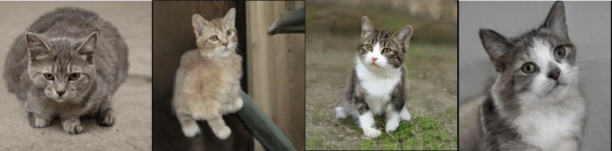

# Gradient Workflows Tutorial

## Introduction

[Gradient Workflows](https://gradient.run/workflows) provides a simple way to automate machine learning tasks. Workflows brings together powerful Gradient GPU instances with an expressive syntax to generate production-ready machine learning pipelines with a few lines of code.


Gradient Workflows is based on [Argo Workflows](https://argoproj.github.io/workflows), which is an open-source and container-native delivery tool for Kubernetes.&#x20;

Several MLOps platforms on the market promise the ability to define pipelines with code. What Gradient Workflows does best is allow us to manage multiple layers of complexity -- from machine learning code, to development and production dependencies, to compute infrastructure such as GPU nodes and storage providers -- all from a single pane of glass.

Here are some other features that distinguish Gradient Workflows from other MLOps solutions:

* Use any [Gradient instance](https://gradient.run/instances) (including free instances) within a Workflow
* Define a type of compute instance for each step of a Workflow to improve performance and conserve costs
* Connect Workflows to GitHub and trigger Workflow runs from a git commit
* Write your own jobs for use within Gradient Workflows

Don't worry if this doesn't make sense yet. Workflows has a steeper learning curve than Notebooks due to the natural complexities of shipping machine learning applications to production.&#x20;

As we progress through the tutorial, we'll start with a basic use case and add complexity gradually. This way we can get a full understanding of Workflows from a simple toy pipeline through to a production application that is deterministic, reproducible, and fit for external consumption.

Let's get started!



## Part 1: Setting up our first Workflow

The first task in this tutorial will be to create and run a sample workflow on Gradient. We will use one of the starter workflows that Gradient provides in the console.

By the end of this section, we will have used a workflow to train a model to generate a realistic human face using [StyleGAN2](https://github.com/NVlabs/stylegan2), which is a popular library for generative image modeling from NVIDIA.&#x20;

Here is what we will do:

* Create a new project in Gradient
* Connect this Gradient project to GitHub so that we can version the workflow in source control
* Create a new workflow that copies and runs a simple StyleGAN2 demo
* Inspect the results and confirm that we find machine-generated images of human faces

### Create a Project

If we haven't already created a project in the Gradient console, we need to do that first. From the Gradient console, select `Create A Project` and give your project a name.&#x20;

Here we have named our project _Face Generator._ (In Part 2 we will rename the project as we generate more than just faces.)


### Connect to GitHub

From the `Workflows` tab we'll now select `Create` to initialize our first Workflow.&#x20;

At this point Gradient will prompt us to grant access to GitHub if we have not already done so.

We need to give Gradient access to at least one GitHub repository during this step. The reason for this is that Gradient Workflows is designed to keep our code version-controlled during the application development process and during Part 1 of this tutorial we'll be writing our Gradient Workflow to a new repository in GitHub automatically.

In Part 2, we'll be using the GitHub integration to trigger workflow runs. This is an extremely powerful MLOps capability that we'll explore when we push code from our local machine to our remote GitHub repository.

Let's go ahead and make the GitHub connection. When we connect GitHub, we'll unlock the Workflows UI which will allow us to proceed.&#x20;


Please note that Gradient does **not** require access to an entire GitHub organization or account. Granting access to a single repo is enough to grant write privileges to Gradient for the purposes of this tutorial.



When prompted, we'll grant access to a single GitHub repo. We may also grant access to multiple repositories or all repositories at this time.&#x20;


### Create a workflow using a basic template tile in the console

Once we connect GitHub, we will unlock the `Get started with workflows` page.


We now have the option to run either a sample workflow or to set up our own custom workflow.&#x20;

We will make a custom workflow later in this tutorial -- for now we will select the [StyleGAN2](https://github.com/nvlabs/stylegan2) template tile.&#x20;

We'll then select our GitHub account under `Select account or organization`.&#x20;

We'll also give our workflow a `Repository name` for writing to GitHub. In our case we will name our repository "Gradient Workflows Tutorial."&#x20;

We can now select the `Create Workflow` button after which we should see the new workflow begin to initialize:


As the sample workflow initializes, we'll notice that the workflow consists of QTY 2 jobs:

* `CloneRepo`&#x20;
* `StyleGan2`

Each job represents a discrete action or step in the workflow syntax (which we will inspect shortly). In the UI, each job is represented by a light green box. We can reveal more information about the job -- including logs, data, and so forth -- by clicking into it.&#x20;

### Interpreting the results of our first workflow

The workflow has completed successfully when the message reads `Succeeded` in the left sidebar. To confirm this, we can see that the boxes containing each of our jobs (`CloneRepo` and `StyleGan2`) now display the checkmark symbol.


Each job within Gradient Workflows has its own set of logs. To reach the logs click into each of the green boxes and tab over to the `Logs` section.&#x20;


It is extremely useful for debugging to have discrete logs for each step of a workflow. This level of granularity means that we can isolate errors to a single job. Since ML pipelines have historically been difficult to debug, logging each step of a workflow independently is helpful.

If we examine the logs of the second job, `StyleGan2`, we should see something like this:

```
Generating image for seed 6600 (0/6) ...
Generating image for seed 6601 (1/6) ...
Generating image for seed 6602 (2/6) ...
Generating image for seed 6603 (3/6) ...
Generating image for seed 6604 (4/6) ...
Generating image for seed 6605 (5/6) ...
dnnlib: Finished run_generator.generate_images() in 1m 19s.
```

It appears that our face generator has succeeded in generating an image. Fantastic!&#x20;

Let's leave the `Logs` tab for the moment and view the `Data` tab within the `StyleGAN2` job. Here we'll find the seed images that we have just generated.


Amazing! If our training succeeded, we should find the seed image named `seed6600.png` should look exactly like the image above. Reproducibility for the win!

Here are a few more images that we were able to generate in a short amount of time. Each of these faces [does not exist](https://thispersondoesnotexist.com) in real life -- we've just used Gradient Workflows to perform some generative image modeling to create them!


### Checking in on our GitHub repository

Now that we've successfully run our first workflow, let's check in on the GitHub repository that we created when we kicked off this workflow.&#x20;


Our entire Workflow is visible in GitHub, which comes in handy. In the next part of this tutorial we'll learn how to work with the GitHub repository.

### Results from our first workflow run

At this point here is everything we've done:

* We created a new project and workflow
* We connected our GitHub account to Gradient allowing us to write our workflow to GitHub
* We ran a starter workflow that contained two jobs
* We successfully ran both jobs and generated a number of images of lifelike human faces
* We confirmed that the contents of the workflow is available in GitHub

Up next we're going to customize the workflow to support a more complex use case. We will be creating QTY 7 jobs and we will produce more interesting results -- this time by generating images of cats instead of images of people!

## Part 2: Setting up a custom workflow

Now that we've successfully generated our first StyleGAN2 workflow, we're going to create a  more advanced implementation that increases the complexity of the workflow.&#x20;

We'll be running QTY 3 jobs to start while demonstrating how to use the GitHub integration to trigger workflow runs. We'll also scale-up the workflow to QTY 5 jobs.&#x20;

This time we'll be modifying the YAML file that was created automatically in Part 1. To verify the existence of the YAML file, let's visit the repository we created in Part 1 and navigate to the file located at `Gradient-Workflows-Tutorial/.gradient/workflows/stylegan2.yaml`.&#x20;


Excellent! As we'll come to learn, this YAML file contains instructions for each workflow job in a format that Gradient Workflows can understand. We'll cover that syntax and more in this part of the tutorial.&#x20;

Here are the steps we'll be taking to modify our workflow:

* Clone our existing connected GitHub repository to our local machine
* Create empty datasets for the workflow
* Copy some new text into the YAML file
* Push the updated repository to GitHub to trigger a new workflow run
* Repeat the process once again to add another step

### Cloning the repo to our local machine

The first thing we're going to do is clone the repo that we created in Part 1 onto our local machine. While it's certainly _possible_ to modify code files directly in the GitHub user interface, we greatly prefer to work with files locally and then push them to source control. &#x20;

We named our Workflow `Gradient-Workflows-Tutorial` previously so our git clone command will look like this. Yours will be different depending on the GitHub account you connected to Gradient and the name you gave to your first Workflow.

Our particular command looks like this:

```
git clone https://github.com/ps-dban/Gradient-Workflows-Tutorial.git
```

However yours may looks like this:

```
git clone https://github.com/{your-github-handle}/{your-workflow-name}.git
```

Let's go ahead and clone the repo locally. If you need a refresher on how cloning from source control works, we recommend checking out [GitHub's excellent documentation](https://docs.github.com/en/repositories/creating-and-managing-repositories/cloning-a-repository).&#x20;


After we clone the repo locally, we should `cd` into the local directory and `ls` to reveal a directory structure like this:

```
Dockerfile		docs			run_metrics.py
LICENSE.txt		metrics			run_projector.py
README.md		pretrained_networks.py	run_training.py
dataset_tool.py		projector.py		test_nvcc.cu
dnnlib			run_generator.py	training
```

This directory contains a number of files that we created during Part 1 of the tutorial.&#x20;

If we use the `ls -a` command, we will reveal a number of hidden directories including `.git`, `.gitignore`, and `.gradient` directories.&#x20;

Our YAML file is located within the `.gradient` directory and we can `cd` into it and `ls` to confirm that it contains a `workflows` directory that contains our YAML file.&#x20;

### Working with a YAML file locally

Now that we know we have the right files, let's open the repo in whatever local IDE we prefer.

In this tutorial we'll be using [VSCode](https://code.visualstudio.com):


The file that we're looking at in this image is the YAML file responsible for orchestrating the workflow we ran in Part 1. The file is located in the directory `.gradient/workflows` within the repo.&#x20;

If we inspect the file, we see that there are QTY 2 jobs specified in this YAML file. One is called `CloneRepo` and the other is called `StyleGAN2`. This is exactly what we expected to see since we can recall these two jobs running in Part 1.

What we will do next is modify this YAML file to add a number of steps to our workflow. Whenever we make a change to this repo and push it to the `main` branch we will trigger a new workflow run.&#x20;

In the next step we're going to do exactly that.

### Modifying the YAML file to expand the workflow

Next up we're going to be copying a new YAML over to our local repo and then pushing our repo to GitHub to trigger a new workflow run.&#x20;

The **new** YAML file that we need to copy and paste into our workflow project is available at this URL:&#x20;

```
https://raw.githubusercontent.com/gradient-ai/gradient-workflows-tutorial-files/main/stylegan2.yaml
```

Let's go ahead and copy that text and paste it into the file on our local machine located at `.gradient/workflows/stylegan2.yaml`:


As you can see, we have copied the contents of the YAML file linked above and pasted it _in its entirety_ into the YAML file located at `.gradient/workflows/stylegan2.yaml`.

Before we push this modified YAML to GitHub, let's quickly understand what it's going to do.

### Breaking down the new YAML file contents

We're now going to be talking about the new 5-step YAML file that we've pasted into our repo on our local machine. After we understand what's in it, we're going to push it to GitHub to trigger a workflow run in Gradient.

The first thing we can see is that our `on` block is commented out. We will need to uncomment this block before we push the file to GitHub if we're going to run the new workflow.

```
#on:
#  github:
#    branches:
#      only: main
```

The rest of the file specifies QTY 5 distinct jobs. This is a substantial increase from the first tutorial in which we created a total of QTY 2 jobs.

Each job is specified under the `jobs` heading in the file.&#x20;

1. `cloneStyleGAN2Repo` - uses a C4 instance type (a basic CPU machine) to clone the StyleGAN2 source code from NVIDIA's GitHub repo into a managed storage provider on Gradient
2. `getPretrainedModelCats` - uses a C4 instance type to copy a pretrained model of cats (a large `.pkl` file) over to Gradient
3. `generateCatImagesPretrainedModel` - uses a P4000 instance type to display images of cats generated using the pretrained cats model
4. \[Commented out to start] `getPretrainedModelCars` - uses a C4 instance type to copy a pretrained model of cars (a large `.pkl` file) over to Gradient
5. \[Commented out to start] `generateCarImagesPretrainedModel` - uses a P4000 instance type to display images of cars generated using the pretrained cars model

One of the best parts of Gradient Workflows is that we can schedule an arbitrary number of jobs on different compute instances -- here we are doing just that. As we can see we are starting with jobs #4 and #5 commented out -- so our first run will only run QTY 3 jobs and we can make additions from there.

We can run a job with no dependencies, or external dependencies, or we can require that a job wait for a previous job to complete before running. Each job can consume different types of inputs, produce different types of outputs, and accept different arguments at runtime. Workflows even allows each job to load a distinct Docker image from a public or private repo!&#x20;

Our next step is to push our local repo to the GitHub remote repository to kick off a new training run. Let's do that now.

### Creating datasets for our workflow

One of the things we may have noticed in the YAML file is the appearance of  Gradient Datasets. Here's an example from `#2 Get pretrained cat model`:&#x20;

```
outputs:
      pretrainedNetwork:
        type: dataset
        with:
          ref: stylegan2-wsp-cats-pretrained-network
```

In this code block, Gradient is expecting to see a Gradient Dataset called `stylegan2-wsp-cats-pretrained-network` -- so we'll have to create it!

We'll quickly create QTY 4 datasets now, which should only take a minute or two.&#x20;

First we'll navigate over to the `Data` tab in Gradient. It should look like this:


Next, we'll create our new empty dataset. If we read through the YAML file, we can see that we'll need a total of QTY 4 empty datasets.

Those are as follows:

```
stylegan2-wsp-cats-pretrained-network
stylegan2-wsp-cats-generated
stylegan2-wsp-cars-pretrained-network
stylegan2-wsp-cars-generated
```

We create the empty dataset like so:

.gif>)

All we're doing here is using each of the QTY 4 references listed above as the `Name` parameter when creating a new dataset.&#x20;

For the `Storage Provider` parameter, we're using **Gradient Managed**, which is the name of the default Gradient cluster.&#x20;


Once we have these empty datasets created, it's time to kickoff the workflow!

### Push to GitHub to run the workflow

Let's go ahead and run the Workflow now.&#x20;

First, in our local text editor, we'll uncomment the command at the top of the new YAML file. If we do not uncomment the `on` block our workflow will not run.&#x20;

It should now look like this:

```
on:
 github:
   branches:
     only: main
```

After we save the file, we'll push the change to our remote repository on GitHub.

We use the terminal to push the change using these commands -- although of course we can use any technique we like to push code to remote source control:

```
git add .
git commit -m "modify yaml file"
git push origin main
```

After we push to GitHub we should confirm that our remote repo received the changes.


Next we're going to swap back from our GitHub repo to our Gradient console. If everything is working as expected, we should see a new workflow run commence.


Fantastic! We can see that we have successfully pushed code to our remote repo, and we can see that pushing this code has automatically created a new workflow run in Gradient. Perfect!

### Inspect the results of the workflow

When our training is done (it took us less than 2 minutes but times may vary), we should see that all QTY 3 jobs have succeeded as represented by the green boxes:


What we'll do next is inspect the results of our step called `generateCatImagesPretrainedModel` -- our expectation is to find images of cats within the dataset.&#x20;

To inspect the generated images, we select the box in the DAG that represents the generation step and we select the `DATA` tab to explore the dataset that we've just generated. Inside we should find a number of seed images of cats.&#x20;

Because this is a deterministic process, the cats you generate should look exactly like these cats. Try it out for yourself!&#x20;


Excellent!&#x20;

If we look at a number of our seed images we should see some cats that look exactly like this:



Our next step is to expand this workflow from QTY 3 steps to QTY 5 steps. We'll do that by uncommenting steps 4 and 5 from our YAML file to trigger a new workflow run.

### Uncomment the remaining steps to re-run the workflow

Let's return to our YAML file locally and uncomment steps 4 and 5. This is going to add an addition QTY 2 steps to our workflow and trigger a re-run and the result is that we're going to also generate some cars.


Next we'll push the changes from our local machine back to our remote repository. Here we give the commit the unimaginative title `uncomment steps 4 and 5`.&#x20;

```
git add .
git commit -m "uncomment steps 4 and 5"
git push origin main
```

We should then see this commit hit our GitHub repository. In the GIF below we can see that our checks pass in Gradient, the workflow is triggered, and then swapping over to Gradient we see that we now have a workflow running with QTY 5 steps in the DAG!


We've just kicked off a 5-step workflow run -- fantastic!&#x20;

Let's inspect the results once the workflow has finished. This time it may take a little bit longer since we've added two extra steps.


If we've succeeded, in addition to our cats, we should now see that we've generated a number of cars!


Success once again!

### What we've accomplished

In Part 2 of this tutorial, we've managed to do the following:

* Pull our workflow repo locally so that we can make changes to the YAML file
* Made one change to the YAML to create QTY 3 workflow jobs to produce a dataset of cats
* Made another change to the YAML to create QTY 5 workflow jobs to produce a dataset of cats and of cars

We've now seen how to take a workflow and make changes to the YAML file to add complexity. From here, as you might imagine, we can get as complicated as we would like.

## What's next?

From here, we should feel like we have the tools and resources to get started building modifying the YAML spec to build our own Gradient Workflows.

As we develop our own Gradient Workflows, we might notice that a git commit does not trigger a  workflow run. When this happens, we'll want to pay attention to the errors generated in GitHub when making a commit.&#x20;

If we are successful triggering a workflow run, but the workflow itself is erroring, we'll want to read through the logs generated in the Gradient console. We should remember to inspect each job in the DAG and read the logs independently in order to troubleshoot.

If you have any questions or need a hand getting something to work -- please let us know! You can [file a support ticket](https://support.paperspace.com/hc/en-us/requests/new) or reach us on Twitter [@hellopaperspace](https://twitter.com/hellopaperspace).

## Reference reading

* Read through the [Gradient Workflows](../../explore-train-deploy/workflows/) documentation
* In particular, read through the [Gradient Workflows spec](../../explore-train-deploy/workflows/workflow-spec.md)
* Browse a large number of Gradient tutorials and walkthroughs available on the [Paperspace blog](https://blog.papae)

## Additional tutorials

* [Gradient Notebooks Tutorial](gradient-notebooks-tutorial.md)
* End-to-end StyleGAN2 tutorial [blogpost](https://blog.paperspace.com/end-to-end-data-science-with-gradient-workflows-stylegan2/) and [GitHub repo](https://github.com/gradient-ai/StyleGAN2-with-Workflows)
* End-to-end recommender system tutorial&#x20;
  * [Part 1: Posing a business problem](https://blog.paperspace.com/end-to-end-recommender-system-part-1-business-problem/)
  * [Part 2: Preparing the data](https://blog.paperspace.com/end-to-end-recommender-system-part-2-data-preparation/)
  * [Part 3: Building a TensorFlow model](https://blog.paperspace.com/end-to-end-recommender-system-part-3-building-tensorflow-model/)
  * [Part 4: Tuning the model for best performance](https://blog.paperspace.com/end-to-end-recommender-system-part-4-tuning-model-best-performance/)
  * [Part 5: Deploying the model into production](https://blog.paperspace.com/end-to-end-recommender-system-part-5-deploying-model-production/)
  * [Part 6: Conclusion and next steps](https://blog.paperspace.com/end-to-end-recommender-system-part-6-conclusion-next-steps/)
