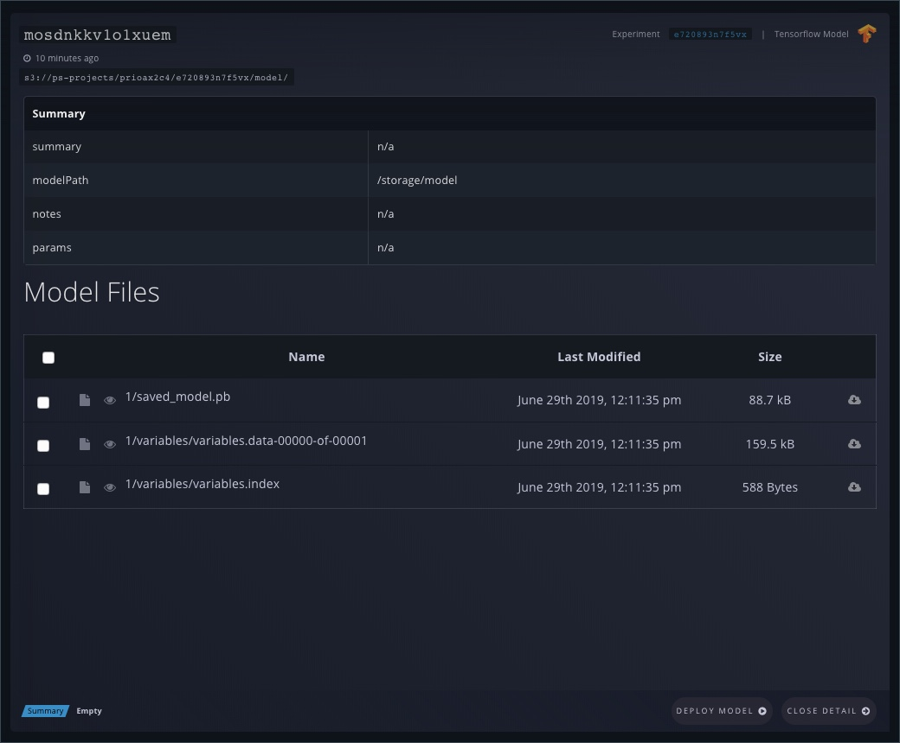

# Registering Models in Gradient

## **Objectives**

* Understand the process involved in registering models
* Passing environment variables to Gradient Workflows
* Registering Tensorflow Models in Gradient 

## **Introduction**

Training workloads in Gradient can generate machine learning models, which can be interpreted and stored in your Project's Models list. This list holds references to the model and checkpoint files generated during the training period as well as summary metrics associated with the model's performance, such as accuracy and loss.

In this tutorial, we will create a Worklfow to generate a Keras model based on the [Fashion MNIST dataset](https://www.kaggle.com/zalando-research/fashionmnist). We will learn techniques such as using the Git checkout action, passing environment variables to Workflows, and specifying the right container image.

The model is trained in Keras but it is finally exported as a TensorFlow model through `tf.saved_model.simple_save`method. This approach seralizes Keras session into a TensorFlow `.pb` file.

This repo [https://github.com/gradient-ai/fashionmnist](https://github.com/gradient-ai/fashionmnist) contains the code for training and inferencing the model.

## Create a Project for Fashion MNIST

We will start by creating a project that can contain multiple Workflows we may run during the training. We'll use the CLI here but you can perform the action in the user interface.  

```text
gradient projects create --name Fashion
```

Now let's create our Workflow

```bash
gradient workflows create --name fashion-mnist --projectId <id of project>
```

## Create a Workflow run to Train the Model

We will now start a Workflow run within the Workflow created above. Make a note of the Workflow id before proceeding further.

### Get the training code

[Download](https://github.com/gradient-ai/fashionmnist/blob/master/workflow.yaml) or copy the YAML training code to your computer. 

```yaml
defaults:
  env:
    apiKey: secret:api_key #Replace this secret with your own secret
  resources:
    instance-type: C5
jobs:
  CloneRepo:
    inputs:
      repo:
        type: volume
    uses: git-checkout@v1
    with:
      url: https://github.com/gradient-ai/fashionmnist.git
  TrainModel:
    env:
      MODEL_DIR: /my-trained-model
    needs:
      - CloneRepo
    inputs:
      repo:
        type: volume
    outputs:
      trained-model:
        type: dataset
        with:
          ref: dsrvw1m30ymhiyt #Replace this id with your own dataset id
    uses: container@v1
    with:
      args:
        - bash
        - "-c"
        - >-
          cd /inputs/repo/train && python train.py && cp -R /my-trained-model /outputs/trained-model
      image: 'tensorflow/tensorflow:1.9.0'
  UploadModel:
    inputs:
      model: TrainModel.outputs.trained-model
    outputs:
      model-id:
        type: string
    needs:
      - TrainModel
    uses: create-model@v1
    with:
      name: trained-model
      type: Tensorflow
```

This YAML file incorporates several concepts that are important to understand:

The `secret:api_key` parameter masks your API key so it is not visible to others. You can learn how to store an API key as a Secret [here](../managing-projects/storing-an-api-key-as-a-secret.md).

`instance-type: C5` sets a default [instance type](../../more/instance-types/) in case a step does not specify an instance type.

`git-checkout@v1` is a [Gradient Action](../../explore-train-deploy/workflows/gradient-actions.md#git-checkout) which will clone a Git repo.

`env` and `MODEL_DIR` passes an environment variable to the script. In our code, we decide the location to store the model based on the value defined in the MODEL\_DIR environment variable.

`image` is a parameter that points the step to a Docker image used to execute the step. Note: This same training code can run on a GPU instance which would require using the following image: `tensorflow/tensorflow:1.9.0-gpu`

`TrainModel` takes an `outputs` parameter which stores the model artifacts within a Gradient dataset. You must create a dataset before running the Workflow and add the id on this line.  

`UploadModel` takes a `type` parameter that specifies the format of the model. In this case, we are passing in `TensorFlow` as the type.  Frameworks other than TensorFlow are supported such as `ONNX`, `TensorRT`, and `Custom`.

### Create a Workflow run

```bash
gradient workflows run \
  --id <workflow id> \
  --clusterId <if using a private cluster> \
  --path ./workflow.yaml
```

## Verifying the Creation of Model

We can check if the output of the job is registered as a valid TensorFlow model with the following command. 

```bash
gradient models list
```

`+------+-----------------+------------+  
| Name | ID | Model Type | Project ID |    
+------+-----------------+------------+  
| None | mosdnkkv1o1xuem | Tensorflow |  
+------+-----------------+------------+`

You can also visit the Models section of Gradient UI to see a list of registered models.



## Summary

After registering the model, we can turn that into a Deployment to perform inferencing:



