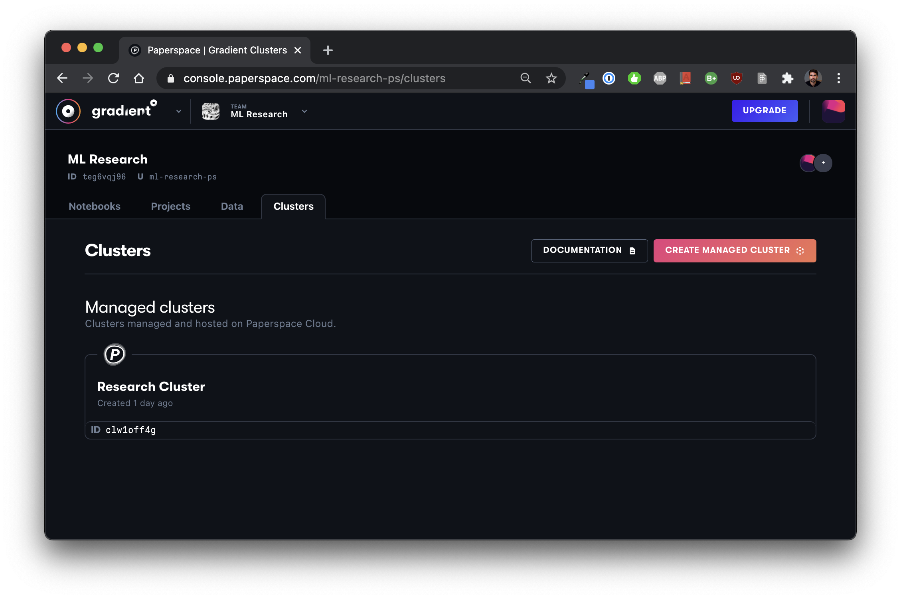

# Usage

## Finding your Cluster ID

Your clusters are available under the __Clusters tab.  Here you can find information about your cluster, including your cluster ID – you will need to specify this ID in order to designate your private cluster as the place to run Workflows, Deployments, etc. 



## **Using Gradient private clusters via the Gradient CLI**

```bash
gradient <command> ... --clusterId <your-cluster-ID>
```

`--clusterId string` Cluster ID for this processing site, e.g. "clxxxxxxx". 


You will need to provide your API key to authenticate your requests. Learn how to obtain and set your API key [here](../../get-started/quick-start/install-the-cli.md#obtaining-an-api-key).


A complete example of utilizing Gradient features on a cluster might look like this:

```bash
gradient workflows run \
--id 01f00ea6-6f78-4ad9-b5ca-f56006e64193 \
--clusterId cl8pwu9qn \ 
--path ./workflow.yaml 
```

In order to run workloads on your Gradient cluster, you must specify the `clusterId` parameter on most Gradient commands, including:

* workflows
* deployments
* models
* notebooks

If you don't supply the `clusterId` parameter, then your command will default to run on Paperspace instances, which are not part of your private cluster environment.

## **Using Gradient clusters via the Web UI**

When creating a notebook, an experiment, or a model deployment, select your private cluster in the console, then select an instance type that's available in your cluster.


