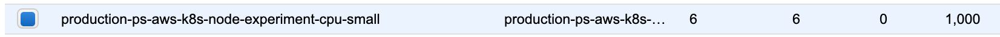

# Setup


Please contact your Account Manager or [contact sales](https://info.paperspace.com/contact-sales) for setting up Gradient Private Cloud.


Gradient Private Cloud is a Kubernetes native application that can be installed in an existing Kubernetes cluster \(in the public cloud or on-premise\) or Kubernetes can be installed during the Gradient Private Cloud deployment process.  

During the deployment process, the Paperspace team will work closely with you to implement a private processing site via Kubernetes. The process will include specifying the instance types that will be available in your cluster, providing the domain name where your notebooks and other Gradient features will be hosted, and setting up your Paperspace team membership and permissions. 

For public cloud installs such as AWS and Google Cloud, Paperspace will provide machine images that are fully prepped for running Gradient workloads. 

#### Autoscaling Groups and node readiness

Kubernetes will scale up worker nodes for Gradient experiments, model deployments, Jupyter notebooks, etc. as needed. This process does require some time, and this time can be minimized by settings in your cloud providers auto-scaling groups. For example, in AWS EC2 you could set the minimum number of nodes for all commonly-used instance types to a number larger than zero. 


Setting auto-scaling groups with non-zero minimums will result in 24x7 nodes, and that will incur cloud expenses


The auto-scaling group configuration could be done through Terraform or another cloud management utility, or manually through the AWS EC2 console.

#### Custom AWS S3 bucket for artifacts

Gradient Enterprise customers can add one set of S3 credentials for their team to use a private S3 bucket for persistence of artifacts/models/etc. To add these credentials, select your team at the bottom left, which will take you to the “Team management” page. Find the S3 Credentials tab:

Here you can set S3 credentials. Re-submitting will override your current credentials. These credentials will be used for storing artifacts, models, etc. in the specified S3 bucket. Additional steps are required to fully set this up – please work with your Paperspace account manager to implement.

