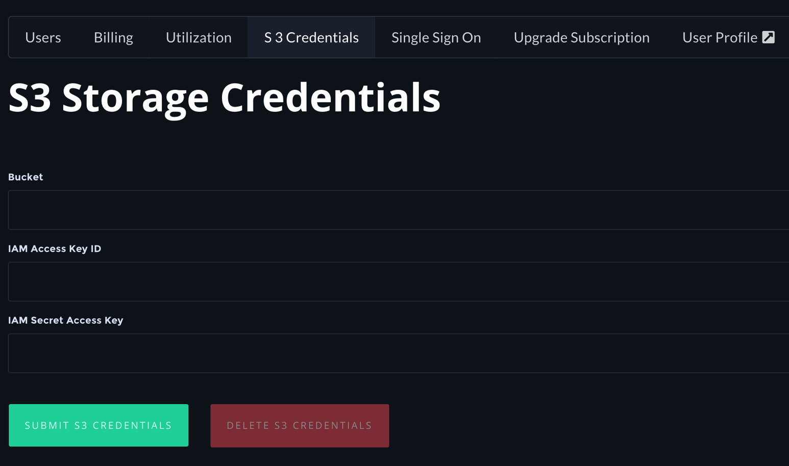

# Setup


Please contact your Account Manager or [contact sales](https://info.paperspace.com/contact-sales) for setting up Gradient Private Cloud.


Gradient Private Cloud is a Kubernetes native application that can be installed in an existing Kubernetes cluster \(in the public cloud or on-premise\) or Kubernetes can be installed during the Gradient Private Cloud deployment process.  

During the deployment process, the Paperspace team will work closely with you to implement a private processing site via Kubernetes. The process will include specifying the instance types that will be available in your cluster, providing the domain name where your notebooks and other Gradient features will be hosted, and setting up your Paperspace team membership and permissions. 

For public cloud installs such as AWS and Google Cloud, Paperspace will provide machine images that are fully prepped for running Gradient workloads. 

Gradient Enterprise customers can add one set of S3 credentials for their team to use their own S3 buckets for persistence of artifacts/models/etc. To add these credentials, select your team at the bottom left, which will take you to the “Team management” page. There, you’ll see an S3 Credentials tab. Clicking that, Gradient Enterprise customers will see three fields:

Here you can set S3 credentials. Re-submitting will override your current credentials. These credentials will be used so make sure that your artifacts, models, etc. are persisted to your specified S3 bucket.

