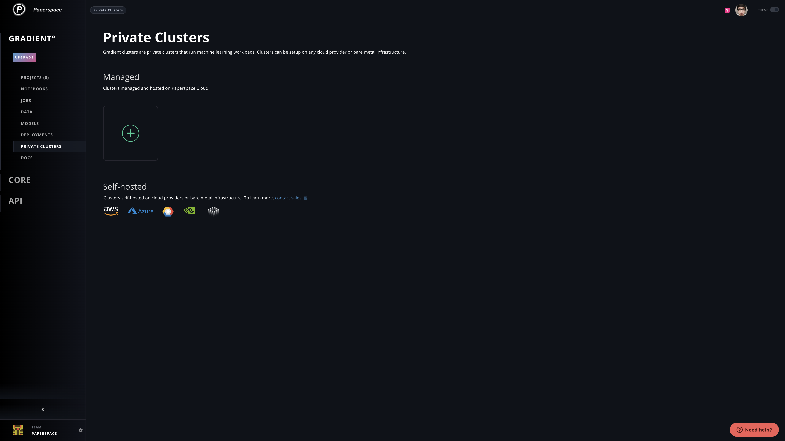
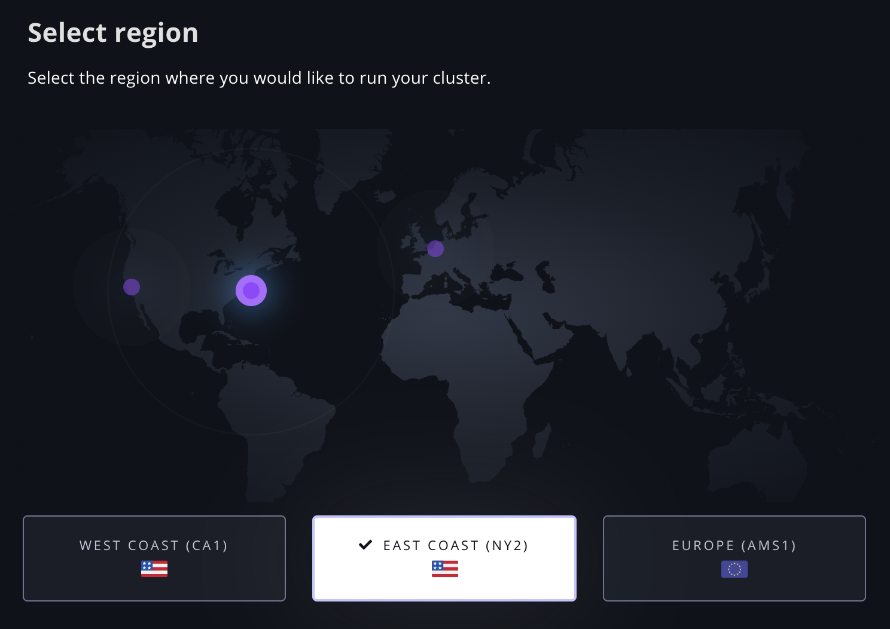
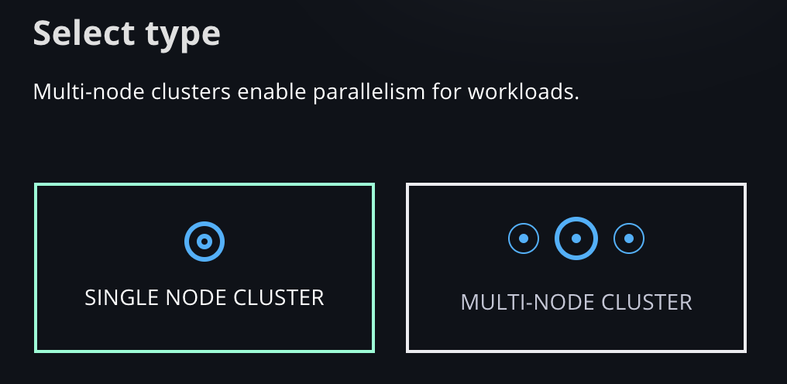
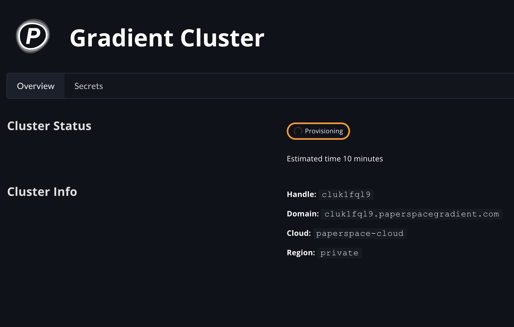
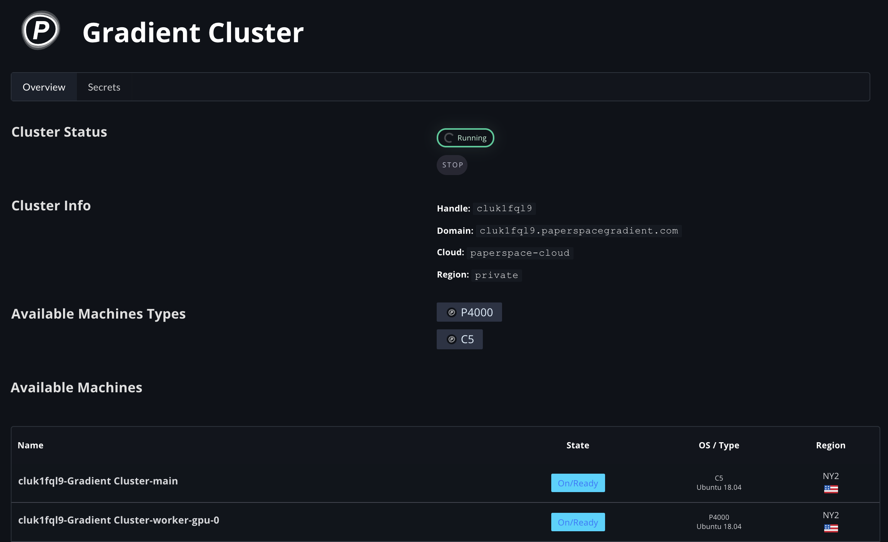
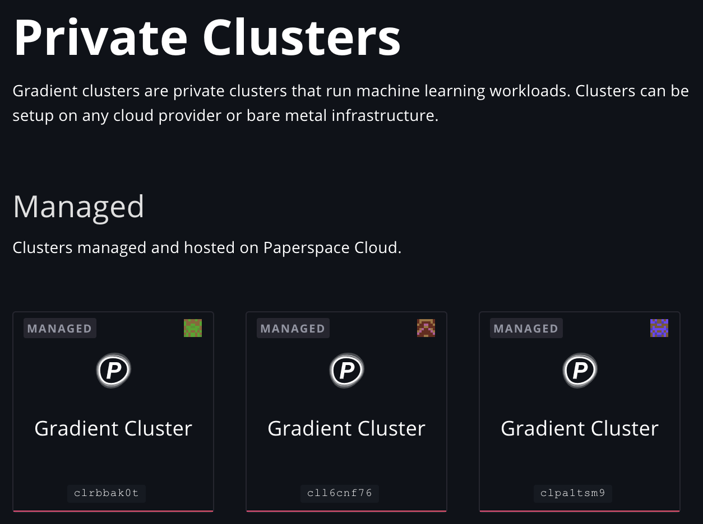

# Managed Install

Gradient clusters can be created in just a few clicks in the Web UI as a fully managed service in Paperspace Cloud. Create and run notebooks, experiments, and deployments all in your private cluster from within the Web UI, from the CLI, or using the SDK.

On this page, you'll learn how to create a managed cluster and view your managed clusters from the Web UI.

To create a self-hosted Gradient cluster, use the [Gradient Installer CLI](gradient-installer-cli.md).

## Create a managed cluster

### 1. Navigate to the Private Clusters page

Click Private Clusters under Gradientº in the side nav.

Then click the **+** tile to start creating a Managed Gradient cluster.

### 2. Configure your managed cluster

Select the region where your machines will be provisioned, as well whether you want a Single Node or Multi-Node cluster.

### 3. Select a Paperspace Cloud region

### 4. Select a cluster type and create your private cluster

Once you've configured your managed cluster, click **Create Cluster**. This will begin provisioning your machines and installing Gradient, and will automatically navigate you to the Cluster Details page below.

### 5. Your managed cluster details page

Your cluster will show as _Provisioning_ until it completes. It currently takes about 10 minutes to provision a cluster. Plenty of time to get a chai latte, eat some pineapple, and plan your first machine learning experiment on Gradient.

Once it is completed, your cluster handle will show up anywhere in the Web UI that you can select a cluster, for you to create and run Notebooks, Experiments, Deployments, Tensorboards, etc.

You can see your cluster and machine details, as well as Start and Stop your cluster machines.

### Currently supported cluster types

* **Single Node Cluster**
  * 1 x Main node \(C5\)
  * 1 x P4000
* **Multi-node Cluster**
  * 1 x Main node \(C5\)
  * 1 x C5 worker
  * 3 x P4000 workers

## View your Managed Clusters

Once you've created any number of managed clusters, you can view them on the same Private Clusters page.

