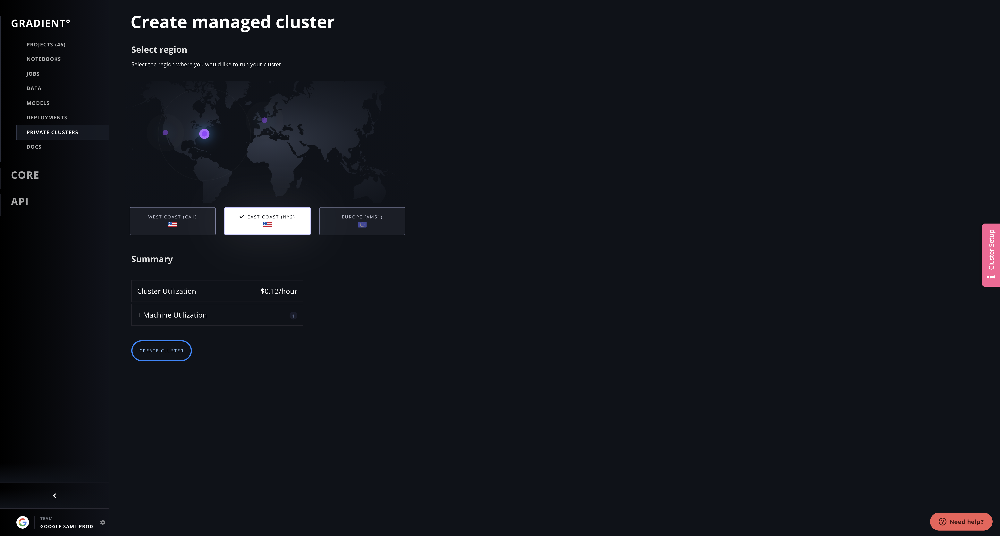

# Managed Private Clusters

## What is a managed private cluster?

Gradient offers a multi-tenant service for running basic ML workloads as well as private clusters that offer more advanced functionality for power users.  Both managed options run on the Paperspace Cloud.  

**How to choose between the multi-tenant service and a private cluster:** If you are doing distributed training, deploying models into production, or need more control over your environment, we recommend creating a private cluster.  

This section covers the managed private cluster option.  If you are looking to use Gradient without a private cluster, just [create an account](https://console.paperspace.com/signup?gradient=true) to get started. If you are looking to run Gradient on your own infrastructure, see the [self-hosted clusters](self-hosted-clusters/) section.  

## Overview

Gradient clusters can be created in just a few clicks in the Web UI as a fully managed service in Paperspace Cloud. Create and run notebooks, experiments, and deployments all in your private cluster from within the Web UI, from the CLI, or using the SDK.

On this page, you'll learn how to create a managed cluster and view your managed clusters from the Web UI.


**Note:** Managed clusters require a T1 or greater [subscription](https://gradient.paperspace.com/pricing).



**Note:** If you are looking to create a _self-hosted_ Gradient cluster, see the [Gradient Installer CLI](self-hosted-clusters/gradient-installer-cli.md).


## Create a managed cluster

### 1. Navigate to the Private Clusters page

Click Private Clusters under Gradientº in the side nav.

Then click the **+** tile to start creating a Managed Gradient cluster.

### 2. Configure your managed cluster

Select the region where your machines will be provisioned, as well whether you want a Single Node or Multi-Node cluster.

### 3. Select a Paperspace Cloud region

Once you've configured your managed cluster, click **Create Cluster**. This will begin provisioning your machines and installing Gradient, and will automatically navigate you to the Cluster Details page below.

### 4. Your managed cluster details page

Your cluster will show as _Provisioning_ until it completes. It currently takes about 10 minutes to provision a cluster. Plenty of time to get a chai latte, eat some pineapple, and plan your first machine learning experiment on Gradient.

Once it is completed, your cluster handle will show up anywhere in the Web UI that you can select a cluster, for you to create and run Notebooks, Experiments, Deployments, Tensorboards, etc.

You can see your cluster and machine details, as well as Start and Stop your cluster machines.

## View your Managed Clusters

Once you've created any number of managed clusters, you can view them on the same Private Clusters page.

