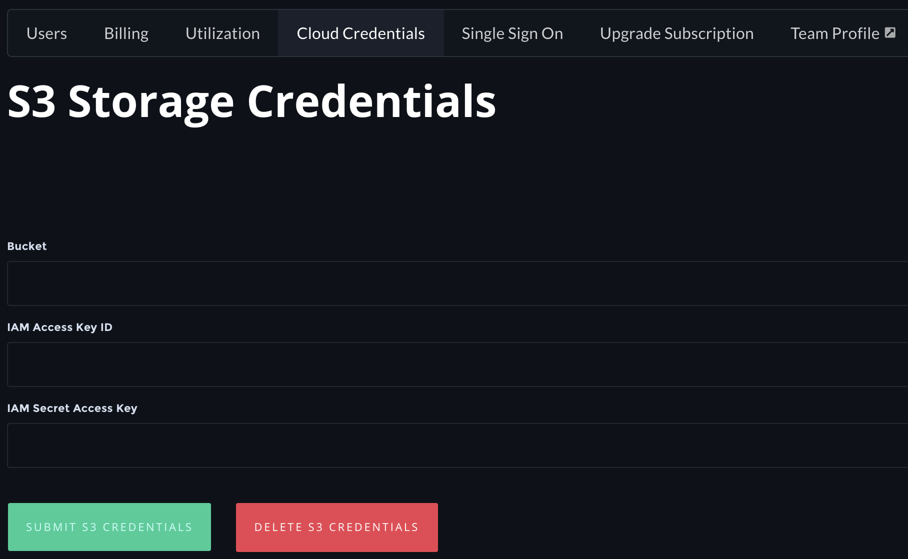

# Pre-installation steps

There's several steps that are common to all installed environments, and these are listed below. After completing these steps you'll find links to individual steps for AWS and other cloud/VM/bare metal environments. 

#### Pre-install - cluster registration

Register a new cluster in the [Paperspace web console](https://www.paperspace.com/console/clusters). _Copy the cluster API key and cluster handle to be used later in the install process._

#### Pre-install - artifacts storage

Create an AWS S3 bucket for artifacts. Next, add CORS permissions to the bucket you created:

```text
<?xml version="1.0" encoding="UTF-8"?>
<CORSConfiguration xmlns="http://s3.amazonaws.com/doc/2006-03-01/">
<CORSRule>
    <AllowedOrigin>https://www.paperspace.com</AllowedOrigin>
    <AllowedMethod>GET</AllowedMethod>
    <AllowedMethod>PUT</AllowedMethod>
    <MaxAgeSeconds>3000</MaxAgeSeconds>
    <AllowedHeader>*</AllowedHeader>
</CORSRule>
</CORSConfiguration>
```

Then, create an IAM user / role with the following policy:

```text
{
    "Version": "2012-10-17",
    "Statement": [
        {
            "Sid": "AllowGeneratedUrls",
            "Effect": "Allow",
            "Action": "sts:GetFederationToken",
            "Resource": "*"
        },
        {
            "Sid": "AllowListbucket",
            "Effect": "Allow",
            "Action": "s3:ListBucket",
            "Resource": "arn:aws:s3:::[bucket_name]"
        },
        {
            "Sid": "AllowBucketAccess",
            "Effect": "Allow",
            "Action": "s3:*",
            "Resource": "arn:aws:s3:::[bucket]/*"
        }
    ]
}
```

The S3 bucket credentials must also be added into the Paperspace console:

To add these credentials, visit the Paperspace web console[ ](https://www.paperspace.com/console/teams/[team_id]/s3)team management page by clicking on your profile icon in the top right. Then find the S3 Credentials tab:



#### Pre-install - SSL certificate 

Gradient uses a wildcard SSL certificate to secure HTTP traffic into your processing site. You will need two files: one private key file and one .crt file that contains your entire certificate chain including any root or intermediate certificates. \(Example: [https://support.comodo.com/index.php?/Knowledgebase/Article/View/1145/1/how-do-i-make-my-own-bundle-file-from-crt-files](https://support.comodo.com/index.php?/Knowledgebase/Article/View/1145/1/how-do-i-make-my-own-bundle-file-from-crt-files)\)

Example:

* \*.gradient.mycompany.com

#### Set up gradient-installer \(note: skip this step for the NVIDIA DGX installer mode\)

The Gradient installer code is housed in a public GitHub repo, which will need to be cloned to the computer or cloud instance where you plan to run the installer. There's also a pre-install script that needs to be run.

```text
git clone git@github.com:Paperspace/gradient-installer.git gradient-installer
gradient-installer/bin/setup
mkdir gradient-cluster
cd gradient-cluster
```

#### Create Terraform provider file in S3 \(optional\)

To maintain Terraform state in a shared location, you should create a file called in the gradient-cluster folder called: `backend.tf` with the information below \(replace `artifacts-bucket` with the name of the artifacts storage bucket you created.

```text
terraform {
    backend "s3" {
        bucket = "artifacts-bucket"
        key    = "gradient-processing"
        region = "us-east-1"
        session_name = "gradient-processing-terraform"
    }
}
```

