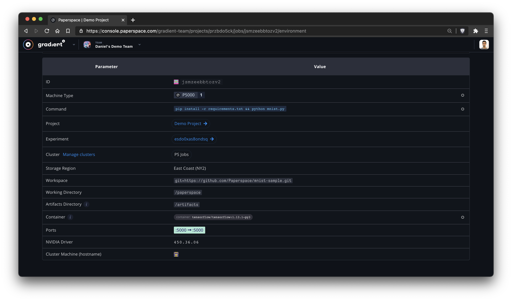

# Ports

### Why use a public IP?

Public IP addresses are useful for accessing your Gradient job container from the outside world. For example, you might want to run TensorBoard, [a simple flask web server](https://github.com/Paperspace/gradient-flask-example), or even [SSH directly into your running job instance](https://support.paperspace.com/hc/en-us/articles/360003413994).

Gradient Notebooks and Jobs automatically have public IP addresses. For Jobs, you can additionally pass in which ports you would like to open on the running Job.



### Opening Ports On Your Job

You can easily open ports into your Gradient job using the --ports syntax.

If you are familiar with the Docker syntax for port forwarding, it is helpful to note that we use a similar form of:

```text
--ports $HOSTPORT:$CONTAINERPORT
```

For example, if you are running TensorBoard within your image and want to expose port 8888 to the world, you would just pass the following:

```text
gradient jobs create --container tensorflow/tensorflow:latest --command './run.sh' --ports 8888:8888
```

Within the interface you can see that this job has the public IP address of 104.196.249.111, so now any traffic that you send through 104.196.249.111:8888 will get redirected to the job's container on that same port.


### Considerations / Additional Notes

Public IP addresses are not persistent. This means that once a job terminates, the public IP address is released back into the pool and is no longer available.  

