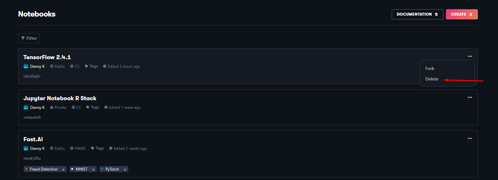
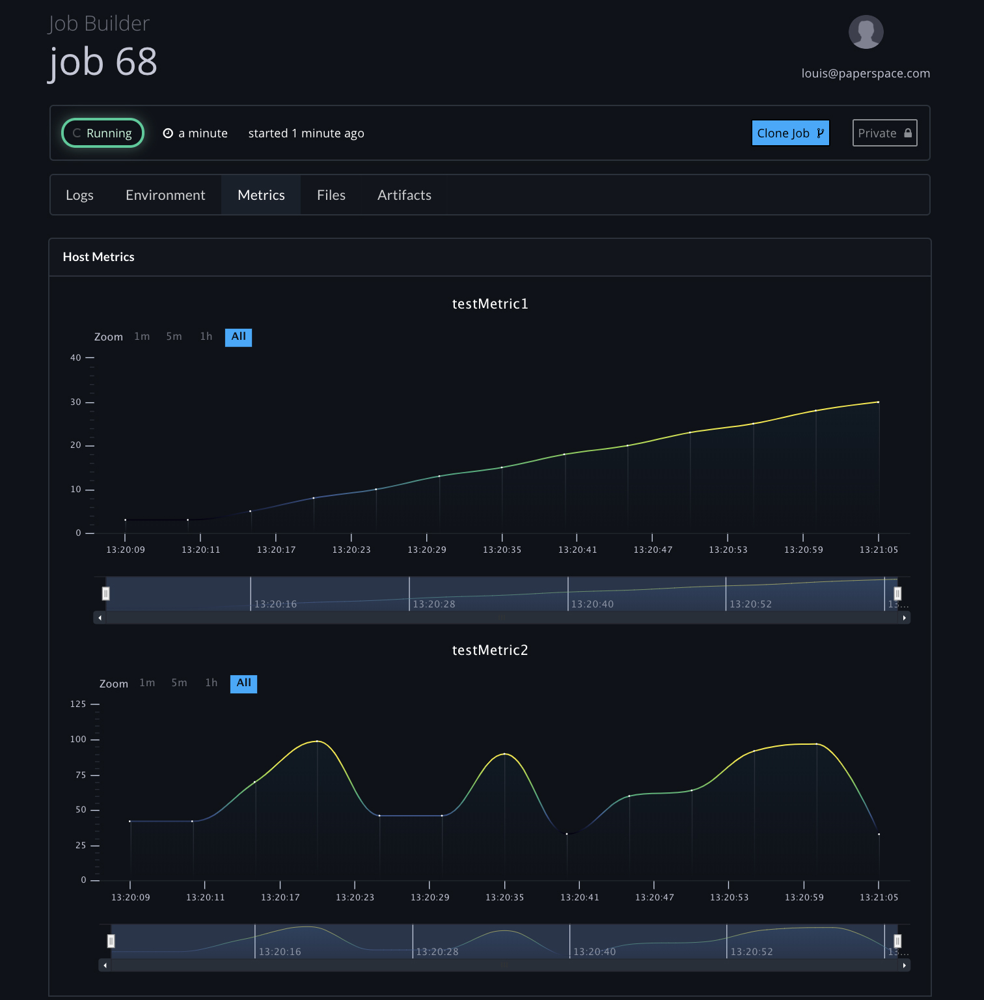

# Custom Metrics

## Overview

The gradient platform will now graph metrics you define in your gradient jobs. The process begins by you defining the metric names you'd like to gain insight over. Once determined you can provide these metric names to the Job Builder, instrument your code with `gradient-statsd`, and view your metrics under the Metrics tab within the Job info page.

## Defining your metrics

The Gradient platform supports a subset of the statsd standard. Currently the methods `increment` `decrement` and gauge are available. Increment can be used to increment a counter. Decrement can be used to decrease a counter and Gauge can be used to plot a value which can vary freely. 

You as the developer must create appropriate names for your metrics. Metrics in our platform **must** contain only alpha-numeric characters `a-z`, `A-Z`, `0-9` and the special characters `_` `-` . If any other characters are used you will receive an error when submitting the job. 

## Supplying your metrics to Gradient

In order for our platform to plot your custom metrics you must inform Gradient when create the job. The Job Builder form now includes a section titled `Custom Metrics`



Once your metrics are defined you may submit the job.

## Instrumenting your code

In order for your job to write metrics to the gradient platform you will need to instrument your code. Paperspace provides a python module named gradient-statsd. This can be found [here](https://pypi.org/project/gradient-statsd/). You can install this package into your project via pip: `pip install gradient-statsd`

Below is a small toy application making use of the gradient-statsd client. 

```text
from gradient_statsd import Client
from datetime import datetime, timedelta
from random import randint
import time

METRIC1 = "testMetric1"
METRIC2 = "testMetric2"

if __name__ ==  '__main__':
    client = Client()

    endAt = datetime.now() + timedelta(hours=1)

    while datetime.now() <= endAt:
        print("sending {} with counter at {}".format(METRIC1, datetime.now().isoformat()))
        client.increment(METRIC1, 1)

        randNum = randint(1, 100)
        print("sending {} with gauge {} at {}".format(METRIC2, randNum, datetime.now().isoformat()))
        client.gauge(METRIC2, randNum)

        time.sleep(2)

```

 Make note that the metric names we use in the application above match exactly with the metrics we provided in the Job Builder form in the previous step.

## Viewing your metrics

Once the job is submitted the gradient platform will begin streaming metrics to the Metrics tab in the Job Info page.  These metrics will remain available to you until you delete your job. 



