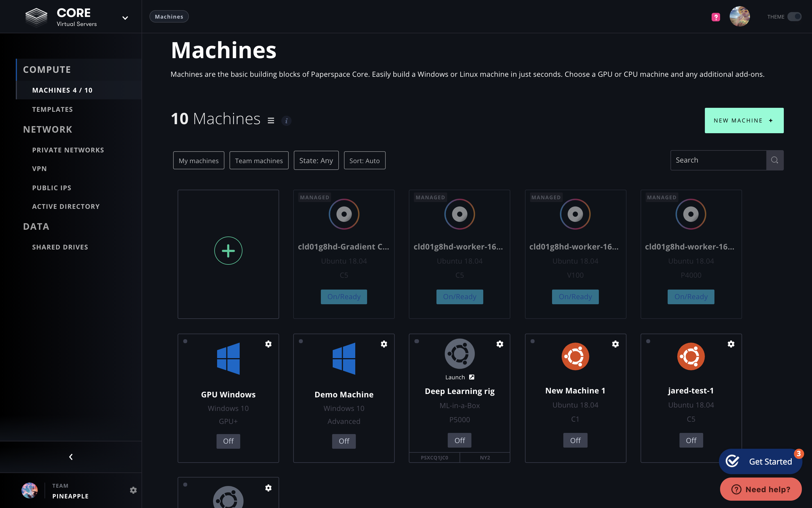

# Overview


This feature is currently only available to our Gradient Managed offering. [Contact Sales](https://info.paperspace.com/contact-sales) to learn more.


Paperspace Machines are the basic building blocks of Paperspace CORE and can be taken advantage of using the UI or via the CLI.

You can build a Windows or Linux virtual machine quickly, choose a GPU or CPU machine and any additional add-ons.

To list your existing machines or create a new one via the Web UI, navigate to Core &gt; Compute &gt; Machines in the Side Nav.

Alternately, you can [List your Machines via the CLI](using-machines/list-machines.md).

